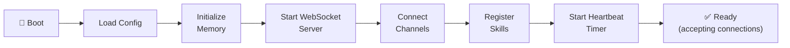

# The Gateway

The Gateway is OpenClaw's core — a single long-running Node.js process that manages all communication, orchestration, and execution.

## Starting the Gateway

```bash
# Foreground (for development)
openclaw gateway

# As a daemon (for production)
openclaw gateway --daemon

# With custom port
openclaw gateway --port 19000
```

## WebSocket Control Plane

The Gateway exposes a WebSocket server (default: `ws://localhost:18789`) that serves as the control plane for:

- **CLI communication** — `openclaw chat` and other commands connect here
- **Channel bridges** — Messaging platforms send/receive through WebSocket
- **Health monitoring** — Status checks and metrics
- **Skill execution** — Skills communicate results back through the control plane

### Connecting to the Control Plane

```typescript
const ws = new WebSocket('ws://localhost:18789');

ws.on('message', (data) => {
  const msg = JSON.parse(data);
  console.log(msg.type, msg.payload);
});

ws.send(JSON.stringify({
  type: 'chat',
  payload: { text: 'Hello from my custom client' }
}));
```

## Daemon Mode

When installed as a daemon (`openclaw onboard --install-daemon`), the Gateway:

- Starts on system boot
- Restarts on crash
- Logs to `~/.openclaw/logs/gateway.log`
- Manages PID file at `~/.openclaw/gateway.pid`

### Daemon Management

```bash
# Check status
openclaw status

# View logs
openclaw logs

# Restart
openclaw gateway restart

# Stop
openclaw gateway stop
```

## Process Lifecycle



On shutdown, the Gateway:
1. Sends disconnect to all channels
2. Saves pending memory updates
3. Closes WebSocket connections
4. Writes final log entry

## Configuration

Gateway settings in `~/.openclaw/openclaw.json`:

```json5
{
  "gateway": {
    "port": 18789,
    "host": "127.0.0.1",  // Bind to localhost only
    "max_connections": 10,
    "log_level": "info",   // debug, info, warn, error
    "pid_file": "~/.openclaw/gateway.pid"
  }
}
```

:::danger
**Never bind the Gateway to `0.0.0.0` or a public interface.** This exposes the control plane to the network. Security researchers found [40,000+ exposed instances](/security/known-vulnerabilities) doing exactly this.
:::

## See Also

- [Configuration Reference](/reference/configuration) — Full gateway config options
- [Gateway API](/reference/gateway-api) — WebSocket message protocol
- [Security Hardening](/security/hardening) — Securing the gateway
