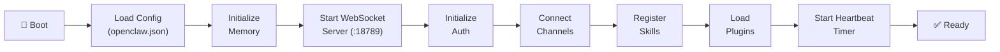

# The Gateway

The Gateway is OpenClaw's core — a single long-running Node.js process that manages all communication, orchestration, and execution. It binds an HTTP/WebSocket server on `127.0.0.1:18789` and serves as the control plane and message broker for every connected client.

---

## Starting the Gateway

```bash
# Foreground (development)
openclaw gateway

# Daemon mode (production)
openclaw gateway --daemon

# Custom port
openclaw gateway --port 19000

# With debug logging
openclaw gateway --log-level debug
```

---

## Process Lifecycle



### Shutdown Sequence

On `SIGTERM` or `openclaw gateway stop`:

1. Stop accepting new connections
2. Send disconnect to all channels
3. Save pending memory updates
4. Drain command queues
5. Close WebSocket connections
6. Write final log entry
7. Remove PID file

---

## Wire Protocol

The Gateway communicates via WebSocket using JSON text frames at **protocol version 4**.

### Message Frame Types

| Type | Direction | Structure | Purpose |
|------|-----------|-----------|---------|
| **Request** | Client → Gateway | `{type: "req", id, method, params}` | RPC calls |
| **Response** | Gateway → Client | `{type: "res", id, ok, payload\|error}` | RPC replies |
| **Event** | Gateway → Client | `{type: "event", event, payload, seq?, stateVersion?}` | Push notifications |

### Connection Handshake

1. Client opens WebSocket to `ws://localhost:18789`
2. Client sends a `connect` message (must be the first frame)
3. Gateway responds with `connect.challenge` containing a nonce
4. Client responds with authentication credentials (see [Authentication](#authentication))
5. Gateway sends `hello-ok` with policy limits

### Payload Limits

| Phase | Max Size |
|-------|----------|
| Pre-handshake | 64 KiB |
| Post-handshake (maxPayload) | 25 MiB |
| Buffered bytes (maxBufferedBytes) | 50 MiB |

### Key RPC Methods

The protocol defines 200+ RPC methods. The most commonly used:

| Category | Methods |
|----------|---------|
| **Chat** | `chat.send`, `chat.abort`, `sessions.create`, `sessions.send`, `sessions.steer` |
| **Tools** | `tools.catalog`, `tools.effective`, `tools.invoke` |
| **Exec Approval** | `exec.approval.request`, `exec.approval.resolve` |
| **Heartbeat** | `heartbeat.trigger`, `heartbeat.status` |
| **Memory** | `doctor.memory.status`, `doctor.memory.dreamDiary`, `doctor.memory.remHarness` |
| **Agents** | `agents.list`, `agents.create`, `agents.switch` |
| **Config** | `config.get`, `config.set`, `config.reload` |
| **Plugins** | `plugins.list`, `plugins.install`, `plugins.enable` |
| **Device** | `device.pair`, `device.approve`, `device.list` |
| **Voice** | `talk.session.create`, `talk.session.end` |
| **Node** | `node.invoke`, `node.capabilities` |

### Idempotency

Side-effecting methods (`send`, `agent`, etc.) require an idempotency key. The Gateway maintains a short-lived dedupe cache to prevent duplicate processing.

### Example: Sending a Chat Message

```typescript
// Client sends request
ws.send(JSON.stringify({
  type: 'req',
  id: 'msg-001',
  method: 'chat.send',
  params: {
    text: 'What files are in my home directory?',
    idempotencyKey: 'idem-abc123'
  }
}));

// Gateway streams events
// → {type: "event", event: "tool_call", payload: {tool: "shell", args: {command: "ls ~"}}}
// → {type: "event", event: "tool_result", payload: {output: "Desktop\nDocuments\n..."}}
// → {type: "res", id: "msg-001", ok: true, payload: {text: "Your home directory contains..."}}
```

---

## Authentication

The Gateway supports multiple authentication modes, configured in `openclaw.json`:

### Modes

| Mode | How It Works | Use Case |
|------|-------------|----------|
| **shared-secret** | Token or password compared at handshake | Default for most setups |
| **trusted-proxy** | Gateway trusts `X-Forwarded-*` headers from configured proxies | Behind Nginx/Caddy |
| **tailscale** | Identity from Tailscale Serve headers | Tailnet deployments |
| **none** | No authentication | Local development only |

### Challenge-Response Handshake

1. Gateway sends `connect.challenge` with a random nonce
2. Client responds with:
   - Auth token (shared-secret mode)
   - Ed25519 device identity (`device.id` = SHA-256 of public key)
   - Nonce signature (v3 payload binds platform + deviceFamily, 10-minute skew tolerance)
   - Role (`operator` or `node`), scopes, and capabilities
3. Gateway verifies signature and issues device token

### Device Pairing

New devices must be approved before they can connect:

- Loopback connections (127.0.0.1) are auto-approved
- Remote devices enter a pairing flow: `openclaw pairing approve <device-id>`
- Max 3 pending pairing requests per channel
- Pairing codes expire after 1 hour

### Configuration

```json5 title="~/.openclaw/openclaw.json"
{
  "gateway": {
    "auth": {
      "mode": "shared-secret",
      "token": "${OPENCLAW_AUTH_TOKEN}"
    }
  }
}
```

:::danger
**Never bind to `0.0.0.0` without authentication.** Security researchers found [42,665 exposed instances](/security/known-vulnerabilities#exposed-instances-january-february-2026) with 93.4% having auth bypasses. Always bind to `127.0.0.1` and use a reverse proxy for remote access.
:::

---

## Internal Components

### Node Registry

Tracks connected execution sessions (Local Execution processes). When a node connects, it's registered with its capabilities; when it disconnects, it's cleared. The Gateway dispatches `node.invoke` requests to the appropriate node based on required capabilities.

### Exec Approval Manager

Serializes pending command-approval requests. When the Brain wants to execute a shell command, the Exec Approval Manager:

1. Creates an approval record with a UUID
2. Presents the command to the user (exact argv, cwd, rawCommand)
3. Waits for `exec.approval.resolve` (approve or deny)
4. Routes the result back to the requesting session

This ensures only one approval prompt is active at a time, preventing race conditions.

### Command Queue

A **lane-aware FIFO queue** that serializes concurrent messages destined for the same session. Each session gets its own lane — only one agent run touches a given session at a time. This prevents message ordering issues when multiple channels or heartbeat triggers fire simultaneously.

---

## Daemon Mode

When installed as a daemon (`openclaw onboard --install-daemon`), the Gateway:

- Starts on system boot
- Restarts automatically on crash
- Logs to `~/.openclaw/logs/gateway.log`
- Manages PID file at `~/.openclaw/gateway.pid`

### Management Commands

```bash
# Check status
openclaw status

# View logs
openclaw logs
openclaw logs --filter heartbeat
openclaw logs --filter channel

# Restart
openclaw gateway restart

# Stop
openclaw gateway stop
```

---

## Configuration

```json5 title="~/.openclaw/openclaw.json"
{
  "gateway": {
    "port": 18789,
    "host": "127.0.0.1",
    "max_connections": 10,
    "log_level": "info",
    "pid_file": "~/.openclaw/gateway.pid",
    "auth": {
      "mode": "shared-secret",
      "token": "${OPENCLAW_AUTH_TOKEN}"
    },
    "trustedProxies": []
  }
}
```

### Transport Security

- **Plaintext `ws://`** is only accepted for: loopback addresses, private IPs, `.local` hostnames, and Tailnet `*.ts.net` URLs
- All other connections require `wss://` (TLS)
- Browser SSRF to private networks is blocked by default

---

## See Also

- [Architecture Overview](/architecture/overview) — High-level component diagram
- [Gateway API](/reference/gateway-api) — WebSocket message protocol reference
- [API & Webhooks](/guides/api-webhooks) — Client libraries and integration patterns
- [Security Hardening](/security/hardening) — Gateway security, reverse proxy, authentication
- [Configuration Reference](/reference/configuration) — Full gateway config options
