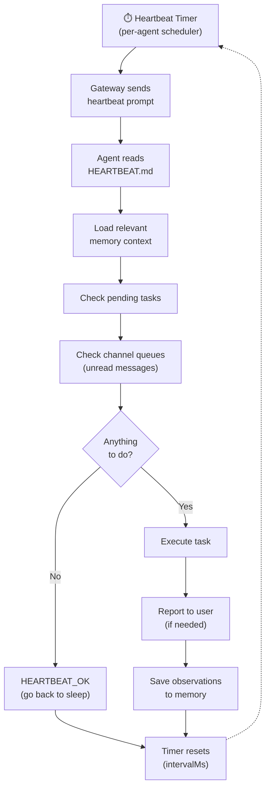

# Heartbeat System

The Heartbeat is what transforms OpenClaw from a reactive chatbot into a **proactive autonomous agent**. Every N minutes, the Gateway triggers a heartbeat cycle — the agent checks for pending work, monitors channels, and takes action without being prompted.

---

## How It Works



### Per-Agent Scheduling

The heartbeat system uses a **per-agent scheduling model** tracked internally with per-agent state:

- `intervalMs` — How often this agent's heartbeat fires
- `nextDueMs` — When the next heartbeat is scheduled
- `lastRunStartedAtMs` — When the last heartbeat started
- `recentRunStarts` — Sliding window for flood detection

Each agent in a multi-agent setup can have its own heartbeat interval.

---

## Defining Heartbeat Tasks

Edit `~/.openclaw/HEARTBEAT.md` to define what the agent should do proactively:

```markdown title="~/.openclaw/HEARTBEAT.md"
# Heartbeat Tasks

## Continuous (every heartbeat)
- Check Gmail for emails from my boss or with "urgent" in subject
- Monitor GitHub notifications for @mentions

## Hourly
- Check if any running deployments have failed
- Summarize new Slack messages in #engineering

## Daily (morning)
- Weather briefing for my location
- Summarize my Google Calendar for today
- Check for new OpenClaw releases

## Weekly (Monday)
- Generate a summary of last week's GitHub activity
- Review and clean up my Downloads folder
```

### Writing Effective Tasks

| Pattern | Example | Tip |
|---------|---------|-----|
| **Specific triggers** | "emails from boss@company.com" | Avoid vague "check for important emails" |
| **Clear actions** | "summarize and post to #daily channel" | Tell the agent what to do with findings |
| **Frequency hints** | "## Hourly" section headers | Agent uses these to prioritize |
| **Conditional** | "only if temperature drops below 32F" | Reduce unnecessary actions |

### Keep It Concise

Every token in HEARTBEAT.md is loaded into every heartbeat cycle. A 500-token HEARTBEAT.md costs ~500 tokens per cycle. At 48 cycles/day, that's 24,000 tokens just for the task definition.

---

## Heartbeat Responses

The agent responds to each heartbeat with one of:

| Response | Meaning | Cost |
|----------|---------|------|
| `HEARTBEAT_OK` | Nothing to do, go back to sleep | Minimal (just the check) |
| Message to channel | Sends a proactive notification to user | Moderate (message generation) |
| Tool execution | Runs commands, API calls, file operations | Variable (depends on task) |
| Memory update | Records observations for future reference | Minimal |

Most heartbeat cycles end with `HEARTBEAT_OK` — the agent checks all defined tasks, finds nothing actionable, and goes back to sleep. This is the expected behavior and keeps costs low.

---

## Cost Analysis

The heartbeat is the single biggest cost driver for most OpenClaw users.

### Cost Per Model

| Model | Input Cost | Output Cost | Daily Cost (48 cycles) | Monthly |
|-------|-----------|------------|----------------------|---------|
| **Claude Opus 4.6** | $15/M | $75/M | $10-20 | $300-600 |
| **Claude Sonnet 4.5** | $3/M | $15/M | $3-8 | $90-240 |
| **Claude Haiku 4.5** | $0.25/M | $1.25/M | $1-3 | $30-90 |
| **Gemini 2.5 Flash** | $0.20/M | $0.80/M | $0.50-2 | $15-60 |
| **DeepSeek V3** | $0.27/M | $1.10/M | $0.50-2 | $15-60 |
| **Local (Ollama)** | $0 | $0 | $0 | $0 |

### Cost Reduction Levers

| Lever | Savings | How |
|-------|---------|-----|
| Use Haiku instead of Opus | ~90% | Set `heartbeat.model` |
| Increase interval to 60 min | 50% | Set `heartbeat.interval: 3600` |
| Enable quiet hours (8h) | 33% | Set `heartbeat.quiet_hours` |
| Reduce HEARTBEAT.md size | 10-30% | Fewer tokens per cycle |
| Use local model | 100% | Set to Ollama/vLLM endpoint |

### Combined Example

Default (Opus, 30 min, no quiet hours): **~$15/day = $450/month**

Optimized (Haiku, 60 min, 8h quiet hours): **~$0.60/day = $18/month** (96% reduction)

---

## Configuration

```json5 title="~/.openclaw/openclaw.json"
{
  "heartbeat": {
    "enabled": true,
    "interval": 1800,
    "model": "claude-haiku-4-5-20251001",
    "max_tokens": 1024,
    "quiet_hours": {
      "start": "23:00",
      "end": "07:00",
      "timezone": "America/Los_Angeles"
    }
  }
}
```

### Configuration Options

| Option | Default | Description |
|--------|---------|-------------|
| `enabled` | `true` | Enable/disable heartbeat |
| `interval` | `1800` | Seconds between heartbeats (30 min) |
| `model` | Brain's model | LLM model for heartbeat (override for cost) |
| `max_tokens` | `1024` | Max output tokens per heartbeat |
| `quiet_hours.start` | None | When to stop heartbeats (HH:MM) |
| `quiet_hours.end` | None | When to resume heartbeats (HH:MM) |
| `quiet_hours.timezone` | System TZ | Timezone for quiet hours |

---

## Multi-Agent Heartbeat

In multi-agent setups, each agent can have its own heartbeat schedule:

```json5 title="~/.openclaw/openclaw.json"
{
  "agents": {
    "list": [
      {
        "id": "alex",
        "model": "claude-opus-4-6",
        "heartbeat": { "every": "30m" }
      },
      {
        "id": "monitor",
        "model": "claude-haiku-4-5-20251001",
        "heartbeat": { "every": "5m" }
      },
      {
        "id": "weekly-reporter",
        "model": "claude-sonnet-4-6",
        "heartbeat": { "every": "4h" }
      }
    ]
  }
}
```

Each agent's heartbeat reads its own workspace's HEARTBEAT.md and fires independently.

:::info
A bug in v2026.2.9 caused all agents to fire on the main agent's schedule regardless of per-agent config. This was fixed by late February 2026 (issue #14986). Ensure you're running a recent version if using per-agent intervals.
:::

---

## Dreaming Integration

When the [memory-core plugin](/architecture/memory-system#dreaming-mode) is enabled, the heartbeat system coordinates with Dreaming:

- **Dreaming runs during quiet hours** (default 3 AM daily) to consolidate memories
- The heartbeat scheduler ensures Dreaming doesn't conflict with regular heartbeat cycles
- Dreaming results are written to `DREAMS.md` and available to the next heartbeat cycle
- Memory consolidation reduces the retrieval corpus over time, making heartbeat memory lookups faster and cheaper

---

## Debugging

```bash
# View heartbeat logs
openclaw logs --filter heartbeat

# Trigger a manual heartbeat
openclaw heartbeat --now

# Test HEARTBEAT.md without executing
openclaw heartbeat --dry-run

# Check heartbeat schedule status
openclaw status
```

### Common Issues

| Problem | Cause | Fix |
|---------|-------|-----|
| Heartbeat never fires | `enabled: false` or Gateway not running | Check config, `openclaw status` |
| Fires but does nothing | HEARTBEAT.md is empty or too vague | Add specific tasks with clear actions |
| Costs too high | Expensive model + short interval | Use Haiku, increase interval, add quiet hours |
| Agent fires at wrong time | Quiet hours timezone wrong | Set correct `timezone` value |
| Multi-agent all fire together | v2026.2.9 bug | Update to latest version |
| Heartbeat takes too long | Complex tasks with many tool calls | Split into smaller tasks, set `max_tokens` limit |

---

## See Also

- [Architecture Overview](/architecture/overview) — Where the heartbeat fits in the data flow
- [Heartbeat Guide](/guides/heartbeat) — Practical recipes for heartbeat tasks
- [Memory System](/architecture/memory-system) — How Dreaming integrates with heartbeat
- [Performance Tuning](/guides/performance-tuning) — Heartbeat cost optimization in depth
- [Multi-Agent Workflows](/guides/multi-agent) — Per-agent heartbeat configuration
- [Configuration Reference](/reference/configuration) — All heartbeat settings
