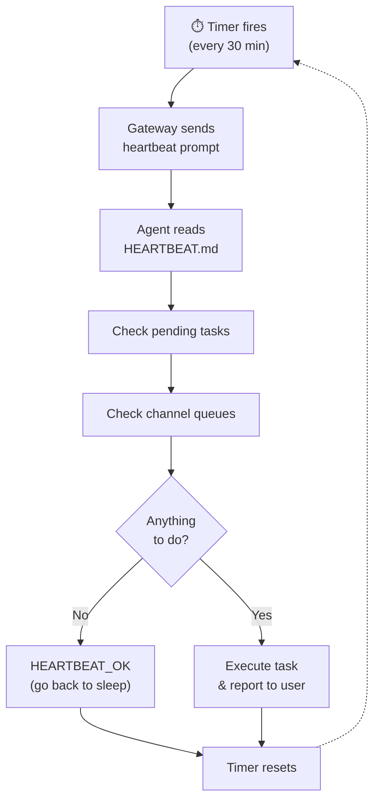

# Heartbeat System

The Heartbeat is what transforms OpenClaw from a reactive chatbot into a **proactive autonomous agent**.

## How It Works

Every N minutes (default: 30), the Gateway triggers a heartbeat cycle:



## Defining Heartbeat Tasks

Edit `~/.openclaw/HEARTBEAT.md` to define what the agent should do proactively:

```markdown title="~/.openclaw/HEARTBEAT.md"
# Heartbeat Tasks

## Continuous (every heartbeat)
- Check Gmail for emails from my boss or with "urgent" in subject
- Monitor GitHub notifications for @mentions

## Hourly
- Check if any running deployments have failed
- Summarize new Slack messages in #engineering

## Daily (morning)
- Weather briefing for my location
- Summarize my Google Calendar for today
- Check for new OpenClaw releases

## Weekly (Monday)
- Generate a summary of last week's GitHub activity
- Review and clean up my Downloads folder
```

## Heartbeat Responses

The agent responds to each heartbeat with one of:

| Response | Meaning |
|----------|---------|
| `HEARTBEAT_OK` | Nothing to do, go back to sleep |
| Message to channel | Sends a proactive message to user |
| Tool execution | Runs commands/scripts silently |
| Memory update | Records observations for future reference |

## Configuration

```yaml title="~/.openclaw/config.yml"
heartbeat:
  enabled: true
  interval: 1800         # seconds (30 minutes)
  model: "claude-haiku-4-5-20251001"  # Use a cheap model for heartbeat
  max_tokens: 1024
  quiet_hours:
    start: "23:00"
    end: "07:00"
    timezone: "America/Los_Angeles"
```

### Cost Optimization

The heartbeat fires frequently, so token costs add up. Recommendations:

- **Use a cheap model** — Haiku 4.5 is excellent for heartbeat tasks
- **Increase the interval** — 60 minutes instead of 30 if tasks aren't time-sensitive
- **Set quiet hours** — No heartbeats during sleep
- **Keep HEARTBEAT.md concise** — More text = more tokens per cycle

:::tip
At default settings with Haiku, the heartbeat costs roughly $1–3/day. With Opus, it can be $10+/day. Choose wisely.
:::

## Debugging the Heartbeat

```bash
# View heartbeat logs
openclaw logs --filter heartbeat

# Trigger a manual heartbeat
openclaw heartbeat --now

# Test HEARTBEAT.md without executing
openclaw heartbeat --dry-run
```

## See Also

- [Heartbeat Guide](/guides/heartbeat) — Practical recipes for heartbeat tasks
- [Configuration Reference](/reference/configuration) — All heartbeat settings
- [Brain & Hands](/architecture/brain-and-hands) — Cost optimization strategies
