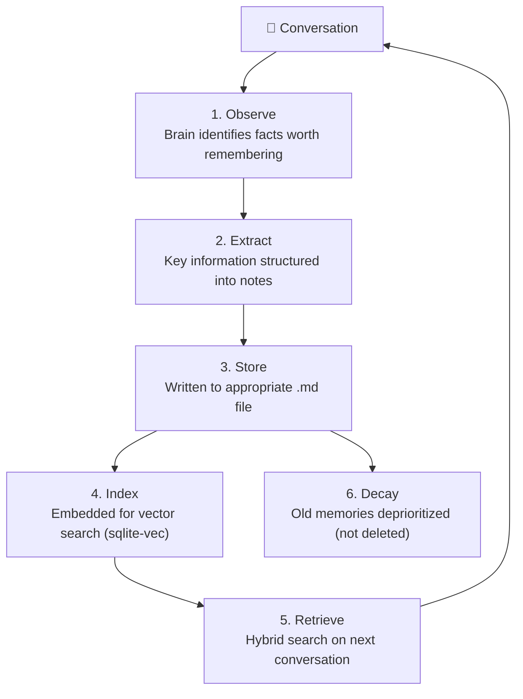

# Memory System

OpenClaw's memory is one of its most distinctive features — persistent context stored as **local Markdown files** that survive restarts, updates, and migrations. Unlike session-based chatbot memory, OpenClaw builds a growing knowledge base that makes the agent more useful over time.

---

## How It Works

Every conversation contributes to a knowledge base at `~/.openclaw/memory/`:

```
~/.openclaw/
├── memory/
│   ├── preferences.md     # User preferences and habits
│   ├── contacts.md        # People the agent has learned about
│   ├── projects.md        # Active projects and their context
│   ├── learnings.md       # Discoveries and solutions
│   ├── tools.md           # Tools and workflows used
│   └── custom/            # User-defined categories
│       ├── work.md
│       └── recipes.md
├── SOUL.md                # Agent identity (not memory, but loaded with it)
├── HEARTBEAT.md           # Autonomous task definitions
├── AGENTS.md              # Task instructions
├── TOOLS.md               # Available capabilities
├── USER.md                # User context
├── IDENTITY.md            # External presentation (name, emoji)
└── DREAMS.md              # Dreaming output (if enabled)
```

---

## Memory Lifecycle



### What Gets Remembered

The agent autonomously identifies and stores:
- **Preferences** — "I prefer dark mode", "Always use pnpm not npm"
- **Contacts** — People mentioned and their roles/relationships
- **Projects** — Active work, goals, deadlines, context
- **Learnings** — Solutions found, patterns discovered, tools configured
- **Instructions** — Standing orders ("always use strict TypeScript")

You can also explicitly instruct the agent:

```
"Remember that I prefer dark mode for all tools"
"Forget everything about my previous project"
"What do you remember about me?"
```

---

## Memory Retrieval

When a new conversation starts, the agent retrieves relevant memories using **hybrid search**:

### Hybrid Search (70/30 Split)

| Component | Weight | Method | Implementation |
|-----------|--------|--------|---------------|
| **Vector search** | 70% | Semantic similarity via embeddings | sqlite-vec (local, no API calls) |
| **BM25 keyword search** | 30% | Full-text search | SQLite FTS5 |

This hybrid approach catches both semantically similar memories (vector) and exact keyword matches (BM25). All processing happens locally — no embedding API calls required.

### Context Token Budget

Retrieved memories are truncated to fit within `max_context_tokens`:

```json5 title="~/.openclaw/openclaw.json"
{
  "memory": {
    "max_context_tokens": 2000
  }
}
```

| Setting | Effect | Trade-off |
|---------|--------|-----------|
| 500 tokens | Minimal memory per message | Low cost, may miss relevant context |
| 2,000 tokens (default) | Good balance | Standard cost |
| 5,000 tokens | Rich context | Higher cost per message |
| 10,000+ tokens | Very rich context | Significant cost increase |

Each message's total context = SOUL.md + memory + skills + history + message. Reducing `max_context_tokens` is one of the most effective cost levers — see [Performance Tuning](/guides/performance-tuning).

---

## Dreaming Mode

The **memory-core** plugin (v2026.5+) adds **Dreaming** — a background memory consolidation process inspired by sleep phases. It runs during off-hours to deduplicate, synthesize, and organize accumulated memories.

### Three Phases

| Phase | What It Does | Input |
|-------|-------------|-------|
| **Light** | Ingests recent daily files, deduplicates obvious redundancies | Last 24 hours of memory writes |
| **REM** | Identifies patterns and connections within a sliding window | 7-day memory window |
| **Deep** | Scores candidates on 6 signals, promotes or archives | Full memory corpus |

### Scoring Signals (Deep Phase)

1. **Relevance** — How often is this memory retrieved?
2. **Frequency** — How many conversations reference it?
3. **Recency** — When was it last accessed?
4. **Diversity** — Does it add unique information?
5. **Credibility** — Was it confirmed or corrected?
6. **Utility** — Did it lead to successful actions?

### Configuration

```json5 title="~/.openclaw/openclaw.json"
{
  "plugins": {
    "entries": {
      "memory-core": {
        "enabled": true,
        "dreaming": {
          "enabled": true,
          "schedule": "0 3 * * *",
          "model": "claude-haiku-4-5-20251001"
        }
      }
    }
  }
}
```

### Output

Dreaming results are written to `~/.openclaw/DREAMS.md` for human review. This file is informational — the actual memory changes happen in the `memory/` directory.

### Inspection

```bash
# Check memory status
openclaw doctor memory status

# View dream diary
openclaw doctor memory dreamDiary

# Run REM harness manually
openclaw doctor memory remHarness
```

---

## Memory Plugins

The built-in Markdown memory works for most users, but plugins can extend or replace the memory backend:

### Available Plugins

| Plugin | Backend | Best For |
|--------|---------|----------|
| **Built-in** | Local Markdown + sqlite-vec | Default — simple, private, no dependencies |
| **memory-core** | Enhanced built-in + Dreaming | Active users who want consolidation |
| **PostClaw** | PostgreSQL + pgvector | Teams with existing Postgres infrastructure |
| **Redis memory** | Redis + RediSearch | High-performance, shared memory across instances |
| **Qdrant memory** | Qdrant vector DB | Large memory corpuses needing scale |
| **ChromaDB memory** | ChromaDB | Local vector DB alternative |

### Why Use a Plugin?

| Need | Solution |
|------|----------|
| Share memory across multiple Gateway instances | PostgreSQL or Redis |
| Scale to millions of memory entries | Qdrant or PostgreSQL |
| Background consolidation and dedup | memory-core (Dreaming) |
| Existing database infrastructure | Match your stack |

For most single-user setups, the built-in Markdown memory is sufficient and has the advantage of being human-readable and editable.

See [Memory Systems Compared](/guides/memory-systems) for detailed comparison of all 12+ options.

---

## Manual Memory Management

Since memory is just Markdown, you can edit it directly:

```bash
# View what the agent remembers
cat ~/.openclaw/memory/preferences.md

# Edit memories
vim ~/.openclaw/memory/preferences.md

# Add a new memory category
echo "# Cooking Notes" > ~/.openclaw/memory/custom/cooking.md

# Reset all memory (start fresh)
rm -rf ~/.openclaw/memory/*
```

### Example Memory Entry

```markdown title="~/.openclaw/memory/preferences.md"
## Communication Style
- Prefers concise responses, no filler
- Uses dark mode everywhere
- Timezone: America/Los_Angeles

## Development
- Primary language: TypeScript
- Editor: VS Code with Vim bindings
- Package manager: pnpm (never npm)
- Always use strict TypeScript config

## Updated: 2026-06-08
```

---

## Configuration

```json5 title="~/.openclaw/openclaw.json"
{
  "memory": {
    "enabled": true,
    "path": "~/.openclaw/memory",
    "max_context_tokens": 2000,
    "auto_save": true,
    "categories": [
      "preferences",
      "contacts",
      "projects",
      "learnings"
    ]
  }
}
```

---

## Privacy

- Memory files are **never sent to any external service** — they're loaded locally and included in the LLM prompt
- If using a cloud LLM provider, memory content *is* sent as part of the prompt (this is unavoidable)
- For maximum privacy, use [local models](/guides/local-models) so nothing leaves your machine
- The built-in memory backend uses sqlite-vec for local embeddings — no external embedding API calls

:::tip
Periodically review `~/.openclaw/memory/` to see what the agent has learned. Remove anything you don't want included in future prompts.
:::

---

## See Also

- [Architecture Overview](/architecture/overview) — Where memory fits in the data flow
- [Memory Systems Compared](/guides/memory-systems) — 12+ memory backends compared
- [Performance Tuning](/guides/performance-tuning) — Context token budget optimization
- [Security Hardening](/security/hardening) — Protecting memory files
- [Local Models](/guides/local-models) — Keep everything on-device
- [Configuration Reference](/reference/configuration) — Memory settings
