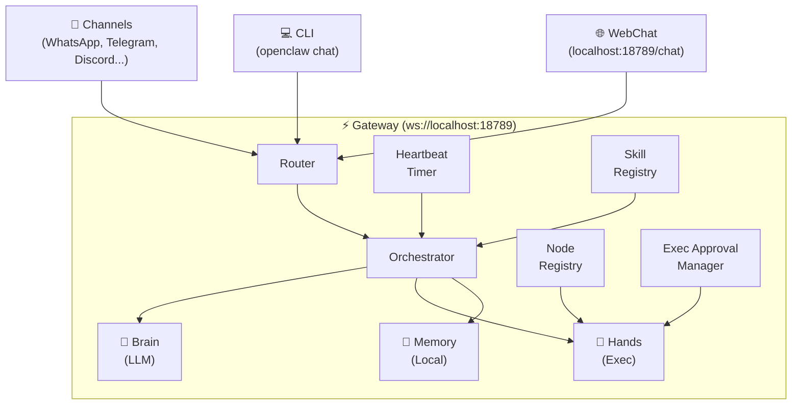
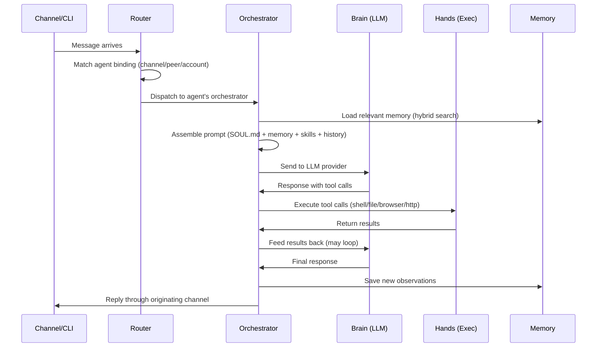

# Architecture Overview

OpenClaw uses a **Gateway-centric architecture** where a single long-running Node.js process orchestrates communication between an LLM (the "Brain"), local execution capabilities (the "Hands"), persistent memory, and external messaging channels.

## High-Level Architecture



## Component Summary

| Component | Role | Deep Dive |
|-----------|------|-----------|
| **Gateway** | Central process — WebSocket server, daemon, process manager | [Gateway](/architecture/gateway) |
| **Brain** | LLM reasoning — prompt assembly, model routing, provider fallback | [Brain & Hands](/architecture/brain-and-hands) |
| **Hands** | Execution — shell, filesystem, browser, HTTP with sandboxing | [Brain & Hands](/architecture/brain-and-hands) |
| **Memory** | Persistence — local Markdown files with hybrid search retrieval | [Memory System](/architecture/memory-system) |
| **Heartbeat** | Autonomy — per-agent periodic task loop with Dreaming integration | [Heartbeat](/architecture/heartbeat) |
| **Channels** | I/O — 26 messaging platform bridges (bundled + plugin) | [Channels](/guides/channels) |
| **Skills** | Extensions — YAML+Markdown skill definitions from ClawHub | [Skills](/guides/skill-development) |
| **Router** | Dispatch — routes messages to appropriate agent by channel binding | [Multi-Agent](/guides/multi-agent) |
| **Node Registry** | Session tracking — connected execution sessions with command queues | [Gateway](/architecture/gateway) |
| **Exec Approval Manager** | Command approval — serializes pending approval requests | [Gateway](/architecture/gateway) |

## Request Lifecycle

When a message arrives — from any channel, the CLI, or a heartbeat trigger — it follows this path:



### Prompt Assembly

Each LLM call assembles context from multiple sources:

| Layer | Source | Typical Size |
|-------|--------|-------------|
| **System identity** | SOUL.md | 200-1,000 tokens |
| **Agent instructions** | AGENTS.md, TOOLS.md | 100-500 tokens |
| **Memory** | Hybrid search results from `~/.openclaw/memory/` | Up to `max_context_tokens` (default 2,000) |
| **Active skills** | Matching skill instructions from SKILL.md files | 100-500 tokens per skill |
| **Conversation history** | Recent messages in this session | Variable |
| **Channel message** | The incoming message with EXTERNAL_UNTRUSTED_CONTENT markers | Variable |

The Brain processes this assembled context and outputs either a text response, one or more tool calls, or both. Tool calls loop back through the Hands and return results to the Brain until it produces a final response.

## Data Flow

```
Input Sources                    Gateway                         Output
─────────────              ─────────────────────              ──────────
WhatsApp message ──┐                                    ┌──► WhatsApp reply
Telegram message ──┤       ┌─────────────────┐          ├──► Telegram reply
Discord message  ──┤──────►│ Router          │          ├──► Shell commands
Slack message    ──┤       │   ↓             │          ├──► File operations
CLI command      ──┤       │ Orchestrator    │──────────┤──► Browser actions
Heartbeat tick   ──┤       │   ↓       ↑     │          ├──► API requests
Webhook          ──┘       │ Brain ──► Hands │          ├──► Memory updates
                           │   ↓             │          └──► Proactive messages
                           │ Memory          │
                           └─────────────────┘
```

## Design Principles

### Single Process

One gateway manages everything — no microservices, no containers required, no inter-process communication complexity. The Node.js event loop handles concurrency naturally. This makes deployment simple (one binary, one config file) but means vertical scaling is the primary option.

### Local-First

All data stays on disk — memory as Markdown, config as JSON, credentials in `~/.openclaw/credentials/`. No cloud dependencies beyond the LLM API. If you use local models via Ollama or vLLM, nothing ever leaves your machine.

### Model-Agnostic

Swap LLM providers by changing a config line. The Brain abstracts provider differences behind a unified interface. Route different tasks to different models: Opus for complex reasoning, Haiku for heartbeat checks, local models for privacy-sensitive operations.

### Extensible

Skills are Markdown files — anyone can write them. Channels are plugins — install on demand from ClawHub. The Gateway's plugin architecture (v2026.3.22+) lets the community extend every layer without forking core.

### Transparent

Memory is human-readable Markdown. Config is JSON. The WebSocket protocol uses JSON text frames. Execution approvals show the exact command before running. No black boxes.

### Security-Conscious

The Gateway binds to localhost by default. Authentication uses challenge-response with device pairing. External content is wrapped in `EXTERNAL_UNTRUSTED_CONTENT` boundary markers. Tool execution goes through approval workflows. But the security posture requires active configuration — see [Security Hardening](/security/hardening).

## Key Files

| File | Purpose |
|------|---------|
| `~/.openclaw/openclaw.json` | Main configuration (gateway, brain, hands, channels, plugins) |
| `~/.openclaw/SOUL.md` | Agent identity and personality |
| `~/.openclaw/HEARTBEAT.md` | Autonomous task definitions |
| `~/.openclaw/AGENTS.md` | Task instructions and operating rules |
| `~/.openclaw/TOOLS.md` | Available capabilities and contact info |
| `~/.openclaw/memory/` | Persistent memory files |
| `~/.openclaw/credentials/` | Per-channel auth credentials |
| `~/.openclaw/skills/` | Installed skill files |
| `~/.openclaw/logs/` | Gateway and agent logs |

## Deep Dives

- [Gateway](/architecture/gateway) — Wire protocol, authentication, internal components, daemon management
- [Brain & Hands](/architecture/brain-and-hands) — LLM integration, tool execution, sandboxing, model routing
- [Memory System](/architecture/memory-system) — Hybrid retrieval, Dreaming mode, memory plugins
- [Heartbeat](/architecture/heartbeat) — Per-agent scheduling, cost optimization, multi-agent coordination
