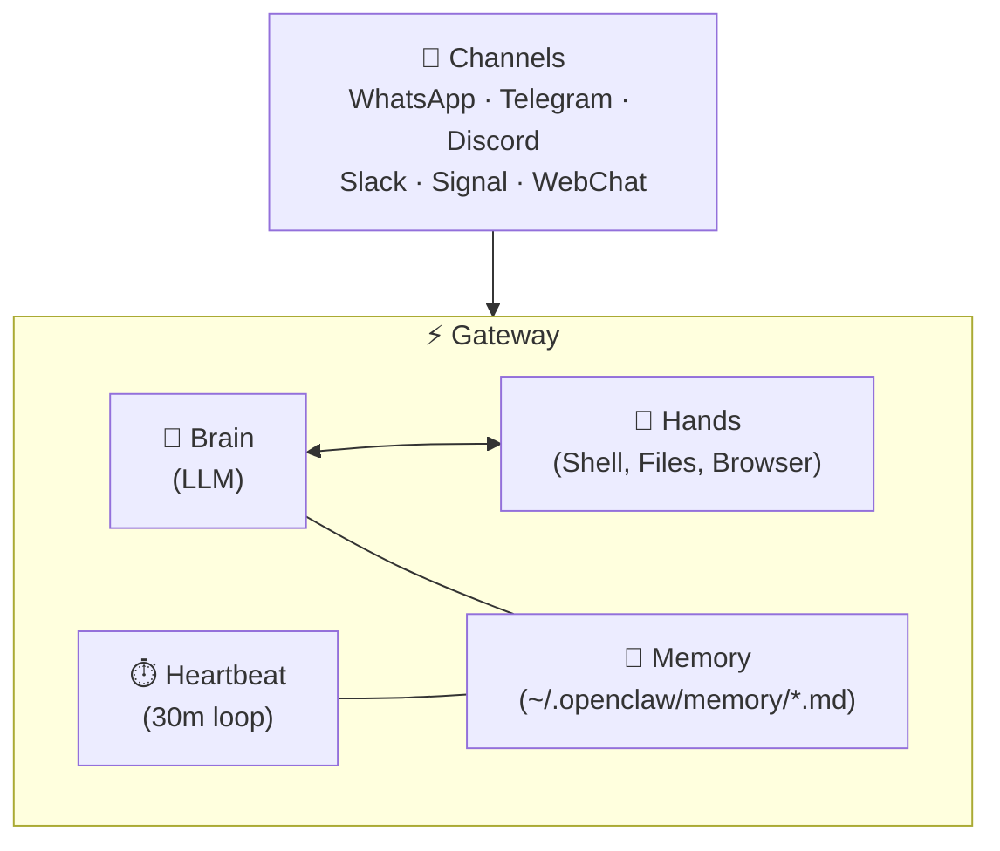

# Core Concepts

Before diving deeper, understand these five core components that make OpenClaw work.

## The Gateway

The **Gateway** is the central nervous system — a single long-running process that orchestrates everything.

```
openclaw gateway
```

It provides:
- A **WebSocket control plane** on port 18789 (default)
- Bridges between the Brain (LLM) and Hands (execution)
- Channel management for all connected messaging platforms
- The heartbeat loop for autonomous operation

The Gateway is designed to run as a **daemon** (background service) that starts on boot.

## The Brain (Reasoning Engine)

The Brain is the LLM that powers OpenClaw's intelligence:

- Makes API calls to your chosen provider (Anthropic, OpenAI, xAI, or local)
- Handles multi-step reasoning and task decomposition
- Decides *what* to do based on context and instructions
- Model-agnostic — swap providers without changing your setup

## The Hands (Execution Environment)

The Hands are what let OpenClaw *do things*:

- **Shell access** — Run commands, install packages, manage processes
- **File system** — Read, write, modify files anywhere on your machine
- **Browser automation** — Fill forms, scrape pages, interact with web apps
- **API calls** — Hit any HTTP endpoint, manage webhooks

:::warning
The Hands have the same permissions as the user running OpenClaw. This is powerful but dangerous. See [Security Hardening](/security/hardening) for how to limit access.
:::

## The Memory System

OpenClaw remembers things across conversations using **local Markdown files**:

```
~/.openclaw/
├── memory/
│   ├── preferences.md    # Your preferences and habits
│   ├── contacts.md       # People it's learned about
│   ├── projects.md       # Active projects and context
│   └── learnings.md      # Things it's figured out
├── HEARTBEAT.md          # Autonomous task definitions
└── config.yml            # Main configuration
```

Memory is:
- **Persistent** — Survives restarts and updates
- **Local** — Never sent to any cloud service
- **Human-readable** — It's just Markdown, you can edit it directly
- **Growing** — The agent builds context over time

## The Heartbeat

The Heartbeat is what makes OpenClaw *autonomous* rather than just *reactive*.

Every N minutes (default: 30), the Gateway sends the agent a heartbeat prompt. The agent:

1. Reads `HEARTBEAT.md` for defined tasks
2. Checks for pending work (unread messages, monitored events)
3. Either responds `HEARTBEAT_OK` (nothing to do) or takes action

This enables proactive behaviors like:
- Monitoring your inbox and flagging urgent messages
- Watching GitHub repos for new issues
- Running scheduled tasks (daily summaries, reports)
- Alerting you about system events

## How They Fit Together



## Skills

Skills are OpenClaw's extension system. Each skill is a Markdown file with YAML frontmatter that defines:

- **What** the skill does
- **When** to activate it
- **What tools** it needs
- **How** to execute

```yaml title="skills/weather.md"
---
name: weather-briefing
trigger: "weather|forecast|temperature"
tools: [web-search, chat]
---

# Weather Briefing

When asked about weather, search for current conditions
and provide a concise briefing with temperature, conditions,
and any weather alerts.
```

Skills can be installed from [ClawHub](/guides/clawhub) or written from scratch. See [Skill Development](/guides/skill-development) for details.

## Next Steps

- [Architecture Overview](/architecture/overview) — Deep dive into each component
- [Basic Usage](/guides/basic-usage) — Common patterns and workflows
- [Configuration](/reference/configuration) — Tune every setting
