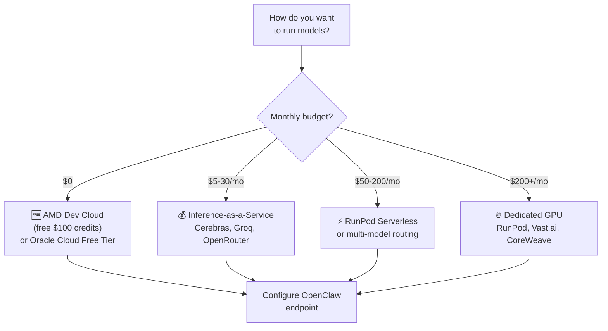

# Cloud GPU & Self-Hosted Models

Don't want to pay per-token API fees but don't have local GPU hardware? You can run open-source models on cloud GPUs and point OpenClaw at them. This guide covers GPU cloud providers, inference-as-a-service, configuration, cost comparisons, and model recommendations.

:::tip
For running models on **your own hardware**, see [Local Models](/guides/local-models). This page focuses on **cloud-hosted** self-hosted inference.
:::

## Quick Decision Guide



---

## GPU Cloud Providers

### Dedicated GPU Cloud

Rent GPUs by the hour and run your own inference server (vLLM, Ollama, etc.).

| Provider | GPU | VRAM | Price/hr | Monthly (24/7) | Notes |
|----------|-----|------|----------|----------------|-------|
| [**Vast.ai**](https://vast.ai) | RTX 4090 | 24 GB | ~$0.44 | ~$320 | Auction model, cheapest |
| [**RunPod**](https://www.runpod.io/pricing) | RTX 4090 | 24 GB | $0.69 | ~$500 | Per-second billing |
| [**Lambda Labs**](https://lambda.ai/pricing) | A100 PCIe | 40 GB | $1.25 | ~$900 | Simple pricing |
| [**RunPod**](https://www.runpod.io/pricing) | A100 80GB | 80 GB | $1.74 | ~$1,250 | Best for 70B models |
| [**CoreWeave**](https://www.coreweave.com/pricing) | A100 80GB | 80 GB | $2.21 | ~$1,590 | Enterprise, InfiniBand |
| [**RunPod**](https://www.runpod.io/pricing) | H100 80GB | 80 GB | $2.79 | ~$2,010 | Fastest inference |
| [**AMD Dev Cloud**](https://www.amd.com/en/developer) | MI300X | 192 GB | **Free** | **Free** ($100 credits) | ~50 hours free |

### GPU Size Guide

| GPU | VRAM | Max Model Size | Best For |
|-----|------|----------------|----------|
| RTX 4090 | 24 GB | 14B FP16, 32B Q4 | Daily driver, coding |
| A100 40GB | 40 GB | 32B FP16, 70B Q4 | Production serving |
| A100 80GB | 80 GB | 70B FP16, 120B Q4 | Large models |
| H100 80GB | 80 GB | 70B FP16, 120B Q4 | Maximum throughput |
| MI300X | 192 GB | 139B FP8 | Largest models (free credits!) |

### RunPod Setup

RunPod has a native vLLM deployment template:

1. Create a RunPod account at [runpod.io](https://www.runpod.io)
2. Deploy a **GPU Pod** with the vLLM template
3. Set the model name (e.g., `Qwen/Qwen3-32B-Instruct`)
4. Set `Max Model Length` to 8192 (or your preferred context window)
5. Note the endpoint URL once initialized

```json5 title="~/.openclaw/openclaw.json"
{
  "brain": {
    "provider": "local",
    "local": {
      "endpoint": "https://your-runpod-endpoint/v1",
      "model": "Qwen/Qwen3-32B-Instruct",
      "type": "openai-compatible"
    }
  }
}
```

#### RunPod Serverless

For bursty usage, RunPod Serverless scales to zero when idle:

| Tier | H100/hr | A100/hr | Billing |
|------|---------|---------|---------|
| Flex Workers | $4.18 | $2.72 | Pay only when running |
| Active Workers | $3.35 | $2.17 | 30% off, always warm |

### Vast.ai Setup

Vast.ai uses an auction model — typically 20-30% cheaper than RunPod but less reliability:

1. Browse available GPUs at [vast.ai](https://vast.ai)
2. Select a GPU and specify your Docker image (e.g., `vllm/vllm-openai:latest`)
3. Set your start command and model
4. Note the endpoint URL

### AMD Developer Cloud (Free!)

AMD offers **$100 free credits** (~50 hours on MI300X with 192 GB HBM3 memory):

1. Sign up at [amd.com/developer](https://www.amd.com/en/developer)
2. Launch an MI300X instance with vLLM pre-installed
3. Run models up to 139B parameters in FP8
4. Additional credits available for public project showcases

---

## Inference-as-a-Service

These providers host open-source models and expose OpenAI-compatible APIs. You pay per token instead of per GPU hour — no infrastructure to manage.

| Provider | 70B Model Cost | Speed | OpenClaw Integration | Best For |
|----------|---------------|-------|---------------------|----------|
| [**Cerebras**](https://www.cerebras.ai) | $0.10/M tokens | 2,957 tok/s | Native (`CEREBRAS_API_KEY`) | Cheapest per-token |
| [**Groq**](https://groq.com/pricing) | Per-token | 18x faster | Native (`GROQ_API_KEY`) | Lowest latency |
| [**OpenRouter**](https://openrouter.ai) | Varies by route | Varies | Native (first-class) | Auto-cheapest routing |
| [**Together AI**](https://www.together.ai/pricing) | ~$0.88/M tokens | Fast | `openai-completions` | Fine-tuning support |
| [**Fireworks AI**](https://fireworks.ai/pricing) | ~$0.90/M tokens | Fast | `openai-completions` | Batch inference (50% off) |
| [**Replicate**](https://replicate.com) | Per-prediction | Cold starts | `openai-completions` | Occasional use |
| [**Modal**](https://modal.com/pricing) | Per GPU cycle | Scales to zero | Custom endpoint | Bursty workloads |

### Cerebras Configuration

The cheapest per-token option at $0.10/M tokens with the fastest output speed.

```bash title="~/.openclaw/env"
CEREBRAS_API_KEY=your-key-here
```

OpenClaw picks it up natively — no additional config needed. Base URL: `https://api.cerebras.ai/v1`

### Groq Configuration

LPU hardware delivers up to 18x faster inference than traditional GPUs.

```bash title="~/.openclaw/env"
GROQ_API_KEY=your-key-here
```

Native provider — set key and go.

### OpenRouter Configuration

Meta-provider that aggregates Together AI, Fireworks, Groq, Cerebras, and more. Automatically routes to the cheapest or fastest provider.

```bash title="~/.openclaw/env"
OPENROUTER_API_KEY=your-key-here
```

Use models with the format `openrouter/<author>/<slug>`. First-class support in OpenClaw.

### Custom OpenAI-Compatible Provider

For Together AI, Fireworks, or any provider with an OpenAI-compatible API:

```json title="~/.openclaw/openclaw.json"
{
  "models": {
    "providers": {
      "together-ai": {
        "baseUrl": "https://api.together.xyz/v1",
        "apiKey": "${TOGETHER_API_KEY}",
        "api": "openai-completions",
        "models": [
          {"id": "meta-llama/Llama-3.1-70B-Instruct", "name": "Llama 3.1 70B"}
        ]
      }
    }
  }
}
```

:::danger
The `api` field is **required**. Omitting it causes a crash with "No API provider registered" ([Issue #6054](https://github.com/openclaw/openclaw/issues/6054)). Use `"openai-completions"` or `"openai-responses"`.
:::

---

## Inference Server Options

If you're renting your own GPU, you need an inference server. All of these expose OpenAI-compatible endpoints.

| Server | Best For | Throughput | Setup |
|--------|----------|-----------|-------|
| **vLLM** | Production, multi-user | Highest | `pip install vllm` |
| **Ollama** | Quick start | Good (single-user) | Single binary |
| **llama.cpp** | CPU-only, edge | Good | C++ build |
| **TGI** (HuggingFace) | Enterprise | High | Docker |
| **TabbyAPI** | Consumer GPUs (EXL2) | Fast | Python |
| **LocalAI** | Multi-backend | Varies | Docker |
| **LM Studio** | Desktop with GUI | Good | App download |

### vLLM (Recommended for Cloud)

The gold standard for cloud GPU inference:

```bash
pip install vllm

vllm serve Qwen/Qwen3-32B-Instruct \
  --host 0.0.0.0 \
  --port 8090 \
  --max-model-len 8192
```

```json5 title="~/.openclaw/openclaw.json"
{
  "brain": {
    "provider": "local",
    "local": {
      "endpoint": "http://your-server:8090/v1",
      "model": "Qwen/Qwen3-32B-Instruct",
      "type": "openai-compatible"
    }
  }
}
```

vLLM supports both NVIDIA (CUDA) and AMD (ROCm) GPUs.

### TabbyAPI (Best for Consumer GPUs)

Uses ExllamaV2/V3 for maximum speed on RTX 3090/4090 with EXL2/GPTQ quantized models:

```bash
git clone https://github.com/theroyallab/tabbyAPI
cd tabbyAPI && pip install -e .
python main.py --model Qwen3-32B-EXL2 --port 5000
```

Exposes both OpenAI-compatible and KoboldAI-compatible APIs.

---

## OpenClaw Configuration Deep Dive

### Config File Locations

| File | Purpose | Permissions |
|------|---------|------------|
| `~/.openclaw/openclaw.json` | Provider settings, model IDs, agent config | 644 |
| `~/.openclaw/env` | API keys and secrets | **600** |
| `~/.openclaw/openclaw.json` | Gateway and brain config | 644 |

### Full Custom Provider Example

```json title="~/.openclaw/openclaw.json"
{
  "models": {
    "providers": {
      "my-runpod-vllm": {
        "baseUrl": "https://abc123-8090.proxy.runpod.net/v1",
        "apiKey": "${RUNPOD_API_KEY}",
        "api": "openai-completions",
        "models": [
          {"id": "qwen3-32b", "name": "Qwen3 32B"},
          {"id": "deepseek-r1-distill-32b", "name": "DeepSeek R1 Distill 32B"}
        ]
      }
    }
  }
}
```

### Key Configuration Rules

| Rule | Detail |
|------|--------|
| `baseUrl` must end with `/v1` | Common misconfiguration — OpenClaw won't connect without it |
| `api` field is required | Use `"openai-completions"` or `"openai-responses"` |
| Environment variable substitution | Use `${ENV_VAR}` syntax in config files |
| Model format | Use `provider-name/model-id` when selecting models |
| Context window | Must match `--max-model-len` in your inference server |

### Provider Priority

When multiple providers are configured, OpenClaw selects in this order:

> Anthropic > OpenAI > OpenRouter > Gemini > xAI > Groq > Mistral > Cerebras > ...

To force a specific provider, set the model explicitly using `provider/model-id` format.

### Known Issues

| Issue | Problem | Workaround |
|-------|---------|-----------|
| [#6054](https://github.com/openclaw/openclaw/issues/6054) | Missing `api` field crashes gateway | Always include `"api": "openai-completions"` |
| [#7211](https://github.com/openclaw/openclaw/issues/7211) | Sub-agents ignore local providers | Sub-agents may default to cloud APIs |
| [#4857](https://github.com/openclaw/openclaw/issues/4857) | "Unhandled API in mapOptionsForApi" | Caused by missing `api` field |

---

## Cost Comparison

### Monthly Costs by Approach

| Approach | Monthly Cost | Quality | Latency |
|----------|-------------|---------|---------|
| Anthropic/OpenAI API (light) | $5-20 | Best | Low |
| Cerebras/Groq/OpenRouter | $5-30 | Good | Very low |
| Anthropic/OpenAI API (heavy) | $50-100 | Best | Low |
| RunPod serverless (bursty) | $50-200 | Good | Medium |
| Vast.ai RTX 4090 (24/7) | ~$320 | Good | Low |
| RunPod RTX 4090 (24/7) | ~$500 | Good | Low |
| RunPod A100 80GB (24/7) | ~$1,250 | Great | Low |
| Anthropic/OpenAI (agent-heavy) | $200-700 | Best | Low |

### When Self-Hosting Wins

- You run agents **24/7** and would spend $200+/mo on API keys
- **Privacy** is a hard requirement — no data leaves your infrastructure
- You already have GPU hardware or free credits
- You want to **fine-tune** models for your specific tasks

### When API Keys Win

- You need **frontier-quality** reasoning (Claude Opus, GPT-5 level)
- Usage is **intermittent** ($5-50/mo)
- You value **time over money** — API keys are zero maintenance
- Complex multi-step agent tasks that need the best model available

### Smart Multi-Model Routing

The most cost-effective approach uses **different models for different tasks**:

| Task | Recommended Model | Cost/M Tokens | Why |
|------|-------------------|---------------|-----|
| Heartbeats | Gemini 2.5 Flash-Lite | ~$0.50 | Ultra-cheap coordination |
| Sub-agents | DeepSeek R1 | ~$2.74 | Good reasoning, low cost |
| Coding | DeepSeek Coder v2 | ~$2 | Strong code generation |
| Complex tasks | Claude Opus / GPT-5 | $15-30 | Frontier quality |

Configure hybrid routing in OpenClaw:

```json5 title="~/.openclaw/openclaw.json"
{
  "brain": {
    "provider": "anthropic",
    "model": "claude-opus-4-6",
    "heartbeat_override": {
      "provider": "local",
      "local": {
        "endpoint": "http://localhost:11434",
        "model": "qwen3:14b",
        "type": "ollama"
      }
    }
  }
}
```

This approach can **cut costs by 50%+** while maintaining quality for critical tasks.

---

## Recommended Models

:::tip
For a comprehensive model selection guide covering cloud, local, and hybrid setups, see the **[Model Selection Guide](/guides/model-selection)**.
:::

### By VRAM Budget

| VRAM | Model | Use Case |
|------|-------|----------|
| **8 GB** (minimum) | Llama 3 8B, DeepSeek-R1 7B | Basic tasks, simple chat |
| **12-16 GB** | Qwen3 14B, DeepSeek-R1-Distill-Qwen-14B | General use, coding |
| **24 GB** (RTX 4090) | **Qwen3 32B** (Q4), DeepSeek-R1-Distill-32B (Q4) | Daily driver |
| **40-80 GB** (A100) | Qwen3 32B (FP16), Llama 3.1 70B (Q4) | Production quality |
| **192 GB** (MI300X) | Llama 3.1 70B (FP16), 139B models (FP8) | Near cloud-quality |

### Community Consensus

From community discussions and benchmarks:

- **Qwen3 32B** — the "daily driver" for coding, reasoning, and tool use
- **DeepSeek-R1-Distill-32B** — best for complex planning and reasoning
- **Qwen 2.5 Coder 32B** — when building new skills or code-heavy work
- **Qwen3 14B** — recommended by OpenClaw docs for 16 GB setups

:::warning
**Avoid models under 8B parameters** for OpenClaw — they hallucinate tool calls and lose context mid-task. OpenClaw's agentic workflows require reliable instruction following.
:::

### Quality Reality Check

> "The most impressive OpenClaw demos run on Claude Opus via API, not local models. If you want that level of capability locally, budget for serious hardware (48GB+ VRAM) and accept you're still behind the frontier."
> — [GitHub Discussion #5719](https://github.com/openclaw/openclaw/discussions/5719)

---

## Security

If running inference servers on cloud GPUs:

- **Always use a reverse proxy with TLS** — never expose raw inference endpoints
- **Use VPN or Cloudflare Zero-Trust tunnel** for remote access
- **Set API keys** even on self-hosted servers (vLLM supports `--api-key`)
- **Run `openclaw security audit`** regularly
- **Restrict network access** to only the OpenClaw gateway

See [Security Hardening](/security/hardening) for full guidance.

## See Also

- [Local Models](/guides/local-models) — Running models on your own hardware
- [Brain & Hands Architecture](/architecture/brain-and-hands) — How OpenClaw integrates with LLM providers
- [Configuration Reference](/reference/configuration) — All model and provider settings
- [Hosting Providers](/guides/hosting-providers) — Managed hosting with API keys
- [Deployment Options](/guides/deployment-options) — Self-hosted deployment methods
