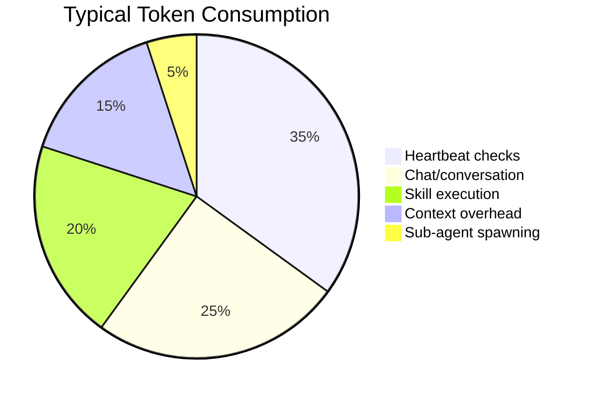

# Cost Management

OpenClaw's default configuration sends everything to one model, includes full conversation history, and heartbeats fire every 30 minutes. Without tuning, **active use can cost $300-750/month**. This guide covers what drives costs, how to control them, and real strategies that have achieved up to **97% cost reductions**.

:::danger Real Horror Stories
These are documented incidents, not hypotheticals:
- **$3,600/month** — Federico Viticci's "Navi" assistant consumed 180M Anthropic tokens in one month
- **$20 overnight** — Benjamin De Kraker's heartbeat drained his entire balance checking "is it daytime yet?" every 30 minutes at $0.75/check
- **$200/day** — An automated task stuck in an infinite loop, churning tokens while accomplishing nothing
- **$8 per 30 min** — Processing Moltbook browsing content, adding up to $380+/day
:::

---

## Where Does the Money Go?

### Cost Breakdown by Component



### Heartbeat Costs

The heartbeat is the biggest silent cost driver. Each heartbeat sends the **entire context window** to the API:

| Model | Cost per Heartbeat (~120K tokens) | Monthly (48/day) |
|-------|----------------------------------|-------------------|
| Claude Opus 4.5 | ~$0.75 | ~$1,080 |
| Claude Sonnet 4.5 | ~$0.45 | ~$648 |
| Claude Haiku | ~$0.15 | ~$216 |
| Gemini 2.5 Flash | ~$0.05 | ~$72 |
| Gemini 2.5 Flash-Lite | ~$0.01 | ~$14 |
| Local (Ollama) | $0.00 | **$0** |

> "Using Opus for a heartbeat is like hiring a lawyer to check your mailbox."

### Context Accumulation

Every request sends the full conversation history. One user's session grew to **1.4 MB / 100K tokens** of pure overhead. System prompts alone are 5,000-10,000 tokens and are resent with every API call.

### What Causes Runaway Costs

| Cause | Impact | Example |
|-------|--------|---------|
| **Infinite loops** | Tokens burn on repeated failures | Tool validation fails, error appended to context, model retries endlessly |
| **Context snowball** | Cost per request grows over time | Session at 56-58% of 400K window means 200K+ cached tokens per query |
| **Wrong model for task** | 60x overpayment | Opus for heartbeat vs. Flash-Lite |
| **Thinking mode** | 10-50x token explosion | Extended reasoning on simple tasks |
| **No spending limits** | Unpredictable bills | Overnight drain with no caps configured |
| **Large tool outputs** | Massive context per loop | 1M file paths sent with full history on every iteration |

---

## Optimization Strategies

### 1. Model Routing (Biggest Impact)

Use different models for different tasks. The cost difference between Opus and Flash-Lite is **60x**.

| Task Type | Recommended Model | Cost/1M Tokens | Notes |
|-----------|------------------|----------------|-------|
| Heartbeat checks | Gemini 2.5 Flash-Lite | **$0.50** | No quality difference for simple checks |
| Simple tasks | Gemini 3 Flash | **$0.15** | Quick lookups, status checks |
| Long context | Kimi K2.5 | **$0.50** | Large document handling |
| Coding | Gemini 3 Pro | **$1.25** | Mid-tier reasoning |
| Quick responses | Claude Haiku | **$1.00/$5.00** | 90% of Sonnet quality at 1/3 price |
| Mid-tier general | Claude Sonnet | **$3.00/$15.00** | Good balance |
| Complex reasoning | Claude Opus 4.5 | **$5.00/$25.00** | Reserve for complex tasks only |
| Budget alternative | DeepSeek V3.2 | **$0.53** | 60x cheaper than Opus |

Configure hybrid routing:

```yaml title="~/.openclaw/config.yml"
brain:
  provider: "anthropic"
  model: "claude-sonnet-4"

  # Use local model for heartbeat
  heartbeat_override:
    provider: "local"
    local:
      endpoint: "http://localhost:11434"
      model: "qwen3:14b"
      type: "ollama"
```

### 2. Context Window Management

| Strategy | How | Impact |
|----------|-----|--------|
| **Start fresh sessions** | Use `/new` or `/reset` regularly | Prevents context snowball |
| **Compact context** | Use `/compact` to summarize old messages | Frees window space |
| **Limit context size** | `openclaw config set max_context_tokens 8000` | Per-session cost dropped from $0.40 to $0.05 |
| **Limit response size** | `openclaw config set max_tokens_per_request 4000` | Prevents verbose responses |
| **Daily auto-reset** | Default 4:00 AM local time | Creates fresh session automatically |

### 3. Heartbeat Tuning

Configure active hours to stop overnight token drain:

```json title="~/.openclaw/openclaw.json"
{
  "heartbeat": {
    "every": "1h",
    "activeHours": {
      "start": "08:00",
      "end": "22:00"
    }
  }
}
```

| Setting | Cost Impact |
|---------|-------------|
| Increase interval from 30m to 1h | **-50%** heartbeat cost |
| Increase interval from 30m to 2h | **-75%** heartbeat cost |
| Set active hours (14h/day vs 24h) | **-42%** heartbeat cost |
| Use local model for heartbeat | **-100%** heartbeat cost |
| Set to `0m` | Disables heartbeats entirely |

### 4. Disable Thinking Mode for Routine Tasks

Thinking/reasoning mode can increase token usage by **10-50x**. Disable it for routine tasks:

```json5 title="~/.config/openclaw/config.json5"
{
  "thinking": "disabled"
}
```

### 5. Leverage Prompt Caching

Anthropic prompt caching charges cache hits at only **10% of normal cost**:

- OpenClaw automatically applies `cacheRetention: "short"` (5-minute cache)
- System prompts (5K-10K tokens) only charged once during cache validity
- High-frequency users save **30-50%** with caching
- Extend with `cacheRetention: "long"` in model config

### 6. Use Existing Subscriptions (Zero Additional Cost)

If you already pay for a subscription, connect it to OpenClaw with **no additional API costs**:

| Subscription | Monthly Cost | How to Connect |
|-------------|-------------|----------------|
| Claude Pro | $20/month | Authenticate via claude-cli |
| Claude Max | $100/month | Same method, higher limits |
| ChatGPT Plus | $20/month | Connect API key |
| Google One AI Premium | $20/month | Connect API key |

During onboarding, select "Anthropic" as your provider, then choose "Claude Code CLI" as the auth method to use your existing subscription.

---

## Budget Controls

### Set Spending Limits

```bash
# OpenClaw built-in limits
openclaw config set daily_budget_usd 5.00
openclaw config set monthly_budget_usd 50.00
```

### Provider-Level Alerts

| Provider | How | Recommendation |
|----------|-----|---------------|
| **Anthropic** | Dashboard spending alerts | Set alerts at 50%, 75%, 90% of budget |
| **OpenAI** | Hard monthly spending caps | Configure directly in dashboard |
| **OpenRouter** | Built-in spending tracking | Monitor across all routed models |

### Model Failover Chain

```json title="~/.openclaw/openclaw.json"
{
  "models": {
    "primary": "anthropic/claude-sonnet-4",
    "fallback": "anthropic/claude-haiku",
    "complex": "anthropic/claude-opus-4.5"
  }
}
```

---

## Real Cost Data

### Monthly Spending by Usage Pattern

| Usage Pattern | Monthly Cost | Description |
|--------------|-------------|-------------|
| **Free / Minimal** | $0-8 | Local models (Ollama) or existing subscription |
| **Light / Casual** | $10-30 | Few commands per day, basic automation |
| **Moderate** | $30-70 | Regular file tasks, research, moderate chat |
| **Power User** | $70-200 | Constant automation, long sessions |
| **Heavy / Always-On** | $300-750 | Full proactive assistant, multiple integrations |
| **Enterprise / Opus** | $500-5,000 | Full-time Opus agent, heavy tool usage |

> The median: **90% of users spend under $12/day**, and the average developer spends roughly **$100-200/month**.

### Additional Costs

| Component | Cost | Notes |
|-----------|------|-------|
| OpenClaw software | **$0** | MIT open source |
| Local hardware | **$0** | Your own machine |
| VPS hosting | **$5-20/month** | Optional, for always-on |
| API keys | Variable | See usage patterns above |

---

## The $1,200 to $36 Case Study

A documented case achieved a **97% cost reduction** by combining five changes:

| Change | Effect |
|--------|--------|
| 1. Local search (QMDskill with BM25 + vector) | Token usage dropped 95% |
| 2. Session context reduction (50KB to 8KB) | Per-session cost: $0.40 to $0.05 |
| 3. Free web search via Exa AI | Eliminated paid search tokens |
| 4. Automatic model routing | Right model for each task |
| 5. Local heartbeat handling | Eliminated recurring paid heartbeats |

These reductions **compound multiplicatively** — $1,200/month became $36/month.

---

## Monitoring Tools

### Built-in

| Command | What It Shows |
|---------|--------------|
| `/status` | Agent reachability, context usage, current model |
| `/usage full` | Token usage for every response |

### Third-Party Dashboards

| Tool | Features |
|------|----------|
| [**Clawalytics**](https://www.clawalytics.com/) | Real-time spending dashboard, per-agent breakdowns, daily cost charts, suspicious activity alerts |
| [**ClawWatcher**](https://news.ycombinator.com/item?id=46954200) | Real-time token usage, cost per model, skills/actions tracking |
| [**claw-dash**](https://github.com/openclaw/openclaw/discussions/8277) | Sessions, tokens (24h), costs, model info, cron jobs, system health gauges |
| [**openclaw-dashboard**](https://github.com/tugcantopaloglu/openclaw-dashboard) | Browser notifications for usage limits, cost analysis by model |
| [**OpenClaw Cost Calculator**](https://calculator.vlvt.sh/) | Pre-deployment cost estimation |

### OpenRouter Auto-Routing

For centralized model routing, OpenRouter can automatically select the most cost-effective model per prompt using `openrouter/openrouter/auto` — single API key for all providers with built-in cost tracking.

---

## Quick-Start: Cut Costs Today

If you're spending too much right now, apply these changes immediately:

1. **Switch heartbeat to a cheap model** — biggest single savings
2. **Set active hours** — stop overnight token drain
3. **Set daily and monthly budget limits** — prevent surprises
4. **Use `/compact` regularly** — prevent context snowball
5. **Disable thinking mode** for routine tasks

```yaml title="~/.openclaw/config.yml — Minimum cost configuration"
brain:
  provider: "anthropic"
  model: "claude-sonnet-4"

  heartbeat_override:
    provider: "local"
    local:
      endpoint: "http://localhost:11434"
      model: "llama3.1:8b"
      type: "ollama"
```

```json title="~/.openclaw/openclaw.json — Budget limits"
{
  "heartbeat": {
    "every": "1h",
    "activeHours": {
      "start": "08:00",
      "end": "22:00"
    }
  }
}
```

```bash
openclaw config set daily_budget_usd 5.00
openclaw config set monthly_budget_usd 50.00
```

---

## See Also

- [Local Models](/guides/local-models) — Zero-cost local inference
- [Cloud GPU & Self-Hosted Models](/guides/cloud-gpu-models) — Cost comparison of cloud GPU options
- [Heartbeat System](/architecture/heartbeat) — How heartbeat scheduling works
- [Configuration Reference](/reference/configuration) — All cost-related settings
- [Real-World Use Cases](/guides/use-cases) — Cost data from real deployments
