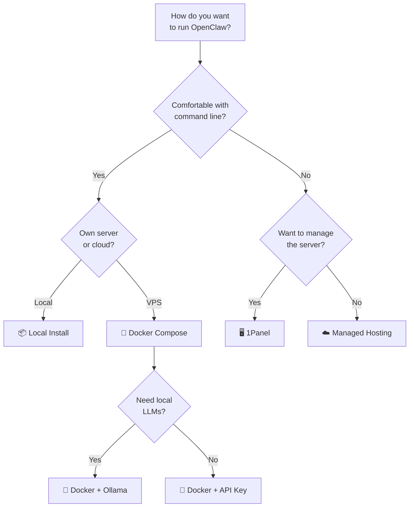

# Deployment Options

OpenClaw can be deployed in many ways, from a simple local install to fully managed cloud hosting. This guide compares the major options.

## Quick Comparison

| Method | Difficulty | Best For | Cost |
|--------|-----------|----------|------|
| [Local install](/getting-started/installation) | Easy | Personal use, development | Free (+ LLM API) |
| [Docker](#docker) | Medium | Self-hosters, VPS | Free (+ VPS + LLM API) |
| [1Panel](#1panel) | Easy | VPS with GUI management | Free (+ VPS + LLM API) |
| [Coolify](#coolify) | Easy | Self-hosted PaaS users | Free (+ VPS + LLM API) |
| [DigitalOcean 1-Click](#digitalocean) | Easy | Quick cloud deploy | From $24/mo |
| [Hostinger Template](#hostinger) | Easy | Budget VPS | From $5/mo + LLM API |
| [Managed Hosting](#managed-hosting) | Easiest | Non-technical users | Varies |

## Docker {#docker}

The official Docker image is the most popular self-hosted deployment method.

```bash
# Pull the latest image
docker pull openclaw/openclaw:latest

# Run with Docker Compose (recommended)
curl -fsSL https://docs.openclaw.ai/docker-compose.yml -o docker-compose.yml
docker compose up -d
```

The Docker setup:
1. Builds the OpenClaw image locally
2. Runs the onboarding wizard inside the container
3. Generates a gateway token for accessing the Control UI
4. Creates necessary configuration volumes
5. Starts the Gateway via Docker Compose

```yaml title="docker-compose.yml (example)"
services:
  openclaw:
    image: openclaw/openclaw:latest
    ports:
      - "18789:18789"
    volumes:
      - openclaw-data:/root/.openclaw
    environment:
      - ANTHROPIC_API_KEY=${ANTHROPIC_API_KEY}
    restart: unless-stopped

volumes:
  openclaw-data:
```

:::danger
**Never bind port 18789 to `0.0.0.0` without authentication.** Use `127.0.0.1:18789:18789` or put OpenClaw behind a reverse proxy with auth.
:::

### Docker with Local Models

To run OpenClaw with Ollama for fully local inference:

```yaml title="docker-compose.yml"
services:
  openclaw:
    image: openclaw/openclaw:latest
    ports:
      - "127.0.0.1:18789:18789"
    volumes:
      - openclaw-data:/root/.openclaw
    environment:
      - OPENCLAW_BRAIN_PROVIDER=ollama
      - OLLAMA_HOST=http://ollama:11434
    depends_on:
      - ollama
    restart: unless-stopped

  ollama:
    image: ollama/ollama:latest
    volumes:
      - ollama-data:/root/.ollama
    deploy:
      resources:
        reservations:
          devices:
            - driver: nvidia
              count: all
              capabilities: [gpu]
    restart: unless-stopped

volumes:
  openclaw-data:
  ollama-data:
```

## 1Panel {#1panel}

[1Panel](https://github.com/1Panel-dev/1Panel) is an open-source web-based Linux server management panel with an **App Store** that includes OpenClaw as a one-click install.

### Why 1Panel?

- **GUI-based management** — No command line required after initial setup
- **One-click OpenClaw install** from the App Store
- **Ollama integration** — Install local LLMs alongside OpenClaw
- **Built-in monitoring** — CPU, memory, disk, network dashboards
- **Docker management** — Visual container management
- **Backup/restore** — One-click backup to cloud storage
- **Firewall management** — Security hardening through the UI
- **33,300+ GitHub stars** — Large, active community

### Installing 1Panel

```bash
# One-line install on any Linux server
bash -c "$(curl -sSL https://resource.fit2cloud.com/1panel/package/v2/quick_start.sh)"
```

After installation, access the web panel at `http://your-server:port` (the installer will show you the URL and credentials).

### Installing OpenClaw via 1Panel

1. Open the 1Panel web interface
2. Navigate to **App Store**
3. Search for **OpenClaw**
4. Click **Install**
5. Configure your LLM API key and other settings
6. Click **Confirm**

1Panel uses the `1panel/openclaw` Docker image and handles all the container management, volume mounts, and networking for you.

### Managing OpenClaw in 1Panel

Once installed, you can:
- **Start/stop/restart** the OpenClaw container
- **View logs** in real-time
- **Update** to new versions with one click
- **Configure** environment variables
- **Monitor** resource usage (CPU, memory)
- **Backup** configuration and memory data

### 1Panel Specs

| Detail | Value |
|--------|-------|
| Repository | [github.com/1Panel-dev/1Panel](https://github.com/1Panel-dev/1Panel) |
| License | GPLv3 (Pro tier available) |
| Stack | Go backend, Vue.js frontend |
| Stars | 33,300+ |
| OpenClaw image | `1panel/openclaw` on Docker Hub |

## Coolify {#coolify}

[Coolify](https://coolify.io) is a self-hosted PaaS (like Heroku) that supports OpenClaw deployment.

```bash
# Deploy via Coolify's one-click service
# (from the Coolify dashboard, select OpenClaw from the service catalog)
```

Multiple community forks exist for optimized Coolify deployments. See [coolify.io/docs/services/openclaw](https://coolify.io/docs/services/openclaw) for the official guide.

## DigitalOcean 1-Click {#digitalocean}

DigitalOcean offers a pre-configured Droplet image with OpenClaw:

- Security-hardened configuration out of the box
- Starts at **$24/month** (4GB RAM Droplet)
- Automatic updates available
- Production-ready Gateway configuration

Deploy from the [DigitalOcean Marketplace](https://marketplace.digitalocean.com/apps/openclaw).

## Hostinger {#hostinger}

Hostinger provides a one-click OpenClaw Docker template for their VPS plans:

- Budget-friendly starting at **~$5/month**
- Docker template pre-configured
- Step-by-step setup guide provided

## Managed Hosting {#managed-hosting}

For users who don't want to manage infrastructure at all, several managed hosting providers have emerged:

- **OpenClawd** — Dedicated managed hosting for OpenClaw with automatic updates and monitoring
- Various other providers listed on [Product Hunt alternatives](https://www.producthunt.com/products/clawdbot-2/alternatives)

:::warning
With managed hosting, your conversations and data pass through a third party's infrastructure. Review the provider's privacy policy carefully. Self-hosting gives you full control over your data.
:::

## Choosing the Right Option



### Minimum Server Requirements

| Setup | RAM | CPU | Storage | GPU |
|-------|-----|-----|---------|-----|
| API-only (Anthropic/OpenAI) | 1 GB | 1 vCPU | 5 GB | None |
| With Ollama (small models) | 8 GB | 4 vCPU | 20 GB | Optional |
| With Ollama (large models) | 32 GB | 8 vCPU | 50 GB | Recommended |

## See Also

- [Installation](/getting-started/installation) — Local installation guide
- [Local Models](/guides/local-models) — Running with Ollama or vLLM
- [Security Hardening](/security/hardening) — Securing any deployment
- [WebClaw](/guides/webclaw) — Browser-based client for remote access
- [Ecosystem](/reference/ecosystem) — All community tools and projects
