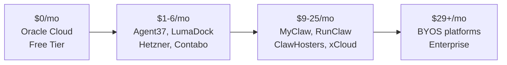

# Hosting Providers

The OpenClaw hosting market exploded in early 2026, with **35+ providers** now competing across managed hosting, VPS templates, and enterprise tiers. This guide compares them all.

:::tip
Not sure whether to self-host or use managed hosting? See [Deployment Options](/guides/deployment-options) for a comparison of all deployment methods including Docker, Kubernetes, and Cloudflare Workers.
:::

## Pricing at a Glance

## Quick Comparison

| Provider | Type | From | Local LLMs | GDPR | Best For |
|----------|------|------|-----------|------|----------|
| [Oracle Cloud](#oracle-cloud) | Free VPS | **$0/mo** | Yes | No | Free hosting with Ollama |
| [Agent37](#agent37) | Managed (shared) | $0.99/mo | No | — | Cheapest managed |
| [LumaDock](#lumadock) | VPS template | $1.99/mo | Possible | — | Budget VPS |
| [Hetzner](#hetzner) | DIY VPS | ~$4/mo | Yes | Yes | Best value self-host |
| [Alibaba Cloud](#alibaba-cloud) | VPS template | $4/mo | Yes (Qwen) | No | Asia-Pacific, Qwen models |
| [Contabo](#contabo) | VPS template | €4.50/mo | Possible | Partial | Global budget VPS |
| [Railway](#railway) | PaaS | $5/mo | No | No | Testing / development |
| [Hostinger](#hostinger) | VPS template | $5.99/mo | Possible | — | Budget VPS with AI credits |
| [MyClaw.ai](#myclawai) | Managed | $9/mo | No | Partial | Cheapest dedicated managed |
| [OpenClaw Launch](#openclawlaunch) | Managed | $6/mo | No | No | AI credits, fast setup |
| [RunClaw.ai](#runclawai) | Managed | ~$13/mo | No | Yes | Transparent managed (Hetzner DE) |
| [OpenClaw Cloud](#openclaw-cloud) | Managed | $19/mo | Free model | Yes | Free trial, own URL |
| [ClawHosters](#clawhosters) | Managed VPS | €19/mo | — | Yes | GDPR, German servers |
| [Molty Hosting](#molty-hosting) | Managed | $19.99/mo | No | — | WebChat dashboard |
| [ClawBook.io](#clawbookio) | Managed | $20/mo | — | Partial | Crypto payments, global |
| [xCloud](#xcloud) | Managed | $24/mo | No | Partial | Beginners, white-label |
| [DigitalOcean](#digitalocean) | VPS 1-Click | $24/mo | No | No | Developers |
| [ClawdHost](#clawdhost) | Managed | $25/mo | No | — | Simple single plan |
| [BoostedHost](#boostedhost) | VPS | Varies | Possible | — | Performance, Auto-Burst |
| [OpenClawHosting.io](#openclawhosting) | BYOS Managed | $29/mo | Yes (GPU) | — | Multi-instance teams |
| [MoltBotHost](#moltbothost) | BYOS Managed | $29/mo | Yes (GPU) | Partial | Bring your own server |
| [WZ-IT](#wz-it) | Enterprise (DE) | Custom | Yes (GPU) | Yes | Enterprise GDPR |
| [NEAR AI Cloud](#near-ai) | TEE hosting | Beta | No | Yes (TEE) | Hardware-level privacy |

:::warning
**API costs are separate.** Most providers require you to bring your own LLM API keys ($20-60/month typical). Some users have reported bills of **$3,600/month** from uncontrolled agent loops. Set spending limits on your API accounts.
:::

---

## Fully Managed Hosting

These providers handle everything — no VPS, Docker, or terminal skills needed.

### xCloud {#xcloud}

The most marketed managed provider, positioning itself as "the only truly managed option that eliminates all DevOps."

- **URL**: [xcloud.host/openclaw-hosting](https://xcloud.host/openclaw-hosting/)
- **Price**: $24/month | 7-day money-back guarantee
- **Setup**: ~5 minutes, no Docker/terminal
- **Channels**: Telegram, WhatsApp (Discord, Slack, Signal on Q2 2026 roadmap)
- **Features**: Free SSL, daily encrypted backups, 24/7 live expert support
- **Local LLMs**: No — API keys only (BYOK)
- **Also offers**: White-label enterprise tier with SLA

### MyClaw.ai {#myclawai}

The most affordable fully managed option with dedicated instances.

- **URL**: [myclaw.ai](https://myclaw.ai)
- **Pricing**:

| Plan | Price | Features |
|------|-------|----------|
| Lite | $9/mo | Always-on, auto-updates, daily backups |
| Pro | $19/mo | + Priority support |
| Max | $39/mo | + Dedicated resources |

- **Channels**: WhatsApp, Telegram, Discord, Slack
- **Security**: Isolated container per plan with encrypted access

### OpenClaw Launch {#openclawlaunch}

Visual configurator with one-click deploy — configure your OpenClaw instance in-browser and launch in under 30 seconds.

- **URL**: [openclawlaunch.com](https://openclawlaunch.com)
- **Pricing**:

| Plan | Price | Features |
|------|-------|----------|
| Lite | $6/mo | 1 instance, AI credits included |
| Pro | $20/mo | Up to 3 instances, more AI credits, dedicated resources |

- **Setup**: Under 30 seconds — no terminal, no Docker knowledge needed
- **Channels**: Telegram, Discord, Web gateway
- **Features**: Browser-based visual configurator, isolated Docker containers, E2E encryption

### OpenClaw Cloud {#openclaw-cloud}

Includes a free AI model and custom URL.

- **URL**: [setupopenclaw.com](https://setupopenclaw.com)
- **Price**: $19/month | **3-day free trial** (no card required)
- **Setup**: 60 seconds
- **Features**: Dedicated server (not shared), free AI model + skills pre-installed, daily encrypted backups, auto-updates, custom URL
- **GDPR**: Data encrypted at rest and in transit, full data export

### OpenClawd.ai {#openclawdai}

The original managed hosting provider, launched when users struggled with self-hosting.

- **URL**: [openclawd.ai](https://openclawd.ai)
- **Pricing**: Free tier + premium (pricing not public)
- **Features**: One-click deploy, handles security patches, uptime monitoring, API management
- **Coverage**: Featured in [Yahoo Finance](https://finance.yahoo.com/news/openclawd-ai-launches-hosted-platform-143600648.html)

### ClawdHost {#clawdhost}

Simple single-plan pricing.

- **URL**: [clawdhost.net](https://clawdhost.net)
- **Price**: $25/month — all features included
- **Setup**: 60 seconds
- **Channels**: WhatsApp, Telegram, Discord, Slack
- **Features**: Dedicated instance, unlimited tasks

### Clawhost.dev {#clawhostdev}

Open-source hosting platform with CLI deployment.

- **URL**: [clawhost.dev](https://www.clawhost.dev)
- **Price**: $25/month | 99.9% uptime
- **Setup**: `npx clawd deploy`
- **Features**: Custom domains, isolated containers with E2E encryption, supports Claude/GPT/Gemini Pro

### RunClaw.ai {#runclawai}

The most transparent managed provider — provisions a dedicated Hetzner VM in Germany.

- **URL**: [runclaw.ai](https://runclaw.ai)
- **Price**: ~$13/month
- **Features**: Dedicated VM (not shared), Docker sandbox, UFW firewall, fail2ban, SSH key-only auth, auto-updates
- **GDPR**: Hetzner Germany infrastructure
- **Notable**: Described as "most transparent about infrastructure" by [bestclawhosting.com](https://www.bestclawhosting.com/)

### Agent37 {#agent37}

The cheapest managed hosting — shared containers with per-tenant isolation.

- **URL**: [agent37.com/openclaw](https://www.agent37.com/openclaw)
- **Price**: **$0.99/month** | 1 vCPU, 2 GB RAM, SSL included
- **Setup**: 30 seconds
- **Features**: Containerized shared infrastructure, burst capacity
- **Notable**: Featured on Hacker News (Show HN). Open-source [host kit](https://github.com/Agent-3-7/openclaw-host-kit) on GitHub

:::info
At $0.99/mo, Agent37 uses shared containers (not dedicated VMs). Fine for experimenting, but consider dedicated hosting for production or sensitive data.
:::

### Molty Hosting {#molty-hosting}

- **URL**: [molthq.com](https://www.molthq.com)
- **Price**: From $19.99/month
- **Features**: Dedicated cloud server, pre-installed, WebChat dashboard in browser, no contracts
- **Channels**: iMessage, WhatsApp, Telegram, Slack

### ClawHosters {#clawhosters}

GDPR-compliant managed hosting on German VPS infrastructure.

- **URL**: [clawhosters.com](https://clawhosters.com)
- **Pricing**:

| Plan | Price | Specs |
|------|-------|-------|
| Budget | €19/mo | 2 vCPU, 4 GB RAM, 40 GB SSD |
| Balanced | €35/mo | 4 vCPU, 8 GB RAM, 80 GB SSD |
| Pro | €59/mo | 8 vCPU, 16 GB RAM, 160 GB SSD |

- **Setup**: Under a minute
- **Channels**: Telegram, WhatsApp, Discord, Slack
- **Features**: Dedicated German VPS, 99.9% uptime, automatic updates and backups
- **GDPR**: Full compliance (German data centers)
- **LLM**: BYOK (bring your own API keys — Anthropic, OpenAI, Google)
- **Promos**: 25% off with code `LAUNCH-SUB`

### ClawBook.io {#clawbookio}

Global presence with cryptocurrency payment support.

- **URL**: [clawbook.io](https://clawbook.io)
- **Price**: From $20/month | 99.9% uptime, 24/7 support
- **Locations**: US (NYC, LA, Miami), Europe (Amsterdam, Frankfurt, London), Asia-Pacific (Singapore, Tokyo)
- **Features**: Docker isolation, UFW firewall, SSL/TLS, auto security patches
- **Payment**: Credit cards, PayPal, Bitcoin, Ethereum

### Clowd.bot {#clowdbot}

Unique pay-as-you-go pricing — no subscriptions.

- **URL**: [clowd.bot](https://clowd.bot)
- **Price**: **$0.50 per instance launch** + LLM token costs only
- **Features**: No idle infrastructure cost, no minimums, no hourly compute fees
- **Channels**: WhatsApp, Telegram, Discord, Slack
- **Best for**: Occasional users who don't need 24/7 uptime

### Kilo Claw {#kiloclaw}

Enterprise-grade, powered by existing infrastructure serving 1.4M+ developers.

- **URL**: [kilo.ai/kiloclaw](https://kilo.ai/kiloclaw)
- **Price**: Free trial, then Kilo Gateway credits | Zero markup on AI tokens
- **Features**: Unified billing, SSO, audit logs, team management, 500+ AI models
- **Status**: Currently waitlist / early access

---

## BYOS (Bring Your Own Server) Platforms

These manage OpenClaw on servers you provision from cloud providers. You pay the platform fee + your VPS cost.

### OpenClawHosting.io {#openclawhosting}

Multi-instance management for teams.

- **URL**: [openclawhosting.io](https://openclawhosting.io)
- **Pricing**:

| Plan | Price | Instances | Annual |
|------|-------|-----------|--------|
| Solo | $29/mo | 2 | $23/mo |
| Team | $49/mo | 10 | $39/mo |
| Business | $149/mo | Unlimited | $119/mo |

- **Features**: Deploy in under 2 min, multi-instance dashboard
- **Local LLMs**: Yes — Ollama support with GPU (8GB+ VRAM)
- **14-day money-back guarantee**

### MoltBotHost {#moltbothost}

- **URL**: [moltbothost.com](https://moltbothost.com)
- **Price**: From $29/month + cloud provider costs
- **Supported providers**: DigitalOcean, Vultr, Hetzner, AWS, Akamai, or any Linux server
- **Features**: Privacy-first with persistent memory, 50+ integrations
- **Local LLMs**: Supported on GPU-capable servers

### Elest.io {#elestio}

Multi-cloud flexibility with hourly billing.

- **URL**: [elest.io/open-source/openclaw](https://elest.io/open-source/openclaw)
- **Price**: Hourly credit-based | **$20 free trial credits** (3-day validity)
- **Supported clouds**: Netcup, Hetzner, DigitalOcean, Vultr, Linode, Lightsail, Scaleway, AWS
- **Features**: Choose your cloud + region, 3 support tiers (first level free)

### ClawRun.dev {#clawrundev}

- **URL**: [clawrun.dev](https://clawrun.dev)
- **Price**: Transparent VPS pricing (Hetzner/DigitalOcean infrastructure)
- **Features**: One-click deploy, full root access, 15+ global locations, full server ownership

---

## VPS Providers with OpenClaw Templates

These are general cloud providers with one-click OpenClaw deployment. You manage the server yourself.

### Oracle Cloud (Free Tier) {#oracle-cloud}

The only truly **free** option with enough resources to run OpenClaw + Ollama.

- **URL**: [docs.openclaw.ai/platforms/oracle](https://docs.openclaw.ai/platforms/oracle)
- **Price**: **$0/month** (Always Free tier)
- **Specs**: 4 ARM CPUs, 24 GB RAM, 200 GB storage
- **Local LLMs**: Yes — enough for 7B parameter models or quantized 13B
- **Catch**: ARM architecture (not x86), more complex setup

:::tip
Oracle's free tier is the only cloud offering with enough RAM (24 GB) to run Ollama meaningfully. AWS/GCP free tiers only provide 1 GB RAM.
:::

### Hetzner {#hetzner}

Best value-for-money for self-hosters. European data sovereignty.

- **URL**: [docs.openclaw.ai/install/hetzner](https://docs.openclaw.ai/install/hetzner)
- **Price**: From ~$4/mo (CX11: 2 GB RAM) | Recommended: CX32 (~$10/mo, 4 vCPU, 8 GB, 80 GB SSD)
- **Locations**: Germany, Finland
- **GDPR**: Full compliance (German/Finnish data centers)
- **Local LLMs**: Possible on larger instances
- **Notable**: 2-3x compute per dollar vs. AWS/GCP/Azure

### Contabo {#contabo}

Global budget VPS with dedicated OpenClaw page.

- **URL**: [contabo.com/en/openclaw-hosting](https://contabo.com/en/openclaw-hosting/)
- **Pricing**:

| Plan | Price | Best For |
|------|-------|----------|
| Cloud VPS 10 | €4.50/mo | Personal use |
| Cloud VPS 20 | €7/mo | Power user |
| Cloud VPS 40 | €25/mo | Team deployment |
| Cloud VPS 60 | €49/mo | Enterprise scale |

- **Locations**: 9 regions, 11 locations globally
- **Features**: Unlimited traffic, DDoS protection, full data ownership

### Hostinger {#hostinger}

Budget VPS with bundled AI credits.

- **URL**: [hostinger.com/vps/openclaw-hosting](https://www.hostinger.com/vps/openclaw-hosting)
- **Pricing**:

| Plan | Promo | Renewal | Specs |
|------|-------|---------|-------|
| KVM 1 | $5.99/mo | $8.99/mo | 1 vCPU, 4 GB RAM, 50 GB NVMe |
| KVM 2 | $8.99/mo | — | 2 vCPU, 8 GB RAM, 100 GB NVMe |

- **Features**: One-click Docker template, AI assistant, Nexos AI credits (eliminates need for separate API keys)

### DigitalOcean {#digitalocean}

The developer-favorite with excellent documentation.

- **URL**: [marketplace.digitalocean.com/apps/openclaw](https://marketplace.digitalocean.com/apps/openclaw)
- **Price**: From $24/month (4 GB RAM Droplet)
- **Features**: 1-Click Deploy, security-hardened (Docker isolation, unique gateway token, firewall rules, non-root execution, fail2ban)
- **Also**: App Platform for elastic scaling of multiple agents

### Alibaba Cloud {#alibaba-cloud}

Largest geographic reach with tight Qwen AI model integration.

- **URL**: [alibabacloud.com/en/campaign/ai-openclaw](https://www.alibabacloud.com/en/campaign/ai-openclaw)
- **Price**: From $4/month (Simple Application Server)
- **Locations**: 19 global regions
- **Features**: Pre-installed OpenClaw image, one-click setup, integrated with Alibaba Cloud Model Studio
- **Local LLMs**: Qwen3-max pre-configured

### LumaDock {#lumadock}

- **URL**: [lumadock.com/openclaw-vps-hosting](https://lumadock.com/openclaw-vps-hosting)
- **Price**: From $1.99/month
- **Features**: Pre-installed on Ubuntu 24.04, AMD EPYC, NVMe SSD, unmetered bandwidth, DDoS protection, snapshots/backups
- **Support**: 24/7 certified engineers, 30-day refund

### BoostedHost {#boostedhost}

Premium performance with Auto-Burst scaling.

- **URL**: [boostedhost.com/openclaw-vps-hosting](https://boostedhost.com/openclaw-vps-hosting/)
- **Features**: NVMe SSD, high-clock CPUs, **Auto-Burst Scaling** (borrows extra power during spikes), dedicated IPv4, 18+ countries
- **Support**: Real human engineers 24/7

### LightNode {#lightnode}

Most global locations of any provider.

- **URL**: [go.lightnode.com/moltbot-vps](https://go.lightnode.com/moltbot-vps)
- **Price**: Hourly billing
- **Locations**: **40+ locations** across US, Europe, Middle East, Asia, South America
- **Features**: Static IP, rapid provisioning

### Railway {#railway}

Cheapest way to test OpenClaw in the cloud.

- **URL**: [railway.com/deploy/openclaw](https://railway.com/deploy/openclaw)
- **Price**: Free trial ($5 credit) | Hobby: $5/month
- **Features**: One-click deploy, web-based setup wizard, state persisted to Railway Volume, auto reverse proxying with auth, one-click backup exports
- **Best for**: Development and testing

### Other VPS Providers

| Provider | Starting Price | Notable Feature |
|----------|---------------|-----------------|
| [**IONOS**](https://www.ionos.com) | Budget | Double CPU cores vs. competitors |
| [**Serverion**](https://www.serverion.com/molt-bot-hosting/) | Custom | Full management service available |
| [**ZAP-Hosting**](https://zap-hosting.com/en/vps-for-openclaw/) | Varies | VPS or dedicated server |

---

## Enterprise & GDPR-Compliant

### WZ-IT (Germany) {#wz-it}

Full GDPR compliance with optional dedicated GPU servers for local LLMs.

- **URL**: [wz-it.com/en/expertises/openclaw](https://wz-it.com/en/expertises/openclaw/)
- **Price**: Custom consultation
- **Features**: Fully managed on German infrastructure, 24/7 monitoring, automated backups, security updates, SLA-based support
- **Security**: Dedicated VMs, network isolation via VPN (Tailscale/WireGuard), no publicly reachable gateway ports, SSO integration (Authentik/Keycloak)
- **Local LLMs**: Optional dedicated GPU server for Ollama — from €499/month
- **GDPR**: Full compliance, German data centers only

### NEAR AI Cloud {#near-ai}

Hardware-level privacy via Trusted Execution Environments.

- **URL**: [near.ai/openclaw](https://near.ai/openclaw)
- **Price**: Beta pricing | Payable via NEAR tokens or card
- **Features**: Runs inside **TEEs** — encrypted execution environment no external party can inspect (including NEAR AI themselves)
- **Security**: Long-term memory and credentials persist in encrypted hardware memory
- **Status**: Limited beta access
- **Notable**: Only provider offering genuinely novel hardware-level isolation

### Clawery {#clawery}

- **URL**: [clawery.com](https://clawery.com)
- **Price**: Custom (enterprise)
- **Features**: Security-first agentic service, compliance posture, no self-hosting required

### Managed OpenClaw {#managed-openclaw}

- **URL**: [managedopenclaw.com](https://managedopenclaw.com)
- **Status**: Pre-launch waitlist
- **Features**: Hardened defaults, predictable performance, network isolation, principle-of-least-privilege, patch cadence, compliance posture, change management
- **Target**: Technical decision-makers wanting speed + governance without hiring DevOps

---

## Serverless & Edge

### Cloudflare (Moltworker) {#cloudflare}

Cloudflare's official adaptation running OpenClaw on Workers.

- **Price**: Workers Paid plan $5/month + API keys
- **Repo**: [github.com/cloudflare/moltworker](https://github.com/cloudflare/moltworker) (8,400 stars)
- **Features**: Sandbox containers, browser automation via CDP, optional R2 storage
- **Status**: Proof of concept — may break

See [Deployment Options](/guides/deployment-options#moltworker) for setup details.

---

## Comparison Resources

Independent comparison sites and reviews:

| Site | Focus |
|------|-------|
| [bestclawhosting.com](https://www.bestclawhosting.com/) | Pricing, security ratings, honest verdicts |
| [HostAdvice](https://hostadvice.com/ai-hosting/openclaw-vps-hosting/) | 7 Best OpenClaw VPS Hosting |
| [Seahawk Media](https://seahawkmedia.com/hosting/top-openclaw-vps-hosting/) | Top 11 Providers Compared |
| [xCloud Guide](https://xcloud.host/best-openclaw-hosting-providers/) | 7 Best Providers (xCloud-biased) |
| [BoostedHost Guide](https://boostedhost.com/blog/en/top-5-best-openclaw-hosting-vps-providers/) | Top 5 Providers (BoostedHost-biased) |
| [Deploy Cost Guide](https://yu-wenhao.com/en/blog/2026-02-01-openclaw-deploy-cost-guide/) | $0-8/month budget guide |
| [The Register](https://www.theregister.com/2026/02/04/cloud_hosted_openclaw/) | "Clouds rush to deliver OpenClaw-as-a-service" |

---

## Security Warnings

Before choosing a provider, be aware of these risks:

- **API cost runaway**: Set spending limits on your LLM API accounts. Community reports of $3,600/month bills from uncontrolled agent loops
- **CVE-2026-25253**: Critical RCE vulnerability — ensure your provider runs the latest patched version
- **42,665 exposed instances**: Many self-hosted and poorly-configured hosted instances were found with unauthenticated API access
- **Managed hosting privacy**: Your conversations pass through the provider's infrastructure. Review their privacy policy and data handling practices

See [Security Overview](/security/overview) and [Security Hardening](/security/hardening) for detailed guidance.

## See Also

- [Deployment Options](/guides/deployment-options) — Self-hosted deployment methods (Docker, Kubernetes, Cloudflare Workers, 1Panel, Coolify)
- [Installation](/getting-started/installation) — Local installation guide
- [Local Models](/guides/local-models) — Running with Ollama or vLLM
- [Ecosystem](/reference/ecosystem) — All community tools and projects
