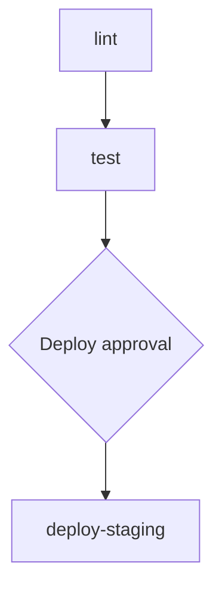

# Lobster Workflows

**Lobster** is OpenClaw's official workflow shell — a typed, local-first macro engine that turns skills and tools into composable pipelines. Instead of asking the agent to figure out multi-step processes every time (consuming tokens and introducing non-determinism), you define the sequence once in a YAML file and let Lobster execute it reliably.

- **Repository**: [openclaw/lobster](https://github.com/openclaw/lobster) | 1,222 stars | MIT license
- **Stack**: TypeScript (99.7%) | npm: `@clawdbot/lobster`
- **Latest release**: v2026.5.22 (234 passing tests)

---

## Why Lobster?

| Without Lobster | With Lobster |
|----------------|-------------|
| Agent decides steps each time (non-deterministic) | Steps defined once in YAML (deterministic) |
| Full LLM call per step decision | No LLM call for step sequencing |
| Token cost grows with complexity | Fixed token cost per workflow |
| No approval gates | Built-in human approval gates |
| Hard to audit or replay | Full execution log, `lobster graph` visualization |

Lobster's design philosophy: **visibility and human-supervised approval gating over autonomous agent loops**. Workflows are deterministic pipelines with explicit control flow, not free-form agent reasoning.

---

## Installation

Lobster runs in two modes:

### Standalone CLI

Install globally and run workflows directly:

```bash
npm install -g @clawdbot/lobster
lobster run path/to/workflow.lobster
```

### Embedded Gateway Plugin

Lobster ships as a bundled optional plugin inside the OpenClaw gateway, running workflows in-process (no external subprocess). Enable it in config:

```json5 title="~/.openclaw/openclaw.json"
{
  "tools": {
    "alsoAllow": ["lobster"]
  }
}
```

Once enabled, the agent can invoke workflows through the gateway's `/tools/invoke` REST endpoint or by calling the Lobster tool directly in conversation.

:::caution Embedded mode limitation
In embedded mode, Lobster does **not** automatically inherit gateway URL/auth context for nested OpenClaw CLI calls via `openclaw.invoke`. This means nested invocations that call back to the gateway may fail. This is a known limitation as of June 2026 — documented in PR #78736.
:::

---

## Workflow Syntax

Workflow files use a YAML-based DSL and support `.lobster`, `.yaml`, and `.json` extensions.

### Basic Structure

```yaml title="workflows/hello.lobster"
name: Hello World
args:
  greeting: "Hello"
env:
  MY_VAR: "some-value"
steps:
  - id: say-hello
    run: echo "{{ args.greeting }}, World!"
  - id: show-date
    run: date "+%Y-%m-%d"
```

### Top-Level Fields

| Field | Type | Description |
|-------|------|-------------|
| `name` | string | Workflow display name |
| `args` | object | Input arguments with defaults |
| `env` | object | Environment variables for all steps |
| `steps` | array | Ordered list of steps to execute |

---

## Step Types

Lobster has three step types:

### 1. Shell Commands (`run:` / `command:`)

Execute OS commands:

```yaml
steps:
  - id: list-files
    run: ls -la /path/to/dir

  - id: run-tests
    command: npm test
    timeout_ms: 60000
```

### 2. Native Pipeline Stages (`pipeline:`)

Invoke Lobster-native operations like LLM calls:

```yaml
steps:
  - id: analyze
    pipeline: llm.invoke
    stdin: "Analyze this code for bugs: {{ $list-files.stdout }}"

  - id: summarize
    pipeline: llm.invoke
    stdin: "Summarize in 3 bullets: {{ $analyze.stdout }}"
```

### 3. Approval Gates (`approval:`)

Pause for human approval before continuing:

```yaml
steps:
  - id: review-deploy
    approval: "Deploy to production?"
    initiated_by: "dev-team"
    required_approver: "ops-team"
    require_different_approver: true
```

Approval gates support identity constraints:

| Field | Description |
|-------|-------------|
| `initiated_by` | Who can trigger this approval request |
| `required_approver` | Who must approve (different from initiator) |
| `require_different_approver` | Enforce separation of duties |

---

## Data Flow

Steps pass data to each other using `$step` references:

```yaml
steps:
  - id: fetch-data
    run: curl -s https://api.example.com/data

  - id: process
    run: jq '.items | length'
    stdin: "{{ $fetch-data.stdout }}"

  - id: report
    pipeline: llm.invoke
    stdin: "There are {{ $process.stdout }} items. Generate a summary."
```

| Reference | Returns |
|-----------|---------|
| `$step-id.stdout` | Standard output of the step |
| `$step-id.json` | Parsed JSON output |
| `{{ args.name }}` | Input argument value |

---

## Control Flow

### Conditionals

Run steps based on conditions:

```yaml
steps:
  - id: check-branch
    run: git branch --show-current

  - id: deploy-staging
    run: ./deploy.sh staging
    when: "$check-branch.stdout == 'main'"

  - id: skip-deploy
    run: echo "Not on main, skipping deploy"
    when: "$check-branch.stdout != 'main'"
```

Supported operators: `==`, `!=`, `&&`, `||`, `<`, `>`, `<=`, `>=`

### Parallel Steps

Run steps concurrently:

```yaml
steps:
  - id: lint
    run: npm run lint
    parallel: true

  - id: typecheck
    run: npm run typecheck
    parallel: true

  - id: test
    run: npm test
    parallel: true
    wait: all   # wait for all parallel steps before continuing
```

| Wait Mode | Behavior |
|-----------|----------|
| `all` | Wait for every parallel step to complete |
| `any` | Continue as soon as one parallel step finishes |

### For-Each Loops

Iterate over items:

```yaml
steps:
  - id: get-repos
    run: gh repo list myorg --json name -q '.[].name'

  - id: audit-each
    for_each: "$get-repos.json"
    batch_size: 3
    steps:
      - id: audit
        run: cd {{ item }} && npm audit --json
      - id: report
        pipeline: llm.invoke
        stdin: "Audit results for {{ item }}: {{ $audit.stdout }}"
```

| Field | Description |
|-------|-------------|
| `for_each` | Array to iterate over (from a previous step's output) |
| `batch_size` | Number of items to process concurrently |
| `pause_ms` | Delay between batches |

### Sub-Workflows

Compose workflows from other workflows:

```yaml
steps:
  - id: lint-and-test
    workflow: workflows/ci.lobster
    args:
      target: "src/"

  - id: deploy
    workflow: workflows/deploy.lobster
    when: "$lint-and-test.exitCode == 0"
```

Sub-workflow composition includes cycle detection — Lobster will error if workflow A calls workflow B which calls workflow A.

:::info
Loop semantics (maxIterations, shell-condition loops) were proposed in PR #20 but closed as "not planned" — the maintainers considered the control-flow surface too large. Use `for_each` for iteration instead.
:::

---

## Error Handling

### Per-Step Retry

```yaml
steps:
  - id: flaky-api
    run: curl -f https://api.example.com/data
    retry:
      max: 3
      delay_ms: 1000
      backoff: exponential
      jitter: true
```

| Field | Description |
|-------|-------------|
| `max` | Maximum retry attempts |
| `delay_ms` | Base delay between retries |
| `backoff` | `fixed` or `exponential` |
| `jitter` | Add random variation to delays |

### Per-Step Timeout

```yaml
steps:
  - id: slow-task
    run: ./long-running-script.sh
    timeout_ms: 300000   # 5 minutes, then SIGKILL
```

### On-Error Policies

```yaml
steps:
  - id: optional-check
    run: ./optional-lint.sh
    on_error: continue    # keep going even if this fails

  - id: critical-test
    run: npm test
    on_error: stop        # halt the entire workflow on failure

  - id: cleanup
    run: ./cleanup.sh
    on_error: skip_rest   # skip remaining steps but don't fail
```

| Policy | Behavior |
|--------|----------|
| `stop` (default) | Halt the entire workflow |
| `continue` | Log the error, move to next step |
| `skip_rest` | Skip remaining steps, exit gracefully |

---

## LLM Integration

### Calling the LLM

Use `pipeline: llm.invoke` to make LLM calls within workflows:

```yaml
steps:
  - id: read-code
    run: cat src/auth.ts

  - id: review
    pipeline: llm.invoke
    stdin: |
      Review this code for security issues:
      {{ $read-code.stdout }}

  - id: fix
    pipeline: llm.invoke
    stdin: |
      Based on this review, generate fixed code:
      {{ $review.stdout }}
```

### LLM Provider Configuration

Lobster supports multiple LLM providers with this resolution order:

1. `--provider` CLI flag
2. `LOBSTER_LLM_PROVIDER` environment variable
3. Auto-detect from available environment

| Provider | Env Vars | Description |
|----------|----------|-------------|
| `openclaw` | `OPENCLAW_URL`, `OPENCLAW_TOKEN` | Route through OpenClaw gateway (default) |
| `pi` | `LOBSTER_PI_LLM_ADAPTER_URL` | Pi adapter endpoint |
| `http` | `LOBSTER_LLM_ADAPTER_URL` | Generic HTTP LLM endpoint |

### Cost Tracking

Lobster tracks LLM token usage per workflow:

```yaml
name: Research Pipeline
cost_limit:
  warn: 5.00       # warn when cost exceeds $5
  stop: 20.00      # halt workflow at $20
steps:
  - id: research
    pipeline: llm.invoke
    stdin: "Research the topic: {{ args.topic }}"
```

After execution, the `_meta.cost` summary shows per-step usage and total cost. Configure custom pricing with the `LOBSTER_LLM_PRICING_JSON` environment variable.

---

## OpenClaw Integration

### Invoking OpenClaw from Lobster

Use `openclaw.invoke` (preferred) or `clawd.invoke` (legacy alias) to call OpenClaw tools from workflow steps:

```yaml
steps:
  - id: search-web
    run: openclaw.invoke web-search "latest TypeScript features"

  - id: check-email
    run: openclaw.invoke gmail-check --unread --from "boss@company.com"

  - id: send-alert
    run: openclaw.invoke telegram-send "Build failed: {{ $run-tests.stdout }}"
```

### Gateway Plugin Invocation

When running as an embedded plugin, the agent can trigger workflows directly:

```
> Run the deploy workflow for staging
Using tool: lobster
Running workflow: workflows/deploy.lobster
  Step 1/4: lint... done
  Step 2/4: test... done
  Step 3/4: approval... waiting
  [Approval required: Deploy to staging?]
  > approve
  Step 4/4: deploy... done
```

### Heartbeat Integration

Trigger workflows from heartbeat tasks:

```markdown title="~/.openclaw/HEARTBEAT.md"
## Every 6 hours
- Run the Lobster workflow at ~/.openclaw/workflows/security-scan.lobster
- If any step fails, alert me on Slack
```

---

## Visualization

Lobster can generate workflow graphs in multiple formats:

```bash
# Mermaid diagram (paste into GitHub, Notion, etc.)
lobster graph workflows/deploy.lobster --format mermaid

# Graphviz DOT format
lobster graph workflows/deploy.lobster --format dot

# ASCII art (terminal-friendly)
lobster graph workflows/deploy.lobster --format ascii
```

Example Mermaid output:



---

## Real-World Patterns

### Deploy Pipeline

```yaml title="workflows/deploy.lobster"
name: Deploy Pipeline
args:
  environment: staging
steps:
  - id: lint
    run: npm run lint
    on_error: stop

  - id: test
    run: npm test
    timeout_ms: 300000
    retry:
      max: 2
      delay_ms: 5000

  - id: build
    run: npm run build

  - id: approve-deploy
    approval: "Deploy to {{ args.environment }}?"
    required_approver: "ops-team"
    when: "args.environment == 'production'"

  - id: deploy
    run: ./scripts/deploy.sh {{ args.environment }}

  - id: healthcheck
    run: curl -f https://{{ args.environment }}.myapp.com/health
    retry:
      max: 5
      delay_ms: 10000
      backoff: exponential

  - id: notify
    run: openclaw.invoke slack-send "#deploys" "Deployed to {{ args.environment }} successfully"
```

### Code Review Chain

Multi-agent review with up to three iterations:

```yaml title="workflows/code-review.lobster"
name: Code Review Chain
args:
  branch: "feature/new-auth"
steps:
  - id: get-diff
    run: git diff main...{{ args.branch }}

  - id: programmer-review
    pipeline: llm.invoke
    stdin: |
      You are a senior programmer. Review this diff for correctness,
      edge cases, and potential bugs:
      {{ $get-diff.stdout }}

  - id: security-review
    pipeline: llm.invoke
    stdin: |
      You are a security reviewer. Check this diff for vulnerabilities,
      injection risks, and auth issues:
      {{ $get-diff.stdout }}

  - id: synthesize
    pipeline: llm.invoke
    stdin: |
      Combine these two reviews into a final assessment with action items:
      Programmer review: {{ $programmer-review.stdout }}
      Security review: {{ $security-review.stdout }}

  - id: approve-merge
    approval: "Merge {{ args.branch }}? Review summary above."
```

### Overnight Research

Cron-triggered research that runs while you sleep:

```yaml title="workflows/overnight-research.lobster"
name: Overnight Research
args:
  topic: "AI agent security best practices"
cost_limit:
  warn: 10.00
  stop: 30.00
steps:
  - id: search
    run: openclaw.invoke web-search "{{ args.topic }} 2026"

  - id: deep-read
    for_each: "$search.json[0:5]"
    batch_size: 2
    steps:
      - id: fetch
        run: openclaw.invoke web-fetch "{{ item.url }}"
      - id: extract
        pipeline: llm.invoke
        stdin: "Extract key findings from: {{ $fetch.stdout }}"

  - id: synthesize
    pipeline: llm.invoke
    stdin: |
      Synthesize these research findings into a structured report
      with citations:
      {{ $deep-read.stdout }}

  - id: save-report
    run: echo "{{ $synthesize.stdout }}" > ~/research/{{ args.topic | slugify }}.md

  - id: notify
    run: openclaw.invoke telegram-send "Research complete: {{ args.topic }}"
```

### System Monitoring

```yaml title="workflows/system-check.lobster"
name: System Health Check
steps:
  - id: disk
    run: df -h --output=pcent,target | awk 'NR>1 && int($1)>85'

  - id: docker
    run: docker ps --filter "health=unhealthy" --format "{{.Names}}"

  - id: ssl
    run: |
      echo | openssl s_client -connect mysite.com:443 2>/dev/null |
      openssl x509 -noout -enddate

  - id: alert
    pipeline: llm.invoke
    stdin: |
      Generate a concise health alert if any issues found:
      Disk: {{ $disk.stdout }}
      Unhealthy containers: {{ $docker.stdout }}
      SSL expiry: {{ $ssl.stdout }}
    when: "$disk.stdout != '' || $docker.stdout != ''"

  - id: send-alert
    run: openclaw.invoke slack-send "#ops-alerts" "{{ $alert.stdout }}"
    when: "$disk.stdout != '' || $docker.stdout != ''"
```

---

## CLI Reference

| Command | Description |
|---------|-------------|
| `lobster run <file>` | Execute a workflow file |
| `lobster run <file> --arg key=value` | Pass arguments |
| `lobster run <file> --provider openclaw` | Override LLM provider |
| `lobster run <file> --dry-run` | Show steps without executing |
| `lobster graph <file>` | Generate workflow visualization |
| `lobster graph <file> --format mermaid` | Mermaid diagram output |
| `lobster graph <file> --format dot` | Graphviz DOT output |
| `lobster graph <file> --format ascii` | ASCII art output |
| `lobster exec <command>` | Run a single OS command |
| `lobster approve <workflow-id>` | Approve a pending gate |
| `lobster workflows.run <name>` | Run a named/registered workflow |

### Data Shaping Operators

Lobster includes built-in data manipulation:

| Operator | Description | Example |
|----------|-------------|---------|
| `where` | Filter items | `lobster exec "..." \| where status == "failed"` |
| `pick` | Select fields | `lobster exec "..." \| pick name,status` |
| `head` | First N items | `lobster exec "..." \| head 5` |
| `json` | Format as JSON | `lobster exec "..." \| json` |
| `table` | Format as table | `lobster exec "..." \| table` |

---

## Configuration

### Environment Variables

| Variable | Description |
|----------|-------------|
| `OPENCLAW_URL` | Gateway URL for openclaw.invoke (default: `ws://localhost:18789`) |
| `OPENCLAW_TOKEN` | Gateway auth token |
| `LOBSTER_LLM_PROVIDER` | LLM provider override (`openclaw`, `pi`, `http`) |
| `LOBSTER_LLM_ADAPTER_URL` | Generic HTTP LLM endpoint |
| `LOBSTER_PI_LLM_ADAPTER_URL` | Pi adapter endpoint |
| `LOBSTER_LLM_PRICING_JSON` | Custom token pricing file path |

### Gateway Plugin Config

```json5 title="~/.openclaw/openclaw.json"
{
  "tools": {
    "alsoAllow": ["lobster"]
  }
}
```

---

## Debugging

```bash
# Dry run (shows steps without executing)
lobster run workflow.lobster --dry-run

# Verbose logging
lobster run workflow.lobster --verbose

# View workflow graph
lobster graph workflow.lobster --format ascii

# Check Lobster version
lobster --version
```

### Common Issues

| Problem | Cause | Fix |
|---------|-------|-----|
| `openclaw.invoke: connection refused` | Gateway not running or wrong URL | Check `OPENCLAW_URL` and `openclaw gateway status` |
| Embedded mode auth failures | Plugin doesn't inherit gateway auth for nested CLI calls | Known limitation — use standalone mode for nested invocations |
| `llm-task tool not allowed` | Tool allowlist bug in v2026.4.26-4.29 | Update to v2026.4.30+ |
| Workflow cycle detected | Workflow A calls B which calls A | Restructure to avoid circular sub-workflow references |
| Cost limit exceeded | LLM calls exceeded `cost_limit.stop` | Increase limit or reduce LLM steps |
| Step timeout | `timeout_ms` exceeded | Increase timeout or optimize the command |

---

## Lobster vs Alternatives

| Tool | Approach | LLM-Native | Approval Gates | Local-First |
|------|----------|-----------|---------------|-------------|
| **Lobster** | YAML workflow shell | Yes (llm.invoke) | Yes (built-in) | Yes |
| **LangGraph** | Python graph library | Yes | No | No (cloud-first) |
| **CrewAI** | Python agent framework | Yes | No | No |
| **n8n** | Visual workflow builder | Plugin | Manual | Self-hosted |
| **Temporal** | Distributed workflows | No | No | Self-hosted |
| **GitHub Actions** | CI/CD YAML | No | Environment gates | Cloud |

Lobster's unique strengths: typed data flow between steps (objects, not just text pipes), built-in LLM cost tracking, approval gates with identity constraints, and zero-overhead integration with OpenClaw skills and tools.

---

## See Also

- [Automation Guide](/guides/automation) — Broader automation patterns including cron, webhooks, and Lobster
- [Multi-Agent Guide](/guides/multi-agent) — Agent orchestration and routing
- [Skill Development](/guides/skill-development) — Building skills that Lobster workflows can invoke
- [CI/CD & Testing](/guides/cicd-testing) — Using Lobster for CI/CD pipelines
- [Ecosystem](/reference/ecosystem#lobster) — Lobster project details
- [Cost Management](/guides/cost-management) — Controlling LLM costs in workflows
