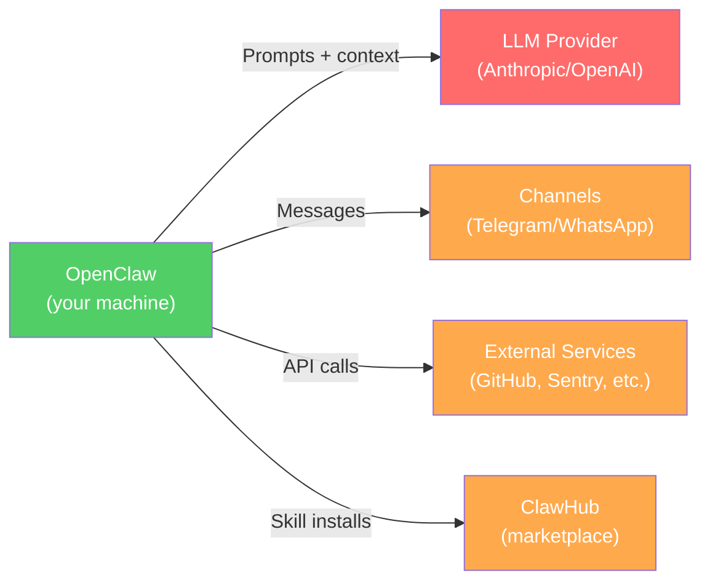

# Privacy & Compliance

OpenClaw offers exceptional **architectural privacy** — self-hosted, no telemetry, local memory files. But it ships with **insecure defaults** (plaintext credentials, no RBAC, gateway bypass vulnerabilities) and an **unvetted ecosystem**. This guide maps exactly what data goes where, what stays local, and how to meet compliance requirements.

:::warning Gartner Assessment
Gartner published a research note characterizing OpenClaw as **"a dangerous preview of agentic AI"** with "insecure by default risks like plaintext credential storage." They recommended enterprises **"block OpenClaw downloads and traffic immediately"** unless running in isolated nonproduction VMs with throwaway credentials.
:::

---

## Data Flow Map

### What Leaves Your Machine



| Data | Where It Goes | Details |
|------|--------------|---------|
| **Prompts and responses** | LLM provider (Anthropic/OpenAI) | Full system prompt + conversation history sent with every API call |
| **Chat messages** | Messaging platform servers | Telegram stores server-side; WhatsApp E2E encrypted but Meta collects metadata |
| **Tool outputs** | LLM provider | Command results, file contents, browser snapshots — anything the agent reads |
| **Skill install telemetry** | ClawHub | Minimal snapshot for install counts when logged in |

### What Stays Local

| Data | Location | Encryption |
|------|----------|------------|
| **Memory files** | `MEMORY.md`, `memory/YYYY-MM-DD.md` | **None** (plaintext Markdown) |
| **Memory search index** | `~/.openclaw/memory/<agentId>.sqlite` | **None** (unencrypted SQLite) |
| **Credentials** | `~/.openclaw/credentials/` | **None** (plaintext by default) |
| **Session transcripts** | Workspace directory | **None** (JSON with descriptive filenames) |
| **Configuration** | `~/.openclaw/openclaw.json`, `openclaw.json` | **None** |
| **Telemetry logs** | `~/.openclaw/logs/telemetry.jsonl` | Local only (opt-in plugin) |

:::danger Credentials Are Stored in Plaintext
By default, `~/.openclaw/credentials/` stores API keys in **plaintext**. This is one of the most criticized security issues. Use environment variables or a secrets manager instead.
:::

### Does OpenClaw Phone Home?

**No.** OpenClaw itself collects no telemetry, no analytics, and sends no data to its developers. The only external data transmission is to the LLM providers and channels you configure.

The third-party [Knostic telemetry plugin](https://github.com/knostic/openclaw-telemetry) is opt-in and writes locally only, with automatic redaction of sensitive data and cryptographic hash chains for tamper detection.

---

## Channel Encryption Comparison

| Channel | Encryption | Privacy Risk |
|---------|-----------|-------------|
| **Signal** | True E2E | Minimal metadata collection. **Best privacy option.** |
| **iMessage** | E2E | Apple ecosystem only |
| **WhatsApp** | E2E | Meta collects metadata (who, when). Uses unofficial reverse-engineered APIs. |
| **Telegram** | Server-side only (not E2E by default) | Messages stored on Telegram servers |
| **Discord** | TLS in transit only | Discord retains message content |
| **Slack** | TLS in transit only | Workspace admins can access all messages |

**Important**: Always configure an allowlist of who can talk to your bot. A bot that accepts messages from anyone on WhatsApp or Telegram is a significant liability.

---

## GDPR Compliance

### Is OpenClaw GDPR-Compliant?

**Partially — compliance is your responsibility.** OpenClaw is infrastructure software, not a SaaS product. When self-hosted:

- You are the **data controller** (and potentially data processor)
- OpenClaw provides **technical controls**; you handle lawful basis, DPIAs, and processes
- The self-hosted architecture is advantageous for GDPR — data never leaves your infrastructure (except to LLM providers)

### LLM Provider Data Processing Agreements

| Provider | DPA | Data Retention | Training on API Data | Zero Data Retention |
|----------|-----|---------------|---------------------|-------------------|
| **Anthropic** | Automatic with commercial terms | Inputs/outputs deleted within **30 days** | No (commercial terms) | Available for enterprise (signed contract) |
| **OpenAI** | Available for enterprise | Configurable | No (enterprise API) | Available |

Anthropic's Zero Data Retention (ZDR) agreement means logs are processed for real-time abuse detection only, then immediately discarded.

### Right to Erasure

OpenClaw stores data in plain files you control. To delete all personal data:

1. `openclaw memory clear --user <id>` — clear user-specific memory
2. Delete `MEMORY.md` and `memory/` directory
3. Delete `~/.openclaw/memory/<agentId>.sqlite`
4. Delete session transcripts
5. Clear `~/.openclaw/credentials/`
6. Contact LLM provider (Anthropic: 30-day auto-deletion; immediate for ZDR)
7. Delete conversations from messaging channels separately

**Gap**: There is no built-in automated right-to-erasure workflow. You must manually identify and delete all data across memory files, transcripts, and the SQLite index.

### EU Data Residency

For complete EU data residency:

| Requirement | Solution |
|-------------|----------|
| Host in EU | Hetzner (Germany), OVH (France), Contabo (Germany) |
| EU LLM inference | Self-hosted models via Ollama (Llama, Mistral) |
| No US data transfers | Eliminates all external API calls |
| EU messaging | Self-hosted Matrix/Signal server |

Using self-hosted LLMs on EU infrastructure eliminates all data transfers to US-based providers.

---

## Enterprise Compliance

### SOC 2

OpenClaw self-hosted **inherits your SOC 2 controls**:

- TLS 1.3 for all network traffic
- Audit logs capture all AI interactions
- Complete audit trails exportable as CSV/JSON
- Up to 365-day log retention for historical analysis
- Anthropic and OpenAI both provide SOC 2 Type II reports

**Enterprise deployment checklist**:

1. Choose deployment model (cloud/on-premise/hybrid)
2. Select AI provider and review their compliance posture
3. Configure audit logging at appropriate level
4. Set up access controls (see Access Control section below)
5. Enable encryption at rest and in transit
6. Integrate with existing SIEM/monitoring
7. Document data flows for compliance team
8. Schedule regular access reviews
9. Establish patch management process
10. Test incident response procedures

### HIPAA

For healthcare organizations handling PHI:

| Approach | Details |
|----------|---------|
| **Cloud AI with BAA** | Anthropic and OpenAI offer Business Associate Agreements for enterprise |
| **Self-hosted models** | Complete PHI isolation with Ollama + local LLMs |
| **PHI redaction** | Implement detection and redaction before AI processing |
| **Air-gapped deployment** | No internet connection, no data leaves the network |
| **Audit logging** | Must capture all interactions involving PHI |

### Air-Gapped Deployments

OpenClaw fully supports air-gapped operation:

- **Ollama + local models** eliminate all external API calls
- No internet connection required
- Hardware requirements: 7B model needs ~8 GB RAM, 70B needs ~48+ GB
- Recommended models for function calling: `qwen2.5-coder`, `qwen3`, `deepseek-r1`, `llama3.3`
- GPU inference is 5-10x faster than CPU-only

### Network Segmentation

- Run OpenClaw in an **isolated Docker network**
- Avoid giving access to internal services or databases unless necessary
- Docker security: run as non-root, read-only filesystem, dropped capabilities
- Restrict outbound network access to required domains only
- Enable **sandbox mode** for tasks that don't need external network

---

## Access Control

### Current State (February 2026)

OpenClaw **does not natively support multi-user permission management** — all users with system access can view and modify sensitive information ([Issue #8081](https://github.com/openclaw/openclaw/issues/8081)).

| Feature | Status |
|---------|--------|
| Gateway authentication | Required by default (fail-closed) |
| Multi-user RBAC | **Not yet implemented** (in development) |
| Per-agent permissions | Limited |
| Audit logging | Available |

### Workarounds for Enterprise

| Approach | Details |
|----------|---------|
| **OAuth integration** | Auth0 documented a five-step guide for securing OpenClaw |
| **Reverse proxy auth** | HAProxy has a specific OpenClaw security guide |
| **Zero-trust access** | Cloudflare Zero Trust or Tailscale for network access |
| **Separate instances** | One OpenClaw instance per user/team |

### Planned RBAC

The proposed role system (in development):

| Role | Permissions |
|------|------------|
| **Admin** | Global config + user management |
| **Developer** | Use OpenClaw + view personal logs |
| **Auditor** | Read-only access to all logs |

---

## Audit and Data Control

### How to Audit What OpenClaw Has Stored

1. **Run the security audit**: `openclaw security audit` (supports `--deep` for exposed ports, auth issues, permission problems)
2. **Inspect memory files**: Browse `MEMORY.md` and `memory/YYYY-MM-DD.md` — plain Markdown
3. **Query the SQLite index**: `~/.openclaw/memory/<agentId>.sqlite`
4. **Review session transcripts**: Full conversation logs with descriptive filenames
5. **Check credentials**: `~/.openclaw/credentials/` for plaintext secrets
6. **Review telemetry logs**: `~/.openclaw/logs/telemetry.jsonl` (if plugin installed)
7. **Export audit trails**: CSV/JSON for compliance reporting

### Conversation Logging and Retention

| Deployment | Retention | Control |
|-----------|-----------|---------|
| **Self-hosted** | Persists until you delete it | Full control |
| **Clawctl Starter** ($49/mo) | 7-day audit trail | Managed |
| **Clawctl Team** ($299/mo) | 90-day retention | Managed |
| **Clawctl Business** ($999/mo) | 365-day retention | Managed |

Built-in pruning functionality supports duration/size thresholds, session rotation, and stale entry removal.

### Memory File Encryption Options

OpenClaw does **not** encrypt data at rest by default. Options:

| Method | Scope | Notes |
|--------|-------|-------|
| **Full-disk encryption** (LUKS/FileVault/BitLocker) | Entire disk | Recommended minimum |
| **Encrypted filesystem** (VeraCrypt) | `~/.openclaw/` directory | Targeted protection |
| **Encrypted Docker volumes** | Container deployments | For Docker setups |
| **Clawctl managed hosting** | Platform-managed | AES-256-GCM, credentials in separate vault |
| **Application-level** | Per-file | Not built into OpenClaw |

---

## API Key Protection

### Recommendations

1. **Use environment variables** — never store keys in config files
2. **Use a secrets manager** — encrypted vault with runtime key injection
3. **Set strict file permissions** — readable only by the OpenClaw process owner
4. **Never commit credentials** to version control
5. **Run `openclaw security audit`** to detect credential exposure
6. **Rotate keys regularly** — especially after any security incident

### Environment Variable Setup

```bash title="~/.openclaw/env (permissions: 600)"
ANTHROPIC_API_KEY=sk-ant-xxxxx
OPENAI_API_KEY=sk-xxxxx
```

```bash
chmod 600 ~/.openclaw/env
```

---

## Government and Regulatory Responses

### South Korea — Corporate Restrictions

Major Korean tech platforms have restricted OpenClaw:

| Company | Action |
|---------|--------|
| **Kakao** | Restricted on corporate networks and work devices |
| **Naver** | Restricted across corporate networks |
| **Karrot Market** | Blocked on work devices |

These are corporate-level restrictions (not formal legislation) reflecting the Korean data protection environment.

### China — Security Advisory

China's National Vulnerability Database warned about OpenClaw instances under default configurations. The response stops short of a ban but advises:
- Audit public network exposure
- Implement robust identity authentication and access controls

### Enterprise Security Advisories

| Organization | Position |
|-------------|----------|
| **Gartner** | "Unacceptable cybersecurity risk" — block downloads immediately |
| **CrowdStrike** | Published detailed security briefing for security teams |
| **Bitdefender** | Published technical advisory on enterprise exploitation |
| **Trend Micro** | Risk analysis using OpenClaw as case study |
| **Noma Security** | 53% of enterprise customers gave OpenClaw privileged access in one weekend |

### EU AI Act

The EU AI Act becomes broadly operational **August 2, 2026**:

- Applies to AI agents via provisions for general-purpose AI (GPAI) models and high-risk systems
- High-risk domains (healthcare, finance, legal) require: risk management, data governance, technical documentation, record-keeping, transparency, human oversight
- Gaps remain that require additional European Commission guidelines

---

## Known Security Incidents

For compliance teams evaluating OpenClaw, these documented incidents are relevant:

| Incident | Date | Impact |
|----------|------|--------|
| **Moltbook database breach** | Jan 31, 2026 | 1.5M API tokens + 35K emails exposed via misconfigured Supabase |
| **CVE-2026-25253** (CVSS 8.8) | Feb 2026 | One-click RCE via authentication token theft |
| **40,000+ exposed instances** | Feb 2026 | 12,812 vulnerable to remote code execution |
| **ClawHub malicious skills** | Feb 2026 | 341 malicious skills (12%), 283 leaking credentials (7.1%) |
| **ClawHavoc campaign** | Feb 2026 | 335 skills distributing Atomic Stealer macOS malware |

OpenClaw responded by partnering with **Google's VirusTotal** to scan all ClawHub skill uploads.

See [Known Vulnerabilities](/security/known-vulnerabilities) for full details and mitigations.

---

## Compliance Summary

| Aspect | Status | Action Required |
|--------|--------|----------------|
| Data stays local (self-hosted) | Yes | Except LLM API calls |
| No telemetry/phoning home | Yes | OpenClaw collects nothing |
| GDPR-compliant | Possible | Your responsibility — deploy in EU + local LLMs for full compliance |
| SOC 2 ready | Inherits your controls | Review LLM provider SOC 2 reports |
| HIPAA ready | Possible | Air-gap + self-hosted LLMs + BAA with cloud providers |
| Air-gap capable | Yes | Ollama + local models |
| Credentials secure by default | **No** | Harden manually — use env vars or secrets manager |
| RBAC / multi-user | **Not yet** | Use external auth (OAuth, reverse proxy) |
| Gateway secure by default | **Partially** | Localhost-only but bypass vulnerabilities exist |
| ClawHub skills safe | **No** | 7.1% leak credentials; VirusTotal scanning now active |

---

## See Also

- [Security Overview](/security/overview) — Security architecture and threat model
- [Security Hardening](/security/hardening) — Step-by-step hardening guide
- [Known Vulnerabilities](/security/known-vulnerabilities) — CVEs and incident details
- [Local Models](/guides/local-models) — Zero-API-cost local inference for privacy
- [Deployment Options](/guides/deployment-options) — Self-hosted deployment methods
- [Cost Management](/guides/cost-management) — Budget controls and optimization
