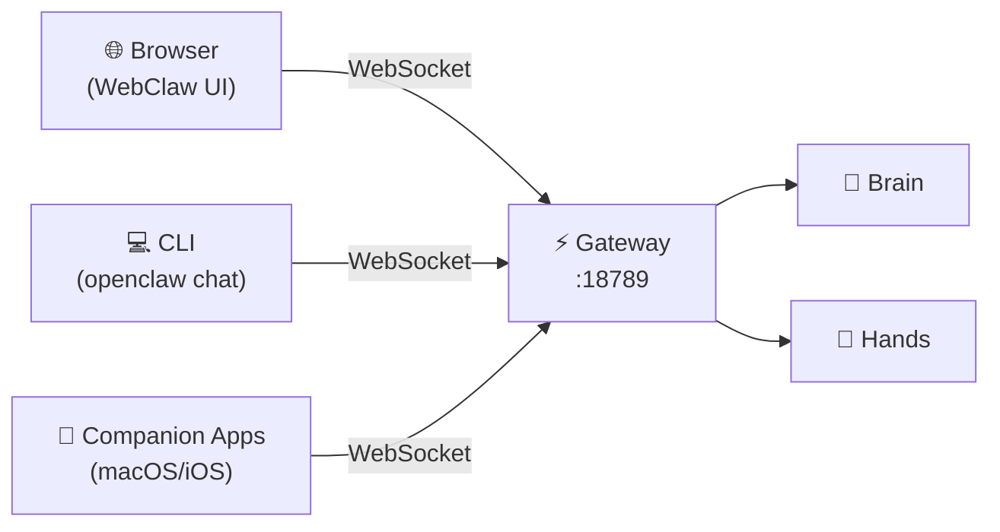

# WebClaw Web Client

[WebClaw](https://github.com/ibelick/webclaw) is a community-built, browser-based chat interface for OpenClaw. It connects to your Gateway over WebSockets and provides a clean, modern UI for interacting with your agent from any device with a browser.

:::info
WebClaw is currently in **beta**. It is a third-party project and not maintained by the OpenClaw team.
:::

## Why WebClaw?

OpenClaw ships with a built-in WebChat UI accessible at `http://localhost:18789/chat`, but WebClaw offers a different experience:

| Feature | Built-in WebChat | WebClaw |
|---------|-----------------|---------|
| Framework | Vanilla JS | React/TypeScript |
| Customization | Limited | Full source access |
| Mobile UX | Basic | Responsive-first |
| Theming | Dark only | Configurable |
| License | Apache 2.0 | MIT |
| Status | Stable | Beta |

If the built-in WebChat works for you, there's no need to switch. WebClaw is for users who want a more customizable or polished web experience.

## Prerequisites

- A running [OpenClaw Gateway](/architecture/gateway) (default: `ws://localhost:18789`)
- **Node.js >= 20**
- **pnpm** (preferred) or npm

## Installation

```bash
# Clone the repository
git clone https://github.com/ibelick/webclaw.git
cd webclaw

# Install dependencies
pnpm install
```

## Configuration

Create the environment file at `apps/webclaw/.env.local`:

```bash title="apps/webclaw/.env.local"
CLAWDBOT_GATEWAY_URL=ws://127.0.0.1:18789
CLAWDBOT_GATEWAY_TOKEN=your-gateway-token-here
```

The token must match your OpenClaw Gateway authentication settings. You can find or set your token in `~/.openclaw/config.yml`:

```yaml title="~/.openclaw/config.yml"
gateway:
  auth:
    token: "your-gateway-token-here"
```

:::tip
If you use password authentication instead of token auth, set `CLAWDBOT_GATEWAY_PASSWORD` instead of `CLAWDBOT_GATEWAY_TOKEN`.
:::

## Running

```bash
# Development mode (with hot reload)
pnpm dev

# Production build
pnpm build
pnpm start
```

The WebClaw UI will be available at `http://localhost:3000` by default.

## Architecture

WebClaw is a TypeScript monorepo that communicates with OpenClaw through the same WebSocket control plane that all clients use:



WebClaw is just another client — it doesn't replace or modify the Gateway.

## Security Considerations

- **Never expose WebClaw to the public internet** without authentication. It has the same access as any Gateway client.
- Always use **token authentication** rather than leaving the Gateway open.
- If running WebClaw on a different host than the Gateway, use an SSH tunnel or VPN rather than opening the Gateway port.

```bash
# SSH tunnel example (access remote Gateway securely)
ssh -L 18789:localhost:18789 user@your-server
```

## Troubleshooting

### Connection refused

Ensure the Gateway is running and the URL in `.env.local` is correct:

```bash
# Check Gateway status
openclaw status

# Test WebSocket connection
wscat -c ws://127.0.0.1:18789
```

### Authentication failed

Verify your token matches the Gateway config:

```bash
# Check Gateway auth settings
grep -A 3 'auth:' ~/.openclaw/config.yml
```

### CORS errors

If running WebClaw on a different port, the Gateway should handle CORS automatically. If not, check that you're connecting via WebSocket (not HTTP fetch).

## Project Info

- **Repository**: [github.com/ibelick/webclaw](https://github.com/ibelick/webclaw)
- **License**: MIT
- **Language**: TypeScript (98.1%)
- **Status**: Beta

## See Also

- [Gateway Architecture](/architecture/gateway) — Understanding the WebSocket control plane
- [Gateway API Reference](/reference/gateway-api) — WebSocket message protocol
- [Security Hardening](/security/hardening) — Securing your Gateway
