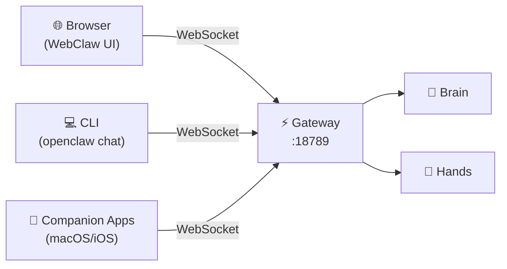

# WebClaw Web Client

[WebClaw](https://github.com/ibelick/webclaw) is a community-built, browser-based chat interface for OpenClaw. It connects to your Gateway over WebSockets and provides a clean, modern UI for interacting with your agent from any device with a browser.

:::info
WebClaw is currently in **beta** (637 stars, 5 contributors). It is a third-party project and not maintained by the OpenClaw team. The repository was last updated March 17, 2026.
:::

---

## Why a Browser Frontend?

OpenClaw ships with a built-in WebChat UI accessible at `http://localhost:18789/chat`, but community frontends offer a richer experience:

| Feature | Built-in WebChat | WebClaw | PinchChat |
|---------|-----------------|---------|-----------|
| Framework | Vanilla JS | React 19 / TanStack Router | React 19 / Vite 7 |
| Customization | Limited | Full source access | Full source access |
| Mobile UX | Basic | Responsive-first | PWA with offline support |
| Theming | Dark only | Configurable | Dark / Light / OLED Black + 6 accents |
| Multi-session | No | No | Split-view monitoring |
| i18n | No | No | English, French |
| Install method | Built-in | `npx webclaw` | Docker or git clone |
| License | Apache 2.0 | MIT | MIT |
| Status | Stable | Beta | Stable (119 releases) |

If the built-in WebChat works for you, there's no need to switch. These frontends are for users who want a more customizable or polished web experience.

---

## Quick Start

The fastest way to get WebClaw running:

```bash
npx webclaw
```

This downloads the CLI package and starts WebClaw locally. For more control, clone and configure manually — see [Installation](#installation) below.

---

## Prerequisites

- A running [OpenClaw Gateway](/architecture/gateway) (default: `ws://localhost:18789`)
- **Node.js >= 20**
- **pnpm** (preferred) or npm

---

## Installation

### Method 1: npx (Quickest)

```bash
npx webclaw
```

### Method 2: Clone and Build

```bash
git clone https://github.com/ibelick/webclaw.git
cd webclaw

# Install dependencies
pnpm install

# Development mode (with hot reload)
pnpm dev

# Production build
pnpm build
pnpm start
```

The WebClaw UI will be available at `http://localhost:3000` by default.

### Method 3: Docker

Community Docker images are available:

```bash
docker run -d \
  --name webclaw \
  -p 3000:3000 \
  -e OPENCLAW_GATEWAY_URL=ws://host.docker.internal:18789 \
  -e OPENCLAW_GATEWAY_TOKEN=your-token-here \
  land007/webclaw:latest
```

:::tip
Use `host.docker.internal` (Docker Desktop) or `172.17.0.1` (Linux) to reach the Gateway running on the host.
:::

---

## Configuration

Create the environment file at `apps/webclaw/.env.local`:

```bash title="apps/webclaw/.env.local"
OPENCLAW_GATEWAY_URL=ws://127.0.0.1:18789
OPENCLAW_GATEWAY_TOKEN=your-gateway-token-here
```

The token must match your OpenClaw Gateway authentication settings. You can find or set your token in `~/.openclaw/openclaw.json`:

```json5 title="~/.openclaw/openclaw.json"
{
  "gateway": {
    "auth": {
      "mode": "shared-secret",
      "token": "your-gateway-token-here"
    }
  }
}
```

:::tip
If you use password authentication instead of token auth, set `OPENCLAW_GATEWAY_PASSWORD` instead of `OPENCLAW_GATEWAY_TOKEN`.
:::

### Environment Variables

| Variable | Required | Default | Description |
|----------|----------|---------|-------------|
| `OPENCLAW_GATEWAY_URL` | Yes | `ws://127.0.0.1:18789` | WebSocket URL of your Gateway |
| `OPENCLAW_GATEWAY_TOKEN` | Recommended | — | Authentication token |
| `OPENCLAW_GATEWAY_PASSWORD` | Alternative | — | Password auth (if not using token) |

:::caution
The WebClaw repository's `.env.example` may still use the legacy `CLAWDBOT_GATEWAY_*` variable names. OpenClaw only reads `OPENCLAW_*` environment variables — the legacy `CLAWDBOT_*` and `MOLTBOT_*` prefixes are silently ignored. Always use the `OPENCLAW_*` prefix.
:::

---

## Tech Stack

WebClaw is a TypeScript monorepo (93.6% TypeScript) managed with pnpm 9.15.4:

```
webclaw-monorepo/
├── apps/
│   ├── webclaw/        # Main web client (React 19 + TanStack Router)
│   └── landing/        # Marketing site (webclaw.dev)
├── packages/
│   └── webclaw/        # npm-publishable CLI (npx webclaw)
├── pnpm-workspace.yaml
└── package.json
```

### Core Dependencies

| Library | Version | Purpose |
|---------|---------|---------|
| React | ^19.2.0 | UI framework |
| TanStack Router | ^1.132.0 | Client-side routing |
| Tailwind CSS | ^4.1.18 | Utility-first styling |
| TypeScript | — | Type safety |

:::info
WebClaw uses **TanStack Router**, not Next.js. It's a single-page application with client-side routing, not a server-rendered framework.
:::

---

## Architecture

WebClaw communicates with OpenClaw through the same WebSocket control plane that all clients use:



WebClaw is just another client — it doesn't replace or modify the Gateway.

### WebSocket Protocol

WebClaw uses the Gateway's standard [wire protocol](/architecture/gateway#wire-protocol) with three frame types:

| Frame | Direction | Structure | Purpose |
|-------|-----------|-----------|---------|
| Request | Client to Gateway | `{type: "req", id, method, params}` | Send messages, invoke tools |
| Response | Gateway to Client | `{type: "res", id, ok, payload}` | RPC replies |
| Event | Gateway to Client | `{type: "event", event, payload}` | Streaming tokens, tool calls |

### Streaming and Optimistic Updates

WebClaw implements streaming chat with an optimistic update pattern:

1. User sends a message
2. WebClaw writes an **optimistic entry** into the history cache immediately (no round-trip delay)
3. The Gateway streams response events back in real-time
4. When server history arrives, WebClaw **reconciles** optimistic entries using `clientId` matching or near-timestamp matching (10-second window)

This is implemented across `use-chat-history.ts`, `chat-queries.ts`, and `use-chat-pending-send.ts`.

---

## Production Deployment

### Behind a Reverse Proxy

For remote access, run WebClaw behind Nginx or Caddy with TLS:

```nginx title="nginx.conf"
server {
    listen 443 ssl;
    server_name webclaw.example.com;

    ssl_certificate     /etc/letsencrypt/live/webclaw.example.com/fullchain.pem;
    ssl_certificate_key /etc/letsencrypt/live/webclaw.example.com/privkey.pem;

    # WebClaw frontend
    location / {
        proxy_pass http://127.0.0.1:3000;
        proxy_set_header Host $host;
        proxy_set_header X-Real-IP $remote_addr;
    }

    # Gateway WebSocket (proxied through same domain)
    location /ws {
        proxy_pass http://127.0.0.1:18789;
        proxy_http_version 1.1;
        proxy_set_header Upgrade $http_upgrade;
        proxy_set_header Connection "upgrade";
        proxy_read_timeout 86400;
    }
}
```

```title="Caddyfile"
webclaw.example.com {
    reverse_proxy /ws localhost:18789
    reverse_proxy localhost:3000
}
```

### Cloudflare Tunnel

Expose WebClaw without opening ports:

```bash
cloudflared tunnel --url http://localhost:3000
```

:::warning
If using Cloudflare Tunnel, you still need to configure Gateway authentication. The tunnel provides transport encryption but not application-layer auth.
:::

### SSH Tunnel (Simple Remote Access)

For quick access without a full reverse proxy setup:

```bash
# Forward both WebClaw and Gateway ports
ssh -L 3000:localhost:3000 -L 18789:localhost:18789 user@your-server
```

Then open `http://localhost:3000` in your browser.

---

## Security

### Authentication Is Required

The Gateway enforces authentication by default (fail-closed model since v2026.2.19, after [CVE-2026-25253](/security/known-vulnerabilities)). WebClaw authenticates using the token or password in your environment variables.

| Auth Mode | How It Works | Config |
|-----------|-------------|--------|
| **Token** (recommended) | Shared secret compared at handshake | `OPENCLAW_GATEWAY_TOKEN` |
| **Password** | Password-based auth | `OPENCLAW_GATEWAY_PASSWORD` |
| **Trusted proxy** | Gateway trusts `X-Forwarded-*` headers | Nginx/Caddy config |

### TLS Requirements

The Gateway enforces TLS for non-local connections:

| Connection Source | Plaintext `ws://` | Encrypted `wss://` |
|-------------------|-------------------|---------------------|
| Loopback (127.0.0.1) | Allowed | Allowed |
| Private network (192.168.x.x, 10.x.x.x) | Allowed | Allowed |
| `.local` hostnames | Allowed | Allowed |
| Tailnet (`*.ts.net`) | Allowed | Allowed |
| **Everything else** | **Blocked** | **Required** |

### CORS

When WebClaw runs on a different origin than the Gateway (e.g., `localhost:3000` vs. `localhost:18789`), the Gateway handles CORS automatically for loopback connections. For non-loopback deployments, configure allowed origins:

```json5 title="~/.openclaw/openclaw.json"
{
  "gateway": {
    "cors": {
      "origins": ["https://webclaw.example.com"]
    }
  }
}
```

### Best Practices

- **Never expose WebClaw to the public internet** without Gateway authentication enabled
- Use **token auth** rather than leaving the Gateway open — WebClaw has the same access as any Gateway client
- Keep tokens in `.env.local` files (never committed to git) — the `.env.example` notes "Keep secrets here (never in the browser)"
- For remote access, always use a **reverse proxy with TLS** or an **SSH tunnel**
- Review the [Security Hardening guide](/security/hardening) for full Gateway lockdown

---

## PinchChat (Alternative Frontend)

[PinchChat](https://github.com/MarlBurroW/pinchchat) is a more mature alternative browser frontend with 182 stars and 119 releases (latest v1.71.3):

| Feature | WebClaw | PinchChat |
|---------|---------|-----------|
| Stars | 637 | 182 |
| Releases | 0 (beta) | 119 (stable) |
| Multi-session | Single chat | Split-view monitoring |
| Themes | Configurable | Dark / Light / OLED Black + 6 accents |
| PWA | No | Yes (installable, offline) |
| i18n | No | English, French |
| Tool visualization | Basic | Colored badges per tool type |
| Message search | No | Ctrl+F search |
| Export | No | Markdown export |
| Session management | Basic | Drag-and-drop reordering |

### Installing PinchChat

```bash
git clone https://github.com/MarlBurroW/pinchchat.git
cd pinchchat
docker compose up -d
```

PinchChat connects to the same Gateway WebSocket and uses the same JSON-framed protocol. Choose PinchChat if you need multi-session monitoring, PWA support, or a more polished out-of-the-box experience. Choose WebClaw if you want a lightweight SPA to customize and build upon.

---

## Customization

### Theming

WebClaw uses Tailwind CSS v4, so you can customize the look by editing the Tailwind configuration in `apps/webclaw/`:

```css title="apps/webclaw/src/styles/globals.css"
@theme {
  --color-primary: #your-brand-color;
  --color-background: #1a1a2e;
  --color-surface: #16213e;
}
```

### Building a Custom Frontend

Since WebClaw is MIT-licensed with full source access, you can fork it as a starting point for your own UI. The monorepo structure makes it easy to modify the client without touching the CLI package:

```bash
# Fork and clone
git clone https://github.com/YOUR-USERNAME/webclaw.git
cd webclaw

# Work only on the web client
cd apps/webclaw
pnpm dev
```

Key files to customize:

| File | Purpose |
|------|---------|
| `apps/webclaw/src/routes/` | Page routes (TanStack Router) |
| `apps/webclaw/src/components/` | UI components |
| `apps/webclaw/src/hooks/use-chat-history.ts` | Chat history and streaming |
| `apps/webclaw/src/hooks/use-chat-pending-send.ts` | Optimistic message sending |
| `apps/webclaw/src/lib/chat-queries.ts` | Gateway API integration |

---

## Troubleshooting

### Connection Issues

| Problem | Cause | Fix |
|---------|-------|-----|
| Connection refused | Gateway not running | Run `openclaw status`, check URL in `.env.local` |
| Authentication failed | Token mismatch | Verify token matches `~/.openclaw/openclaw.json` |
| CORS errors | Different origin, non-loopback | Configure `gateway.cors.origins` or use reverse proxy |
| WebSocket closes immediately | Protocol mismatch | Ensure Gateway is updated to latest version |
| Blank screen after build | Missing env vars | Check `.env.local` exists with correct variables |

### Environment Variable Issues

```bash
# Verify Gateway is running and accessible
openclaw status

# Test WebSocket connection directly
wscat -c ws://127.0.0.1:18789

# Check Gateway auth settings
cat ~/.openclaw/openclaw.json | grep -A 5 'auth'
```

:::caution
If you cloned WebClaw before March 2026, your `.env.local` may use the legacy `CLAWDBOT_GATEWAY_*` variable names. Rename them to `OPENCLAW_GATEWAY_*` — the Gateway silently ignores the old prefix.
:::

### Performance

| Problem | Cause | Fix |
|---------|-------|-----|
| Slow with long conversations | Large history cache | Clear browser cache, start new session |
| High memory usage | Accumulated WebSocket events | Refresh the page periodically |
| Laggy typing | Heavy re-renders | Use production build (`pnpm build && pnpm start`) |

---

## Project Info

| Field | Value |
|-------|-------|
| **Repository** | [github.com/ibelick/webclaw](https://github.com/ibelick/webclaw) |
| **Website** | [webclaw.dev](https://webclaw.dev) |
| **License** | MIT |
| **Language** | TypeScript (93.6%) |
| **Status** | Beta |
| **Stars** | 637 |
| **Contributors** | 5 |

---

## See Also

- [Gateway Architecture](/architecture/gateway) — Understanding the WebSocket control plane
- [Gateway API Reference](/reference/gateway-api) — WebSocket message protocol
- [Security Hardening](/security/hardening) — Securing your Gateway for remote access
- [Channels & Integrations](/guides/channels) — Other ways to interact with your agent
- [Custom Channels](/guides/custom-channels) — Building your own channel adapter
