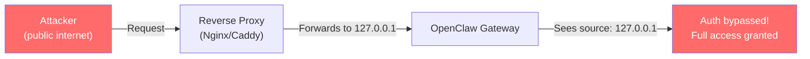

# Security Hardening

This guide walks through hardening OpenClaw from a default install to a production-ready deployment. Apply Level 1 immediately, Level 2 before any real use, and Level 3 for sensitive environments. Then set up the operational security sections for ongoing protection.

:::danger
As of February 2026, Shodan scans found **42,665 OpenClaw instances** on the public internet, with **93.4% having critical authentication bypasses** (JFrog). Apply at minimum all Level 1 steps before doing anything else.
:::

---

## Level 1: Essential (Do These Immediately)

### Update to Latest Version

```bash
# Check current version
openclaw --version

# Update — v2026.1.29+ patches CVE-2026-25253 (one-click RCE)
npm update -g openclaw
```

Subscribe to [OpenClaw security advisories](https://github.com/openclaw/openclaw/security/advisories) for vulnerability notifications.

### Bind Gateway to Localhost

```json5 title="~/.openclaw/openclaw.json"
{
  "gateway": {
    "host": "127.0.0.1",  // NEVER use 0.0.0.0
    "port": 18789
  }
}
```

This is the single most important security step. The old default bound to `0.0.0.0`, which is how **40,000+ instances** ended up exposed to the internet.

### Enable Authentication

The gateway supports three auth modes. Token-based is the most robust:

```json5 title="~/.openclaw/openclaw.json"
{
  "gateway": {
    "auth": {
      "mode": "token"  // or "password"
    }
  }
}
```

If no token/password is configured, the gateway **refuses WebSocket connections** (fail-closed). The onboarding wizard generates an auth token by default — don't disable it.

### Run the Security Audit

```bash
# Basic audit — config and filesystem permissions (read-only, no network)
openclaw security audit

# Deep audit — adds live WebSocket probe, browser exposure check, plugin validation
openclaw security audit --deep

# Auto-fix — applies safe fixes, then runs full audit
openclaw security audit --fix
```

The audit covers **50+ checks across 12 categories** including config validation, filesystem permissions, channel policies, model hygiene, plugin trust, and attack surface analysis.

Auto-fix applies safe defaults only:
- `chmod 600/700` on state/config/credentials
- Flips `groupPolicy` from `open` to `allowlist`
- Sets `logging.redactSensitive` to `"tools"`

### Restrict Shell Commands

```json5 title="~/.openclaw/openclaw.json"
{
  "hands": {
    "shell": {
      "blocked_commands": [
        "rm -rf",
        "shutdown",
        "reboot",
        "mkfs",
        "dd",
        "chmod 777",
        "curl * | bash",
        "wget * | bash"
      ]
    }
  }
}
```

---

## Level 2: Recommended

### Configure `trustedProxies` (Critical for Reverse Proxies)

This is the **most commonly misconfigured setting**. OpenClaw auto-approves connections from `127.0.0.1`. When behind a reverse proxy, ALL requests appear to come from localhost — bypassing authentication entirely.

```json5 title="~/.openclaw/openclaw.json"
{
  "gateway": {
    "bind": "loopback",
    "trustedProxies": ["127.0.0.1"],
    "auth": {
      "mode": "password"
    }
  }
}
```

When `trustedProxies` is set, the gateway uses `X-Forwarded-For` headers for real client IP detection. Without it, **every proxied connection is treated as local**.

**How the bypass works:**



### Nginx Hardening

**Critical**: Strip and re-set forwarding headers. Never pass client-supplied `X-Forwarded-For` directly:

```nginx title="/etc/nginx/sites-available/openclaw"
server {
    listen 443 ssl;
    server_name openclaw.example.com;

    ssl_certificate /etc/ssl/certs/openclaw.pem;
    ssl_certificate_key /etc/ssl/private/openclaw.key;

    # CRITICAL: Overwrite (not append) forwarding headers
    proxy_set_header X-Forwarded-For $remote_addr;
    proxy_set_header X-Real-IP $remote_addr;
    proxy_set_header Host $host;
    proxy_set_header X-Forwarded-Proto $scheme;

    # WebSocket support for OpenClaw Gateway
    location / {
        proxy_pass http://127.0.0.1:18789;
        proxy_http_version 1.1;
        proxy_set_header Upgrade $http_upgrade;
        proxy_set_header Connection "upgrade";
    }

    # Rate limiting
    limit_req_zone $binary_remote_addr zone=openclaw:10m rate=10r/s;
    limit_req zone=openclaw burst=20 nodelay;
}
```

### HAProxy with Brute-Force Protection

HAProxy's official blog recommends using battle-tested HTTP Basic Auth rather than relying on OpenClaw's young authentication code:

```haproxy title="/etc/haproxy/haproxy.cfg"
frontend openclaw_frontend
    bind *:443 ssl crt /etc/ssl/certs/openclaw.pem

    # Stick table for brute force protection
    stick-table type ip size 100k expire 2m store http_req_rate(120s)

    # Track request rates
    http-request track-sc0 src

    # Block after 5 failed auth attempts in 120s
    # Returns 401 (not 429) so attackers don't know they're rate-limited
    http-request deny deny_status 401 \
        if { sc_http_req_rate(0) gt 5 } !{ http_auth(openclaw_users) }

    # Require Basic Auth
    acl auth_ok http_auth(openclaw_users)
    http-request auth realm OpenClaw unless auth_ok

    default_backend openclaw_backend

backend openclaw_backend
    server openclaw 127.0.0.1:18789

userlist openclaw_users
    user admin password $6$rounds=...  # SHA-512 hashed
```

### Caddy Configuration

```caddyfile title="/etc/caddy/Caddyfile"
openclaw.example.com {
    reverse_proxy localhost:18789 {
        header_up X-Forwarded-For {remote_host}
        header_up X-Real-IP {remote_host}
    }

    basicauth / {
        admin $2a$14$...  # bcrypt hashed password
    }
}
```

### Channel Allowlists

Only allow messages from known contacts:

```json5 title="~/.openclaw/openclaw.json"
{
  "channels": {
    "whatsapp": {
      "allowed_contacts": [
        "+1234567890"
      ]
    },
    "telegram": {
      "allowed_chat_ids": [
        123456789
      ]
    },
    "discord": {
      "allowed_guild_ids": [
        "987654321"
      ]
    }
  }
}
```

A bot that accepts messages from anyone on WhatsApp or Telegram is a significant liability. Keep inbound DMs locked down and use mention-gating in group channels.

### Browser Domain Restrictions

```json5 title="~/.openclaw/openclaw.json"
{
  "hands": {
    "browser": {
      "allowed_domains": [
        "github.com",
        "*.google.com",
        "news.ycombinator.com"
      ],
      "blocked_domains": [
        "*.bank.com",
        "*.gov"
      ]
    }
  }
}
```

### File System Restrictions

```json5 title="~/.openclaw/openclaw.json"
{
  "hands": {
    "filesystem": {
      "writable_paths": [
        "~/.openclaw",
        "~/projects",
        "/tmp/openclaw"
      ],
      "readable_paths": [
        "~"
      ],
      "blocked_paths": [
        "~/.ssh",
        "~/.gnupg",
        "~/.aws",
        "~/.config/gcloud"
      ]
    }
  }
}
```

---

## Level 3: Production / Sensitive Environments

### Docker Sandboxing

Run OpenClaw in a hardened Docker container with defense-in-depth:

```yaml title="docker-compose.yml"
version: "3.8"
services:
  openclaw:
    image: openclaw/openclaw:latest
    user: "1000:1000"                      # Non-root user
    read_only: true                         # Read-only root filesystem
    cap_drop:
      - ALL                                 # Drop all Linux capabilities
    security_opt:
      - no-new-privileges:true              # Prevent privilege escalation
      - seccomp:seccomp-openclaw.json       # Custom seccomp profile
    tmpfs:
      - /tmp:rw,noexec,nosuid,size=64M      # Writable temp, no exec
      - /var/tmp:rw,noexec,nosuid,size=32M
      - /run:rw,noexec,nosuid,size=16M
    volumes:
      - openclaw-data:/home/node/.openclaw:rw
    environment:
      - OPENCLAW_GATEWAY_BIND=loopback
    networks:
      - openclaw-isolated
    deploy:
      resources:
        limits:
          memory: 2G
          cpus: "2.0"
    healthcheck:
      test: ["CMD", "openclaw", "doctor"]
      interval: 30s
      timeout: 10s
      retries: 3

networks:
  openclaw-isolated:
    driver: bridge
    internal: true    # No external internet access

volumes:
  openclaw-data:
```

| Measure | Purpose |
|---------|---------|
| `user: "1000:1000"` | Non-root; if permission errors on `~/.openclaw`, chown host mounts to uid 1000 |
| `cap_drop: ALL` | Remove all Linux capabilities |
| `read_only: true` | Prevent modifications to container filesystem |
| `no-new-privileges` | Prevent setuid/setgid escalation |
| `seccomp` profile | Restrict syscalls to minimum required |
| `internal: true` | No external network access |
| `tmpfs` with `noexec,nosuid` | Writable temp that prevents binary execution |

### Sandbox Mode for Tool Execution

```json5 title="~/.openclaw/openclaw.json"
{
  "hands": {
    "sandbox": {
      "enabled": true,
      "type": "docker",
      "image": "openclaw/sandbox:latest",
      "network": false,          // Default: no egress
      "read_only_root": true,
      "writable_paths": [
        "/workspace"
      ]
    }
  }
}
```

The default `docker.network` setting is `"none"` — no outbound access from sandboxed tasks.

### Credential Protection

**By default, `~/.openclaw/credentials/` stores API keys in plaintext.** This is one of the most criticized security issues. OX Security found that credentials are also **backed up when removed** — removing them from the UI does not delete them from the filesystem.

**Recommended approach — use environment variables:**

```bash title="~/.openclaw/env (permissions: 600)"
ANTHROPIC_API_KEY=sk-ant-xxxxx
OPENAI_API_KEY=sk-xxxxx
```

```bash
chmod 600 ~/.openclaw/env
```

**Additional protection options:**

| Method | Details |
|--------|---------|
| **OS Keychain** | macOS Keychain, Windows Credential Manager, Linux secret-service |
| **1Password integration** | With biometric unlock, every secret read requires Touch ID — prompt injection can't bypass biometric |
| **HashiCorp Vault** | Runtime key injection for enterprise deployments |
| **[openclaw-secure](https://github.com/seomikewaltman/openclaw-secure)** | Hardware-gated secret management with pluggable backends |
| **Time-scoped access** | Limit API key access windows (15 min, 60 min, 4 hours) |
| **Composio Managed Auth** | Agent never handles raw tokens — Composio brokers API calls |

**Best practices:**
- Use scoped tokens (read-only where possible) instead of full-access tokens
- Prefer short-lived credentials over long-lived ones
- Create a separate "agent" credential set, intentionally limited
- Assume anything the agent can see might eventually leak

### Local Models Only

Eliminate all cloud API data exposure:

```json5 title="~/.openclaw/openclaw.json"
{
  "brain": {
    "provider": "local",
    "local": {
      "endpoint": "http://localhost:11434",
      "model": "llama3.1:70b",
      "type": "ollama"
    }
  }
}
```

### Disable Skill Installation

```json5 title="~/.openclaw/openclaw.json"
{
  "skills": {
    "allow_install": false,
    "allow_clawhub": false
  }
}
```

### Audit Logging

```json5 title="~/.openclaw/openclaw.json"
{
  "logging": {
    "audit": {
      "enabled": true,
      "path": "~/.openclaw/logs/audit.log",
      "log_tool_calls": true,
      "log_memory_writes": true,
      "log_channel_messages": true
    }
  }
}
```

Audit logs record: user ID + timestamp + action + result + IP. Exportable as CSV/JSON. 90-day retention meets ISO 27001 (configurable up to 365 days).

### Monitor SOUL.md for Tampering

The `SOUL.md` file defines the agent's identity and behavioral boundaries. It is injected into every interaction. Attackers who modify it gain persistent control across all sessions. Use [ClawSec](https://github.com/prompt-security/clawsec) for automated drift detection.

---

## MCP Server Hardening

MCP servers extend the agent's capabilities — and its attack surface. Every connected MCP server can potentially read files, execute commands, or access databases.

### Trust Tiers

| Tier | Source | Trust Level | Action |
|------|--------|-------------|--------|
| **Official** | `@modelcontextprotocol/*` | High | Use with standard precautions |
| **Verified Community** | Popular repos, active maintenance | Medium | Review code, restrict tools |
| **Unknown / New** | Unvetted third-party | Low | Sandbox, restrict heavily |

### Tool Filtering

Never give an MCP server full access. Restrict to only the tools you need:

```json5 title="~/.openclaw/openclaw.json"
{
  "mcp": {
    "servers": {
      "filesystem": {
        "command": "npx",
        "args": ["-y", "@modelcontextprotocol/server-filesystem", "/home/user/projects"],
        "allowed_tools": ["read_file", "list_directory"],
        "blocked_tools": ["write_file", "delete_file", "move_file"]
      },
      "database": {
        "command": "npx",
        "args": ["-y", "@modelcontextprotocol/server-postgres"],
        "allowed_tools": ["query"],
        "blocked_tools": ["execute"]
      }
    }
  }
}
```

### Credential Scoping

Use environment variable expansion and scoped credentials per server:

```json5
{
  "mcp": {
    "servers": {
      "github": {
        "command": "npx",
        "args": ["-y", "@modelcontextprotocol/server-github"],
        "env": {
          "GITHUB_PERSONAL_ACCESS_TOKEN": "${GITHUB_TOKEN_READONLY}"
        }
      }
    }
  }
}
```

Create a **read-only** GitHub token for the agent. Never use your personal full-access token.

### Database Security

For database MCP servers, create a restricted database user:

```sql
-- PostgreSQL: read-only agent user
CREATE ROLE openclaw_agent LOGIN PASSWORD 'strong_random_password';
GRANT CONNECT ON DATABASE mydb TO openclaw_agent;
GRANT SELECT ON ALL TABLES IN SCHEMA public TO openclaw_agent;
-- Explicitly deny writes
REVOKE INSERT, UPDATE, DELETE ON ALL TABLES IN SCHEMA public FROM openclaw_agent;
```

### Network Isolation

For stdio MCP servers, no network access is needed. For remote MCP servers:

```json5
{
  "mcp": {
    "servers": {
      "internal-tools": {
        "url": "https://mcp.internal.company.com/sse",
        "transport": "sse",
        "headers": {
          "Authorization": "Bearer ${MCP_INTERNAL_TOKEN}"
        }
      }
    }
  }
}
```

Only connect to MCP servers on trusted networks. Never expose MCP endpoints to the public internet.

### Pin MCP Server Versions

Avoid `npx -y` pulling latest versions automatically in production:

```json5
{
  "mcp": {
    "servers": {
      "filesystem": {
        "command": "npx",
        "args": ["-y", "@modelcontextprotocol/server-filesystem@1.2.3", "/home/user"]
      }
    }
  }
}
```

Pin versions and update deliberately after reviewing changelogs.

---

## Multi-Agent Isolation

Multi-agent setups multiply the attack surface — every agent with shell access can execute commands as your user, and a compromised agent can access other agents' workspaces.

### Workspace Isolation

Use separate `OPENCLAW_HOME` directories for agents at different trust levels:

```bash
# Sensitive agent (access to credentials, production systems)
OPENCLAW_HOME=~/.openclaw-secure openclaw gateway --port 18789

# General agent (untrusted input, public channels)
OPENCLAW_HOME=~/.openclaw-general openclaw gateway --port 18790
```

### Bootstrap Context Security

Since v2026.5.22, sub-agents only receive AGENTS.md and TOOLS.md by default. SOUL.md, USER.md, memory, and customer runbooks are excluded from delegated workers. This prevents sensitive main-agent context from leaking into worker sessions.

To verify this is active:

```bash
# Check version
openclaw --version  # Must be v2026.5.22+
```

### Namespace Isolation

Since v2026.6.1, internal namespaces provide scoped agent/global sessions:

```json5
{
  "agents": {
    "list": [
      {
        "id": "secure-agent",
        "namespace": "production",
        "workspace": "~/.openclaw/workspace-secure"
      },
      {
        "id": "general-agent",
        "namespace": "general",
        "workspace": "~/.openclaw/workspace-general"
      }
    ]
  }
}
```

Agents in different namespaces have isolated tool dispatch — a compromised general agent cannot invoke production agent tools.

### Per-Agent Shell Restrictions

Apply different shell blocklists per agent role:

```json5
{
  "agents": {
    "list": [
      {
        "id": "researcher",
        "hands": {
          "shell": { "enabled": false },
          "browser": { "enabled": true }
        }
      },
      {
        "id": "coder",
        "hands": {
          "shell": {
            "enabled": true,
            "blocked_commands": ["rm -rf", "sudo"]
          }
        }
      }
    ]
  }
}
```

---

## SOUL.md Protection

SOUL.md is the #1 attack vector in OpenClaw. It's persistent (survives restarts), authoritative (injected into every interaction), and a single modification gives attackers permanent control.

### Lock File Permissions

```bash
# Make SOUL.md read-only
chmod 444 ~/.openclaw/SOUL.md
chmod 444 ~/.openclaw/AGENTS.md
chmod 444 ~/.openclaw/IDENTITY.md

# Verify
ls -la ~/.openclaw/SOUL.md
# -r--r--r-- 1 user user 2048 Jun 08 12:00 SOUL.md
```

The agent cannot modify read-only files even if instructed to via prompt injection.

### Git-Based Integrity Monitoring

Track changes to identity files with git:

```bash
# Initialize git repo for openclaw config
cd ~/.openclaw && git init
git add SOUL.md AGENTS.md IDENTITY.md openclaw.json
git commit -m "Baseline: known-good configuration"
```

```bash title="check-integrity.sh"
#!/bin/bash
cd ~/.openclaw

# Check for unauthorized changes
if ! git diff --quiet SOUL.md AGENTS.md IDENTITY.md openclaw.json; then
    echo "WARNING: Identity files modified!"
    git diff --stat
    
    # Alert via Telegram
    curl -s -X POST "https://api.telegram.org/bot${TG_BOT_TOKEN}/sendMessage" \
      -d "chat_id=${TG_CHAT_ID}" \
      -d "text=SECURITY ALERT: OpenClaw identity files modified on $(hostname)"
    
    # Auto-restore to known-good state
    git checkout -- SOUL.md AGENTS.md IDENTITY.md
    echo "Restored to known-good state"
fi
```

```bash
# Run every 5 minutes via cron
crontab -e
# */5 * * * * /home/user/check-integrity.sh >> /var/log/openclaw-integrity.log 2>&1
```

### ClawSec Integration

[ClawSec](https://github.com/prompt-security/clawsec) provides automated drift detection:

```bash
# Install
openclaw clawhub install clawsec

# Enable continuous monitoring
openclaw config set plugins.clawsec.enabled true
openclaw config set plugins.clawsec.drift_detection true
openclaw config set plugins.clawsec.auto_restore true
```

ClawSec detects zero-width Unicode characters, base64 payloads, and obfuscated instructions that attackers inject into SOUL.md (as seen in the ClawHavoc campaign).

### Detection Patterns

Watch for these indicators of SOUL.md tampering:

```bash
# Check for zero-width characters (injection technique)
cat -v ~/.openclaw/SOUL.md | grep -P '[\x00-\x08\x0B\x0C\x0E-\x1F\x7F]'

# Check for base64 encoded payloads
grep -oP '[A-Za-z0-9+/]{40,}={0,2}' ~/.openclaw/SOUL.md

# Check for suspicious URLs
grep -oP 'https?://[^\s)]+' ~/.openclaw/SOUL.md

# Check for shell commands hidden in markdown
grep -i 'curl\|wget\|bash\|eval\|exec\|system(' ~/.openclaw/SOUL.md
```

---

## Plugin Security

### Plugin Allowlist

Only allow explicitly approved plugins:

```json5 title="~/.openclaw/openclaw.json"
{
  "plugins": {
    "allowlist": [
      "memory-core",
      "clawsec"
    ],
    "sandbox_level": "high"
  }
}
```

Any plugin not on the allowlist is blocked from loading.

### Sandbox Levels

| Level | Restrictions |
|-------|-------------|
| `low` | Full filesystem and network access |
| `medium` | Limited to plugin directory + declared paths |
| `high` | No filesystem, no network, no shell — only declared APIs |

### Plugin Audit

```bash
# Inspect runtime behavior
openclaw plugins inspect memory-core --runtime

# Check for updates (may contain security fixes)
openclaw plugins outdated

# Verify plugin integrity
openclaw doctor --plugins
```

---

## Channel Security

### Per-Channel Rate Limiting

Prevent abuse from any single channel:

```json5 title="~/.openclaw/openclaw.json"
{
  "channels": {
    "telegram": {
      "max_messages_per_hour": 30,
      "cooldown_seconds": 5,
      "require_mention": true,
      "allowed_chat_ids": [123456789]
    },
    "discord": {
      "max_messages_per_hour": 60,
      "require_mention": true,
      "allowed_guild_ids": ["987654321"]
    },
    "whatsapp": {
      "max_messages_per_hour": 20,
      "allowed_contacts": ["+1234567890"]
    }
  }
}
```

### Webhook HMAC Validation

For custom HTTP channels, always validate webhook signatures:

```json5
{
  "webhooks": {
    "incoming": {
      "secret": "${WEBHOOK_SECRET}",
      "require_hmac": true
    }
  }
}
```

Reject any webhook POST that doesn't include a valid `X-Webhook-Secret` or HMAC-SHA256 signature.

### Encryption by Channel

Not all channels are equally secure:

| Channel | Encryption | Risk Level |
|---------|-----------|-----------|
| Signal | E2E encrypted | Low |
| WhatsApp | E2E encrypted | Low |
| Telegram (secret chat) | E2E encrypted | Low |
| Telegram (regular) | Server-side encrypted | Medium |
| Discord | TLS in transit | Medium |
| Slack | TLS in transit | Medium |
| Matrix (encrypted rooms) | E2E encrypted | Low |
| WebChat / HTTP | TLS if configured | High without TLS |

For sensitive data, prefer E2E encrypted channels. Never send credentials, API keys, or sensitive data over unencrypted channels.

---

## Network Security

### Principle: Never Expose Port 18789

Use a private tunnel for remote access. Never expose the gateway directly.

### Cloudflare Zero Trust Tunnel

1. Install cloudflared from [Cloudflare's package repository](https://pkg.cloudflare.com/) (it is not in the stock Ubuntu/Debian repos), or download the `.deb` from [GitHub releases](https://github.com/cloudflare/cloudflared/releases)
2. Authenticate: `cloudflared tunnel login`
3. Create tunnel: `cloudflared tunnel create openclaw`
4. Configure tunnel to point to `http://localhost:18789`
5. Add Cloudflare Access policies with email-based authentication
6. Enable Service Tokens for API access

The server has **no open ports** and cannot be found on the public internet.

### Tailscale (Zero-Config)

OpenClaw has native Tailscale integration:
- Auto-configures **Tailscale Serve** (tailnet-only) or **Tailscale Funnel** (public HTTPS)
- Gateway stays bound to loopback
- Your server gets a private IP (`100.x.x.x`) only your devices can reach

### WireGuard

Bind the gateway to the WireGuard interface IP only. No gateway port is publicly reachable.

### SSH Port Forwarding (Simplest)

```bash
ssh -L 18789:localhost:18789 user@your-server
```

Then access OpenClaw at `http://localhost:18789` on your local machine.

### Firewall Rules

```bash
# Only allow localhost access to gateway
sudo ufw deny 18789
sudo ufw allow from 127.0.0.1 to any port 18789
```

---

## Prompt Injection Defense

### The Architectural Weakness

OpenClaw processes untrusted content (chat messages, skill outputs, external data) **in the same context as user instructions**. There are no hard isolation boundaries. Zenity Labs demonstrated a complete attack chain:

1. **Initial access**: Indirect prompt injection via a Google Document
2. **Persistence**: Attacker modifies `SOUL.md` to include malicious instructions
3. **Scheduled persistence**: Creates a Windows scheduled task that re-injects malicious instructions every 2 minutes
4. **Full compromise**: Deploys a traditional C2 (command-and-control) implant

All of this abuses **intended capabilities** — no software vulnerability required.

### Defense Measures

| Defense | How |
|---------|-----|
| **Lock down DMs** | Use pairing/allowlists — don't accept messages from unknown senders |
| **Mention-gating** | In group chats, require @-mention to trigger the agent |
| **Treat external content as hostile** | Links, attachments, and pasted instructions from external sources |
| **Monitor SOUL.md** | ClawSec provides drift detection for unauthorized modifications |
| **Use strong models** | Anthropic Opus 4.8 is recommended as strongest at recognizing prompt injections |
| **Sandbox external data** | Don't let the agent process untrusted documents with shell access enabled |
| **Avoid "always-on" in public rooms** | Bots that listen to all messages are most vulnerable |

### Prompt Injection Detection

Monitor for indicators that injection has occurred:

```bash
# Check audit log for unexpected tool calls
grep "tool_call" ~/.openclaw/logs/audit.log | \
  grep -v "expected_tool_1\|expected_tool_2" | \
  tail -20

# Look for SOUL.md modification attempts
grep -i "soul\|identity\|agents.md" ~/.openclaw/logs/audit.log | \
  grep -i "write\|modify\|create"

# Check for credential access attempts
grep -i "ssh\|aws\|gcloud\|credentials\|api_key\|token" ~/.openclaw/logs/audit.log

# Watch for encoded/obfuscated content
grep -P 'base64|eval|exec|\\x[0-9a-f]{2}' ~/.openclaw/logs/audit.log
```

### Honeypot Detection

Create a canary file that should never be accessed:

```bash
# Create honeypot file
echo "CANARY: If this file is accessed, the agent may be compromised" > ~/.openclaw/.canary
chmod 444 ~/.openclaw/.canary

# Monitor access (add to cron)
if [ "$(stat -c %X ~/.openclaw/.canary)" != "$LAST_ACCESS" ]; then
    echo "ALERT: Canary file accessed at $(date)" >> /var/log/openclaw-security.log
    # Send alert...
fi
```

---

## Incident Response Runbook

When you suspect a compromise, follow these steps in order.

### Step 1: Isolate

```bash
# Stop the gateway immediately
openclaw stop

# If running as a service
sudo systemctl stop openclaw

# Kill any remaining processes
pkill -f openclaw
```

### Step 2: Preserve Evidence

```bash
# Create forensic snapshot before making changes
TIMESTAMP=$(date +%Y%m%d_%H%M%S)
mkdir -p ~/openclaw-incident-$TIMESTAMP

# Copy all logs
cp -r ~/.openclaw/logs/ ~/openclaw-incident-$TIMESTAMP/

# Copy current config (may be modified by attacker)
cp ~/.openclaw/openclaw.json ~/openclaw-incident-$TIMESTAMP/

# Copy identity files
cp ~/.openclaw/SOUL.md ~/openclaw-incident-$TIMESTAMP/
cp ~/.openclaw/AGENTS.md ~/openclaw-incident-$TIMESTAMP/

# Copy memory (may contain attacker instructions)
cp -r ~/.openclaw/memory/ ~/openclaw-incident-$TIMESTAMP/

# Snapshot running processes
ps aux > ~/openclaw-incident-$TIMESTAMP/processes.txt

# Check for cron jobs added by attacker
crontab -l > ~/openclaw-incident-$TIMESTAMP/crontab.txt

# Check for scheduled tasks (Windows)
# schtasks /query /fo LIST /v > incident/scheduled-tasks.txt
```

### Step 3: Audit

```bash
# Check SOUL.md for modifications
cd ~/.openclaw && git diff SOUL.md AGENTS.md

# Check audit log for the attack timeline
grep -i "error\|denied\|unauthorized\|injection" ~/.openclaw/logs/audit.log | \
  sort -t' ' -k1,2 | tail -50

# Look for suspicious tool calls
grep "tool_call" ~/.openclaw/logs/audit.log | \
  grep -i "curl\|wget\|ssh\|scp\|nc\|ncat\|python\|node\|bash" | \
  tail -20

# Check for exfiltration patterns (large data sent to unknown hosts)
grep -i "http\|https\|ftp\|scp" ~/.openclaw/logs/audit.log | \
  grep -v "api.anthropic.com\|api.openai.com\|localhost"

# Check for memory tampering
grep "memory_write" ~/.openclaw/logs/audit.log | tail -20

# Check for new or modified skills
find ~/.openclaw/skills/ -newer ~/.openclaw/openclaw.json -type f
```

### Step 4: Rotate Credentials

```bash
# Rotate ALL API keys — assume they've been exfiltrated
# Anthropic
# → Go to console.anthropic.com → API Keys → Revoke old → Create new

# OpenAI
# → Go to platform.openai.com → API keys → Revoke old → Create new

# Any other provider keys
# → Rotate in their respective dashboards

# Update local credentials
cat > ~/.openclaw/env << 'ENVEOF'
ANTHROPIC_API_KEY=sk-ant-NEW-KEY-HERE
OPENAI_API_KEY=sk-NEW-KEY-HERE
ENVEOF
chmod 600 ~/.openclaw/env

# Rotate webhook secrets
openssl rand -hex 32  # Generate new webhook secret

# Rotate gateway auth token
export OPENCLAW_AUTH_TOKEN=$(openssl rand -hex 32)

# If SSH keys were accessible, rotate those too
# ssh-keygen -t ed25519 -f ~/.ssh/id_ed25519 -N ""

# Check for any tokens the agent may have created
find ~/.openclaw -name "*.token" -o -name "*.key" -o -name "*.secret" 2>/dev/null
```

### Step 5: Restore

```bash
# Restore SOUL.md from known-good backup
cd ~/.openclaw && git checkout -- SOUL.md AGENTS.md IDENTITY.md

# Or restore from manual backup
cp ~/openclaw-backup/SOUL.md ~/.openclaw/SOUL.md

# Remove any attacker-installed skills
openclaw skills list  # Review carefully
openclaw skills remove suspicious-skill-name

# Remove any attacker-installed plugins
openclaw plugins list
openclaw plugins remove suspicious-plugin

# Clear potentially poisoned memory
openclaw memory clear --confirm

# Remove any attacker cron jobs
crontab -e  # Review and remove unknown entries
```

### Step 6: Verify and Restart

```bash
# Lock down identity files
chmod 444 ~/.openclaw/SOUL.md ~/.openclaw/AGENTS.md

# Run full security audit
openclaw security audit --deep

# Verify no exposure
curl http://$(hostname -I | awk '{print $1}'):18789 2>/dev/null && \
  echo "STILL EXPOSED!" || echo "OK - not accessible externally"

# Restart with monitoring
OPENCLAW_LOG_LEVEL=debug openclaw start

# Watch logs for the first hour
openclaw logs --follow
```

### Step 7: Post-Incident

- Document the timeline, attack vector, and impact
- Report malicious skills: `openclaw clawhub report <skill-name>`
- Check [Have I Been Clawned?](https://haveibeenclawned.com/) for known indicators
- Review and update your hardening configuration
- Consider enabling additional monitoring (see below)

---

## Audit Log Analysis

### Log Location and Format

```bash
# Default location
~/.openclaw/logs/audit.log

# Format: timestamp | user | action | detail | result | ip
# Example:
# 2026-06-08T12:00:00Z | telegram:123456 | tool_call | shell: git status | ok | 127.0.0.1
```

### Detecting Attacks

```bash
# Unauthorized file access attempts
grep "tool_call.*filesystem" ~/.openclaw/logs/audit.log | \
  grep -i "ssh\|aws\|credentials\|env\|passwd\|shadow" | \
  sort -t'|' -k1

# Unusual command patterns (potential exfiltration)
grep "tool_call.*shell" ~/.openclaw/logs/audit.log | \
  grep -i "curl.*-d\|wget.*--post\|nc\|ncat\|python.*http" | \
  tail -20

# Failed authentication attempts (brute force)
grep -c "AUTH_REQUIRED\|AUTH_INVALID" ~/.openclaw/logs/audit.log

# High-volume message bursts (potential DoS or spam)
grep "channel_message" ~/.openclaw/logs/audit.log | \
  awk -F'|' '{print $1}' | \
  cut -d'T' -f1,2 | cut -d':' -f1,2 | \
  sort | uniq -c | sort -rn | head -10

# Memory write anomalies (potential poisoning)
grep "memory_write" ~/.openclaw/logs/audit.log | \
  awk -F'|' '{print $1, $4}' | tail -20
```

### Automated Alerting

Add audit monitoring to the agent's heartbeat or a cron job:

```bash title="security-monitor.sh"
#!/bin/bash
LOG=~/.openclaw/logs/audit.log
ALERT_LOG=/var/log/openclaw-alerts.log

# Count suspicious events in the last hour
HOUR_AGO=$(date -d '1 hour ago' +%Y-%m-%dT%H)
SUSPICIOUS=$(grep "$HOUR_AGO" "$LOG" | \
  grep -ci "ssh\|credentials\|passwd\|curl.*-d\|base64\|eval")

if [ "$SUSPICIOUS" -gt 5 ]; then
    MSG="ALERT: $SUSPICIOUS suspicious events in the last hour on $(hostname)"
    echo "$(date): $MSG" >> "$ALERT_LOG"
    
    # Alert via Telegram
    curl -s -X POST "https://api.telegram.org/bot${TG_BOT_TOKEN}/sendMessage" \
      -d "chat_id=${TG_CHAT_ID}" \
      -d "text=$MSG"
fi

# Check for auth failures
AUTH_FAILS=$(grep "$HOUR_AGO" "$LOG" | grep -c "AUTH_INVALID")
if [ "$AUTH_FAILS" -gt 3 ]; then
    echo "$(date): $AUTH_FAILS auth failures in last hour" >> "$ALERT_LOG"
fi
```

```bash
# Run every 15 minutes
# */15 * * * * /home/user/security-monitor.sh
```

---

## Secrets Rotation

### Rotation Schedule

| Secret | Rotation Frequency | Method |
|--------|-------------------|--------|
| Gateway auth token | Every 90 days | Regenerate with `openssl rand` |
| LLM API keys | Every 90 days | Provider dashboard |
| Webhook secrets | Every 90 days | Regenerate + update senders |
| MCP server tokens | Every 90 days | Per-provider rotation |
| SSH keys (if accessible) | Every 180 days | `ssh-keygen` |

### Automated Rotation Reminder

```bash title="Add to cron — monthly check"
#!/bin/bash
# Check age of credentials
ENV_FILE=~/.openclaw/env
if [ -f "$ENV_FILE" ]; then
    AGE_DAYS=$(( ($(date +%s) - $(stat -c %Y "$ENV_FILE")) / 86400 ))
    if [ "$AGE_DAYS" -gt 90 ]; then
        curl -s -X POST "https://api.telegram.org/bot${TG_BOT_TOKEN}/sendMessage" \
          -d "chat_id=${TG_CHAT_ID}" \
          -d "text=REMINDER: OpenClaw credentials are ${AGE_DAYS} days old. Time to rotate."
    fi
fi
```

### Post-Rotation Checklist

After rotating any secret:
1. Update `~/.openclaw/env` with new values
2. Restart the gateway: `openclaw restart`
3. Verify all channels reconnect: `openclaw channel status`
4. Verify MCP servers connect: `openclaw mcp status`
5. Run `openclaw doctor` to confirm health
6. Update any external systems that use the old secret (webhook senders, CI/CD)

---

## Supply Chain Hardening

### Skill Verification

Before installing any skill:

```bash
# Check security report
openclaw clawhub info <skill-name>

# Scan with Clawdex (pre-install scanning)
openclaw clawhub scan <skill-name>

# Install in sandbox first
openclaw clawhub install <skill-name> --sandbox --no-shell

# Review skill files
openclaw skills inspect <skill-name>
```

**Red flags in skills:**
- `curl | bash` or `wget | bash` patterns
- Obfuscated code (base64, Unicode tricks)
- Hardcoded URLs to unknown domains
- Requests for `~/.ssh`, `~/.aws`, or credential paths
- `chmod 777` or other permission loosening

### Plugin Verification

```bash
# Only allow known plugins
openclaw config set plugins.allowlist '["memory-core", "clawsec"]'

# Inspect before enabling
openclaw plugins inspect <plugin-name>

# Check for updates
openclaw plugins outdated
```

### Dependency Auditing

```bash
# Check for known vulnerabilities in OpenClaw dependencies
npm audit --prefix $(which openclaw | xargs dirname)/..

# Pin OpenClaw version in production
npm install -g openclaw@2026.6.1  # Specific version, not latest
```

---

## Verification

After hardening, verify your configuration:

```bash
# Run deep security audit
openclaw security audit --deep

# Verify gateway is not exposed
curl http://$(hostname -I | awk '{print $1}'):18789 2>/dev/null && \
  echo "EXPOSED!" || echo "OK - not accessible"

# Check for outdated skills
openclaw clawhub outdated

# Scan all installed skills
openclaw security scan --all

# Verify file permissions
ls -la ~/.openclaw/SOUL.md ~/.openclaw/env ~/.openclaw/openclaw.json
```

### External Audit Tools

- [Have I Been Clawned?](https://haveibeenclawned.com/) — Free external OpenClaw security audit
- [SafeClaw Scanner](https://safeclaw.io/secure-openclaw-setup) — Skills security scanner for malicious patterns

---

## Security Tools

| Tool | Purpose |
|------|---------|
| [**ClawSec**](https://github.com/prompt-security/clawsec) | Security skill suite — SOUL.md drift detection, live recommendations, automated audits, skill integrity verification |
| [**ClawBands**](https://github.com/SeyZ/clawbands) | Middleware enforcing human-in-the-loop approval before dangerous actions |
| [**Clawprint**](https://github.com/cyntrisec/clawprint) | Tamper-evident audit trail with SHA-256 hash chain ledger |
| [**SkillGuard**](https://github.com/bossondehiggs/skillguard) | Skill file scanner for vulnerabilities and malicious patterns |
| [**openclaw-secure**](https://github.com/seomikewaltman/openclaw-secure) | Hardware-gated secret management with pluggable backends |
| [**Clawdex**](https://koisecurity.com/clawdex) | Pre-installation skill scanning against Koi Security's malicious skills database |

---

## Hardening Checklist

### Level 1 (Do Now)

- [ ] **Update to v2026.1.29+** — patches CVE-2026-25253
- [ ] **Bind to `127.0.0.1`** — never `0.0.0.0`
- [ ] **Enable authentication** — token or password mode
- [ ] **Run `openclaw security audit --deep`** — after every config change
- [ ] **Set shell command blocklist** — prevent destructive commands

### Level 2 (Before Real Use)

- [ ] **Set `trustedProxies`** — if behind any reverse proxy
- [ ] **Channel allowlists** — lock down DMs, mention-gate groups
- [ ] **Browser domain restrictions** — allowlist/blocklist
- [ ] **Filesystem path restrictions** — block `~/.ssh`, `~/.aws`, etc.
- [ ] **MCP tool filtering** — restrict to needed tools only

### Level 3 (Production)

- [ ] **Docker: non-root, cap_drop ALL, read_only** — defense in depth
- [ ] **Use VPN/tunnel for remote access** — Tailscale, Cloudflare, WireGuard
- [ ] **Protect credentials** — env vars, OS keychain, or Vault
- [ ] **Monitor SOUL.md** — ClawSec drift detection or git monitoring
- [ ] **Scan skills** — before installation, always
- [ ] **Enable audit logging** — with 90+ day retention
- [ ] **Pin versions** — OpenClaw, MCP servers, plugins

### Operational Security (Ongoing)

- [ ] **Rotate credentials** — every 90 days
- [ ] **Review audit logs** — weekly or automated alerts
- [ ] **Run security audit** — after any config or plugin change
- [ ] **Update OpenClaw** — subscribe to security advisories
- [ ] **Audit skills and plugins** — quarterly review of installed extensions
- [ ] **Test incident response** — run through the runbook quarterly

---

## See Also

- [Security Overview](/security/overview) — Threat model and attack surfaces
- [Known Vulnerabilities](/security/known-vulnerabilities) — CVEs and incidents
- [Skill Verification](/security/skill-verification) — Reviewing skills before installation
- [Privacy & Compliance](/guides/privacy-compliance) — GDPR, SOC 2, data flows
- [MCP Servers](/guides/mcp-servers) — MCP security section
- [Multi-Agent Workflows](/guides/multi-agent) — Multi-agent isolation
- [Plugin System](/guides/plugin-system) — Plugin security and sandboxing
- [Custom Channels](/guides/custom-channels) — Channel security and HMAC validation
- [API & Webhooks](/guides/api-webhooks) — Authentication and rate limiting
- [Monitoring & Observability](/guides/monitoring) — Health checks and alerting
- [Configuration Reference](/reference/configuration) — All security settings
