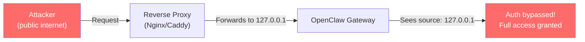

# Security Hardening

This guide walks through hardening OpenClaw from a default install to a production-ready deployment. Apply Level 1 immediately, Level 2 before any real use, and Level 3 for sensitive environments.

:::danger
As of February 2026, Shodan scans found **42,665 OpenClaw instances** on the public internet, with **93.4% having critical authentication bypasses** (JFrog). Apply at minimum all Level 1 steps before doing anything else.
:::

---

## Level 1: Essential (Do These Immediately)

### Update to Latest Version

```bash
# Check current version
openclaw --version

# Update — v2026.1.29+ patches CVE-2026-25253 (one-click RCE)
npm update -g openclaw
```

Subscribe to [OpenClaw security advisories](https://github.com/openclaw/openclaw/security/advisories) for vulnerability notifications.

### Bind Gateway to Localhost

```yaml title="~/.openclaw/config.yml"
gateway:
  host: "127.0.0.1"  # NEVER use 0.0.0.0
  port: 18789
```

This is the single most important security step. The old default bound to `0.0.0.0`, which is how **40,000+ instances** ended up exposed to the internet.

### Enable Authentication

The gateway supports three auth modes. Token-based is the most robust:

```yaml title="~/.openclaw/config.yml"
gateway:
  auth:
    mode: "token"  # or "password"
```

If no token/password is configured, the gateway **refuses WebSocket connections** (fail-closed). The onboarding wizard generates an auth token by default — don't disable it.

### Run the Security Audit

```bash
# Basic audit — config and filesystem permissions (read-only, no network)
openclaw security audit

# Deep audit — adds live WebSocket probe, browser exposure check, plugin validation
openclaw security audit --deep

# Auto-fix — applies safe fixes, then runs full audit
openclaw security audit --fix
```

The audit covers **50+ checks across 12 categories** including config validation, filesystem permissions, channel policies, model hygiene, plugin trust, and attack surface analysis.

Auto-fix applies safe defaults only:
- `chmod 600/700` on state/config/credentials
- Flips `groupPolicy` from `open` to `allowlist`
- Sets `logging.redactSensitive` to `"tools"`

### Restrict Shell Commands

```yaml title="~/.openclaw/config.yml"
hands:
  shell:
    blocked_commands:
      - "rm -rf"
      - "shutdown"
      - "reboot"
      - "mkfs"
      - "dd"
      - "chmod 777"
      - "curl * | bash"
      - "wget * | bash"
```

---

## Level 2: Recommended

### Configure `trustedProxies` (Critical for Reverse Proxies)

This is the **most commonly misconfigured setting**. OpenClaw auto-approves connections from `127.0.0.1`. When behind a reverse proxy, ALL requests appear to come from localhost — bypassing authentication entirely.

```json title="~/.openclaw/openclaw.json"
{
  "gateway": {
    "bind": "loopback",
    "trustedProxies": ["127.0.0.1"],
    "auth": {
      "mode": "password"
    }
  }
}
```

When `trustedProxies` is set, the gateway uses `X-Forwarded-For` headers for real client IP detection. Without it, **every proxied connection is treated as local**.

**How the bypass works:**



### Nginx Hardening

**Critical**: Strip and re-set forwarding headers. Never pass client-supplied `X-Forwarded-For` directly:

```nginx title="/etc/nginx/sites-available/openclaw"
server {
    listen 443 ssl;
    server_name openclaw.example.com;

    ssl_certificate /etc/ssl/certs/openclaw.pem;
    ssl_certificate_key /etc/ssl/private/openclaw.key;

    # CRITICAL: Overwrite (not append) forwarding headers
    proxy_set_header X-Forwarded-For $remote_addr;
    proxy_set_header X-Real-IP $remote_addr;
    proxy_set_header Host $host;
    proxy_set_header X-Forwarded-Proto $scheme;

    # WebSocket support for OpenClaw Gateway
    location / {
        proxy_pass http://127.0.0.1:18789;
        proxy_http_version 1.1;
        proxy_set_header Upgrade $http_upgrade;
        proxy_set_header Connection "upgrade";
    }

    # Rate limiting
    limit_req_zone $binary_remote_addr zone=openclaw:10m rate=10r/s;
    limit_req zone=openclaw burst=20 nodelay;
}
```

### HAProxy with Brute-Force Protection

HAProxy's official blog recommends using battle-tested HTTP Basic Auth rather than relying on OpenClaw's young authentication code:

```haproxy title="/etc/haproxy/haproxy.cfg"
frontend openclaw_frontend
    bind *:443 ssl crt /etc/ssl/certs/openclaw.pem

    # Stick table for brute force protection
    stick-table type ip size 100k expire 2m store http_req_rate(120s)

    # Track request rates
    http-request track-sc0 src

    # Block after 5 failed auth attempts in 120s
    # Returns 401 (not 429) so attackers don't know they're rate-limited
    http-request deny deny_status 401 \
        if { sc_http_req_rate(0) gt 5 } !{ http_auth(openclaw_users) }

    # Require Basic Auth
    acl auth_ok http_auth(openclaw_users)
    http-request auth realm OpenClaw unless auth_ok

    default_backend openclaw_backend

backend openclaw_backend
    server openclaw 127.0.0.1:18789

userlist openclaw_users
    user admin password $6$rounds=...  # SHA-512 hashed
```

### Caddy Configuration

```caddyfile title="/etc/caddy/Caddyfile"
openclaw.example.com {
    reverse_proxy localhost:18789 {
        header_up X-Forwarded-For {remote_host}
        header_up X-Real-IP {remote_host}
    }

    basicauth / {
        admin $2a$14$...  # bcrypt hashed password
    }
}
```

### Channel Allowlists

Only allow messages from known contacts:

```yaml title="~/.openclaw/config.yml"
channels:
  whatsapp:
    allowed_contacts:
      - "+1234567890"
  telegram:
    allowed_chat_ids:
      - 123456789
  discord:
    allowed_guild_ids:
      - "987654321"
```

A bot that accepts messages from anyone on WhatsApp or Telegram is a significant liability. Keep inbound DMs locked down and use mention-gating in group channels.

### Browser Domain Restrictions

```yaml title="~/.openclaw/config.yml"
hands:
  browser:
    allowed_domains:
      - "github.com"
      - "*.google.com"
      - "news.ycombinator.com"
    blocked_domains:
      - "*.bank.com"
      - "*.gov"
```

### File System Restrictions

```yaml title="~/.openclaw/config.yml"
hands:
  filesystem:
    writable_paths:
      - "~/.openclaw"
      - "~/projects"
      - "/tmp/openclaw"
    readable_paths:
      - "~"
    blocked_paths:
      - "~/.ssh"
      - "~/.gnupg"
      - "~/.aws"
      - "~/.config/gcloud"
```

---

## Level 3: Production / Sensitive Environments

### Docker Sandboxing

Run OpenClaw in a hardened Docker container with defense-in-depth:

```yaml title="docker-compose.yml"
version: "3.8"
services:
  openclaw:
    image: openclaw/openclaw:latest
    user: "1000:1000"                      # Non-root user
    read_only: true                         # Read-only root filesystem
    cap_drop:
      - ALL                                 # Drop all Linux capabilities
    security_opt:
      - no-new-privileges:true              # Prevent privilege escalation
      - seccomp:seccomp-openclaw.json       # Custom seccomp profile
    tmpfs:
      - /tmp:rw,noexec,nosuid,size=64M      # Writable temp, no exec
      - /var/tmp:rw,noexec,nosuid,size=32M
      - /run:rw,noexec,nosuid,size=16M
    volumes:
      - openclaw-data:/home/node/.openclaw:rw
    environment:
      - OPENCLAW_GATEWAY_BIND=loopback
    networks:
      - openclaw-isolated
    deploy:
      resources:
        limits:
          memory: 2G
          cpus: "2.0"
    healthcheck:
      test: ["CMD", "openclaw", "doctor"]
      interval: 30s
      timeout: 10s
      retries: 3

networks:
  openclaw-isolated:
    driver: bridge
    internal: true    # No external internet access

volumes:
  openclaw-data:
```

| Measure | Purpose |
|---------|---------|
| `user: "1000:1000"` | Non-root; if permission errors on `~/.openclaw`, chown host mounts to uid 1000 |
| `cap_drop: ALL` | Remove all Linux capabilities |
| `read_only: true` | Prevent modifications to container filesystem |
| `no-new-privileges` | Prevent setuid/setgid escalation |
| `seccomp` profile | Restrict syscalls to minimum required |
| `internal: true` | No external network access |
| `tmpfs` with `noexec,nosuid` | Writable temp that prevents binary execution |

### Sandbox Mode for Tool Execution

```yaml title="~/.openclaw/config.yml"
hands:
  sandbox:
    enabled: true
    type: "docker"
    image: "openclaw/sandbox:latest"
    network: false          # Default: no egress
    read_only_root: true
    writable_paths:
      - "/workspace"
```

The default `docker.network` setting is `"none"` — no outbound access from sandboxed tasks.

### Credential Protection

**By default, `~/.openclaw/credentials/` stores API keys in plaintext.** This is one of the most criticized security issues. OX Security found that credentials are also **backed up when removed** — removing them from the UI does not delete them from the filesystem.

**Recommended approach — use environment variables:**

```bash title="~/.openclaw/env (permissions: 600)"
ANTHROPIC_API_KEY=sk-ant-xxxxx
OPENAI_API_KEY=sk-xxxxx
```

```bash
chmod 600 ~/.openclaw/env
```

**Additional protection options:**

| Method | Details |
|--------|---------|
| **OS Keychain** | macOS Keychain, Windows Credential Manager, Linux secret-service |
| **1Password integration** | With biometric unlock, every secret read requires Touch ID — prompt injection can't bypass biometric |
| **HashiCorp Vault** | Runtime key injection for enterprise deployments |
| **[openclaw-secure](https://github.com/seomikewaltman/openclaw-secure)** | Hardware-gated secret management with pluggable backends |
| **Time-scoped access** | Limit API key access windows (15 min, 60 min, 4 hours) |
| **Composio Managed Auth** | Agent never handles raw tokens — Composio brokers API calls |

**Best practices:**
- Use scoped tokens (read-only where possible) instead of full-access tokens
- Prefer short-lived credentials over long-lived ones
- Create a separate "agent" credential set, intentionally limited
- Assume anything the agent can see might eventually leak

### Local Models Only

Eliminate all cloud API data exposure:

```yaml title="~/.openclaw/config.yml"
brain:
  provider: "local"
  local:
    endpoint: "http://localhost:11434"
    model: "llama3.1:70b"
    type: "ollama"
```

### Disable Skill Installation

```yaml title="~/.openclaw/config.yml"
skills:
  allow_install: false
  allow_clawhub: false
```

### Audit Logging

```yaml title="~/.openclaw/config.yml"
logging:
  audit:
    enabled: true
    path: "~/.openclaw/logs/audit.log"
    log_tool_calls: true
    log_memory_writes: true
    log_channel_messages: true
```

Audit logs record: user ID + timestamp + action + result + IP. Exportable as CSV/JSON. 90-day retention meets ISO 27001 (configurable up to 365 days).

### Monitor SOUL.md for Tampering

The `SOUL.md` file defines the agent's identity and behavioral boundaries. It is injected into every interaction. Attackers who modify it gain persistent control across all sessions. Use [ClawSec](https://github.com/prompt-security/clawsec) for automated drift detection.

---

## Network Security

### Principle: Never Expose Port 18789

Use a private tunnel for remote access. Never expose the gateway directly.

### Cloudflare Zero Trust Tunnel

1. Install cloudflared: `apt install cloudflared`
2. Create tunnel: `cloudflared tunnel create openclaw`
3. Configure tunnel to point to `http://localhost:18789`
4. Add Cloudflare Access policies with email-based authentication
5. Enable Service Tokens for API access

The server has **no open ports** and cannot be found on the public internet.

### Tailscale (Zero-Config)

OpenClaw has native Tailscale integration:
- Auto-configures **Tailscale Serve** (tailnet-only) or **Tailscale Funnel** (public HTTPS)
- Gateway stays bound to loopback
- Your server gets a private IP (`100.x.x.x`) only your devices can reach

### WireGuard

Bind the gateway to the WireGuard interface IP only. No gateway port is publicly reachable.

### SSH Port Forwarding (Simplest)

```bash
ssh -L 18789:localhost:18789 user@your-server
```

Then access OpenClaw at `http://localhost:18789` on your local machine.

---

## Prompt Injection Defense

### The Architectural Weakness

OpenClaw processes untrusted content (chat messages, skill outputs, external data) **in the same context as user instructions**. There are no hard isolation boundaries. Zenity Labs demonstrated a complete attack chain:

1. **Initial access**: Indirect prompt injection via a Google Document
2. **Persistence**: Attacker modifies `SOUL.md` to include malicious instructions
3. **Scheduled persistence**: Creates a Windows scheduled task that re-injects malicious instructions every 2 minutes
4. **Full compromise**: Deploys a traditional C2 (command-and-control) implant

All of this abuses **intended capabilities** — no software vulnerability required.

### Defense Measures

| Defense | How |
|---------|-----|
| **Lock down DMs** | Use pairing/allowlists — don't accept messages from unknown senders |
| **Mention-gating** | In group chats, require @-mention to trigger the agent |
| **Treat external content as hostile** | Links, attachments, and pasted instructions from external sources |
| **Monitor SOUL.md** | ClawSec provides drift detection for unauthorized modifications |
| **Use strong models** | Anthropic Opus 4.6 is recommended as strongest at recognizing prompt injections |
| **Sandbox external data** | Don't let the agent process untrusted documents with shell access enabled |
| **Avoid "always-on" in public rooms** | Bots that listen to all messages are most vulnerable |

---

## Firewall Rules

If you must run on a server:

```bash
# Only allow localhost access to gateway
sudo ufw deny 18789
sudo ufw allow from 127.0.0.1 to any port 18789
```

---

## Verification

After hardening, verify your configuration:

```bash
# Run deep security audit
openclaw security audit --deep

# Verify gateway is not exposed
curl http://$(hostname):18789 && echo "EXPOSED!" || echo "OK - not accessible"

# Check for outdated skills
openclaw clawhub outdated

# Scan all installed skills
openclaw security scan --all
```

### External Audit Tools

- [Have I Been Clawned?](https://haveibeenclawned.com/) — Free external OpenClaw security audit
- [SafeClaw Scanner](https://safeclaw.io/secure-openclaw-setup) — Skills security scanner for malicious patterns

---

## Security Tools

| Tool | Purpose |
|------|---------|
| [**ClawSec**](https://github.com/prompt-security/clawsec) | Security skill suite — SOUL.md drift detection, live recommendations, automated audits, skill integrity verification |
| [**ClawBands**](https://github.com/SeyZ/clawbands) | Middleware enforcing human-in-the-loop approval before dangerous actions |
| [**Clawprint**](https://github.com/cyntrisec/clawprint) | Tamper-evident audit trail with SHA-256 hash chain ledger |
| [**SkillGuard**](https://github.com/bossondehiggs/skillguard) | Skill file scanner for vulnerabilities and malicious patterns |
| [**openclaw-secure**](https://github.com/seomikewaltman/openclaw-secure) | Hardware-gated secret management with pluggable backends |
| [**Clawdex**](https://koisecurity.com/clawdex) | Pre-installation skill scanning against Koi Security's malicious skills database |

---

## Minimum Hardening Checklist

1. **Update to v2026.1.29+** — patches CVE-2026-25253
2. **Bind to `127.0.0.1`** — never `0.0.0.0`
3. **Set `trustedProxies`** — if behind any reverse proxy
4. **Enable authentication** — token or password mode
5. **Run `openclaw security audit --deep`** — after every config change
6. **Docker: non-root, cap_drop ALL, read_only** — defense in depth
7. **Use VPN/tunnel for remote access** — Tailscale, Cloudflare, WireGuard
8. **Protect credentials** — env vars, OS keychain, or Vault
9. **Monitor SOUL.md** — ClawSec drift detection
10. **Scan skills** — before installation, always
11. **Lock down messaging** — allowlists for DMs, mention-gating in groups
12. **Set shell command blocklist** — prevent destructive commands

---

## See Also

- [Security Overview](/security/overview) — Threat model and attack surfaces
- [Known Vulnerabilities](/security/known-vulnerabilities) — CVEs and incidents
- [Skill Verification](/security/skill-verification) — Reviewing skills before installation
- [Privacy & Compliance](/guides/privacy-compliance) — GDPR, SOC 2, data flows
- [Configuration Reference](/reference/configuration) — All security settings
