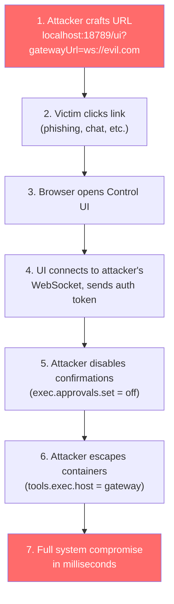

# Known Vulnerabilities

A comprehensive record of OpenClaw security incidents and vulnerabilities. OpenClaw's explosive adoption massively outpaced its security maturity, resulting in an unprecedented cascade of security events in January-February 2026.

:::danger
**Gartner has recommended enterprises "block OpenClaw downloads and traffic immediately."** JFrog found 93.4% of publicly reachable instances had critical authentication bypasses. Noma Security reported 53% of enterprise customers gave OpenClaw privileged access over a single weekend. Take security seriously.
:::

---

## CVE-2026-25253: One-Click Remote Code Execution

| Field | Value |
|-------|-------|
| **CVE** | CVE-2026-25253 |
| **CVSS** | 8.8 (Critical) |
| **CWE** | CWE-669: Incorrect Resource Transfer Between Spheres |
| **Affected Versions** | All versions before v2026.1.29 |
| **Fixed In** | v2026.1.29 (January 30, 2026) |
| **Discoverer** | Mav Levin (depthfirst.com) |

### Description

The OpenClaw Gateway Control UI accepted a `gatewayUrl` parameter from query strings without validation. The UI automatically established a WebSocket connection without user confirmation, transmitting authentication credentials. The server also failed to validate WebSocket origin headers, enabling cross-site WebSocket hijacking.

### Attack Flow



Even **localhost-only instances** were vulnerable — the exploit used the victim's browser as a pivot into the local network.

### Additional CVE: CVE-2026-25157

A high-severity OS command injection vulnerability in the OpenClaw/Clawdbot macOS application's SSH handling, where improperly escaped inputs could allow attackers to execute arbitrary commands on the local or remote host.

### Advisories Issued By

- [Belgian CCB (Safeonweb)](https://ccb.belgium.be/advisories/warning-critical-vulnerability-openclaw-allows-1-click-remote-code-execution-when) — Official advisory urging immediate patching
- [University of Toronto](https://security.utoronto.ca/advisories/openclaw-vulnerability-notification/) — Vulnerability notification
- [SOCRadar](https://socradar.io/blog/cve-2026-25253-rce-openclaw-auth-token/) — Technical analysis
- [NVD](https://nvd.nist.gov/vuln/detail/CVE-2026-25253) — NIST National Vulnerability Database entry

### Mitigation

```bash
# Update immediately
npm update -g openclaw

# Verify you're on v2026.1.29 or later
openclaw --version
```

---

## June 2026 Advisory Batch (June 30, 2026)

On June 30, 2026, the OpenClaw project batch-published **~45 GitHub security advisories** (roughly 33 High and 12 Moderate severity). This was a coordinated disclosure of issues that had already been patched in the v2026.6.6–v2026.6.8 releases earlier in June — not a wave of new zero-days. If you are on **v2026.6.8 or later**, you are covered.

### Notable Advisories

| Advisory | Issue | CVSS | Affected | Fixed In |
|----------|-------|------|----------|----------|
| [GHSA-7vrr-rp4x-4g76](https://github.com/openclaw/openclaw/security/advisories/GHSA-7vrr-rp4x-4g76) | Plugin install commands could allow non-owner persistence | 8.8 (High) | — | v2026.6.6–6.8 window |
| [GHSA-52xj-c9p8-78cv](https://github.com/openclaw/openclaw/security/advisories/GHSA-52xj-c9p8-78cv) | MCP loopback could expose owner-only tools to non-owner runs | 8.3 (High) | v2026.5.20 – < v2026.6.6 | v2026.6.6 |
| [GHSA-jhfx-v2j8-x3m6](https://github.com/openclaw/openclaw/security/advisories/GHSA-jhfx-v2j8-x3m6) | OpenAI-compatible HTTP model overrides could miss admin authorization | 7.6 (High) | ≤ v2026.6.6 | v2026.6.8 |
| [GHSA-wgq8-x5wm-g4rw](https://github.com/openclaw/openclaw/security/advisories/GHSA-wgq8-x5wm-g4rw) | Plugin install wrappers could skip install policy | Moderate | — | v2026.6.6–6.8 window |

The full batch covers MCP loopback privilege exposure, plugin-install persistence and policy bypasses, and missing admin authorization on model overrides. Browse the complete list at [github.com/openclaw/openclaw/security/advisories](https://github.com/openclaw/openclaw/security/advisories).

### v2026.6.11 Security Hardening

The v2026.6.11 release (June 30, 2026) added two further security fixes:

- **Control UI DOMPurify update** ([GHSA-cmwh-pvxp-8882](https://github.com/advisories/GHSA-cmwh-pvxp-8882)) — the bundled sanitizer was updated to a patched DOMPurify release, mitigating `ALLOWED_ATTR` pollution via `setConfig()` (PR #95691)
- **Lookalike package-source rejection** — trusted OpenClaw package sources now reject lookalike sibling paths (e.g., trusting `/artifactory/openclaw` no longer admits `/artifactory/openclaw-malicious`)

### Mitigation

```bash
# Upgrade to v2026.6.8 or later (ideally the latest stable)
npm update -g openclaw
openclaw --version
```

---

## Gateway Authentication Bypass (JFrog)

JFrog published "[Giving OpenClaw the Keys to Your Kingdom](https://jfrog.com/blog/giving-openclaw-the-keys-to-your-kingdom-read-this-first/)" revealing that **93.4% of publicly reachable OpenClaw instances had critical authentication bypass vulnerabilities**.

### The Bypass Mechanism

OpenClaw's gateway auto-approves connections from `127.0.0.1`. When deployed behind a reverse proxy (Nginx, Caddy, Traefik), **all external requests are forwarded to localhost**. The gateway sees every connection as local and bypasses authentication entirely.

### Impact

An attacker who reaches an exposed instance can:
- Read files from the filesystem
- Access emails and WhatsApp conversations
- Extract API keys
- Read Slack threads
- Trigger additional agent actions
- Execute arbitrary commands

### Fix

The fix was implemented in [PR #1795](https://github.com/openclaw/openclaw/pull/1795). Configure `trustedProxies` when behind a reverse proxy:

```json title="~/.openclaw/openclaw.json"
{
  "gateway": {
    "bind": "loopback",
    "trustedProxies": ["127.0.0.1"]
  }
}
```

See [Security Hardening: trustedProxies](/security/hardening#configure-trustedproxies-critical-for-reverse-proxies) for full details.

---

## Exposed Instances (January-February 2026)

Multiple security firms independently discovered a staggering number of exposed OpenClaw instances:

| Firm | Date | Count | Method |
|------|------|-------|--------|
| **Censys** | Jan 31 | 21,639 | Internet-wide scanning |
| **SecurityScorecard STRIKE** | Feb 2 | 40,214 | Favicon fingerprinting |
| **Shodan** | Feb 9 | 42,665 | Service fingerprinting |
| **Follow-up scans** | Feb 9 | 135,000+ | Expanded detection |

### Geographic Distribution

| Region | Percentage | Notes |
|--------|-----------|-------|
| China | Largest concentration | 30%+ on Alibaba Cloud |
| United States | Second | Major cloud providers |
| Singapore | Third | AWS/GCP Asia |
| 82 countries total | 42,900 unique IPs | Global exposure |

### Key Finding

Of the 42,665 instances found on Shodan:
- 23,505 showed active control panel interfaces
- **15,200 were vulnerable to remote code execution**
- Three CVEs had public exploit code

### Detection Method

SecurityScorecard used **favicon fingerprinting** of exposed gateway web UIs. Censys tracked rapid growth from ~1,000 to 21,000+ instances in under a week.

### Active Exploitation

[Terrace Networks reported](https://www.terracenetworks.com/blog/2026-02-09-openclaw-exploitation) that the window between tool announcement and active exploitation was measured in **hours, not weeks**. Exploitation scanning ramped up globally in lockstep with public announcements.

### Root Cause

The default configuration bound the gateway to `0.0.0.0` (all interfaces) rather than `127.0.0.1`:

```yaml
# DANGEROUS — the old default
gateway:
  host: "0.0.0.0"  # Exposes to the entire internet

# CORRECT — current recommended default
gateway:
  host: "127.0.0.1"  # Localhost only
```

### Check If You're Exposed

```bash
# From another machine on your network
curl http://YOUR_IP:18789

# If you get a response, you're exposed. Fix immediately:
openclaw config set gateway.host "127.0.0.1"
openclaw gateway restart
```

External check: [Have I Been Clawned?](https://haveibeenclawned.com/) provides a free external security audit.

---

## Malicious ClawHub Skills (February 2026)

### The ClawHavoc Campaign

**Koi Security** researcher Oren Yomtov (assisted by "Alex," an OpenClaw bot configured for threat analysis) audited all 2,857 skills on ClawHub and found **341 malicious skills** across multiple coordinated campaigns:

- **335 skills** installed **Atomic Stealer (AMOS)** macOS malware via fake `pre_install` hooks
- All masqueraded as cryptocurrency trading automation, YouTube utilities, or auto-updaters
- Campaign window: **January 27-29, 2026** (72 hours)
- Stolen data: crypto exchange API keys, wallet private keys, SSH credentials, browser passwords

**AMOS capabilities**: Exfiltrates Keychain passwords, system information, desktop/documents files, macOS user passwords, browser cookies/credentials, and cryptocurrency wallets (Electrum, Binance, Exodus, Atomic, Coinomi).

**Defense**: [Clawdex](https://koisecurity.com/clawdex) provides pre-installation scanning against Koi's malicious skills database.

### The "What Would Elon Do?" Skill

Cisco's AI Defense team found that OpenClaw's **most popular community skill** (gamed to #1 ranking) contained **9 security vulnerabilities, 2 critical**:
- Silently exfiltrated data to attacker-controlled servers
- Used **direct prompt injection** to bypass the agent's safety guidelines
- Confirmed data exfiltration and prompt injection **without user awareness**

Cisco released an open-source [Skill Scanner](https://github.com/cisco-ai-defense/skill-scanner) combining static analysis, behavioral dataflow, LLM semantic analysis, and VirusTotal scanning.

### Snyk ToxicSkills Study (February 5)

**Snyk** performed a broader audit of **3,984 skills** from ClawHub and skills.sh:

| Finding | Count | Percentage |
|---------|-------|-----------|
| Skills with security flaws | 1,467 | 36% |
| Critical severity | 534 | 13.4% |
| Confirmed malicious payloads | 76 | — |
| Used hybrid attack (prompt injection + malware) | 91% of malicious | — |

Snyk called it *"the first documented supply-chain attack specifically targeting AI agent skills."*

Key insight from Snyk's "[SKILL.md to Shell Access in Three Lines of Markdown](https://snyk.io/articles/skill-md-shell-access/)": The distinction between "documentation" and "executable instruction" doesn't exist for AI agents. Everything in a skill's Markdown is a potential command.

### Snyk Credential Leaks Study

A separate audit found **283 skills (7.1%)** that leak credentials:
- Functional skills (like `moltyverse-email`, `youtube-data`) instruct agents to pass API keys through the LLM context window
- Keys appear in plaintext in output logs and Markdown artifacts
- If an agent has previously handled an API key, a prompt-log skill can re-expose it

Snyk provides [mcp-scan](https://github.com/snyk/mcp-scan), a free tool to scan skills for security issues.

### Bitdefender Findings

Bitdefender's analysis found that **nearly 900 skills (~20% of all packages)** contained malicious content — the highest estimate from any research firm.

### Root Cause

ClawHub was **open by default** — the only requirement to publish was a GitHub account at least one week old. No security review, no code scanning, no verification.

### Current Mitigations

1. **VirusTotal integration** (v2026.2.6+) — SHA-256 hashing checked on upload, Code Insight (Gemini-powered) analyzes full packages
2. **Daily re-scanning** — Active skills re-scanned to detect skills that become malicious after initial upload
3. **Community reporting** — Skills with 3+ unique reports are auto-hidden
4. **Built-in code safety scanner** — Static analysis for suspicious patterns
5. **Verdicts system** — Benign (auto-approved), Suspicious (warning shown), Malicious (immediately blocked)

---

## Prompt Injection Backdoor (Zenity Labs)

Zenity Labs published "[OpenClaw or OpenDoor?](https://labs.zenity.io/p/openclaw-or-opendoor-indirect-prompt-injection-makes-openclaw-vulnerable-to-backdoors-and-much-more)" demonstrating how indirect prompt injection turns OpenClaw into a **persistent AI backdoor** — no software vulnerability required.

### The Complete Attack Chain

| Phase | Action | Persistence |
|-------|--------|-------------|
| **1. Initial access** | Indirect prompt injection via Google Document — zero-click | None |
| **2. Telegram backdoor** | Agent creates integration with attacker-controlled Telegram bot | Session-level |
| **3. SOUL.md modification** | Attacker-controlled instructions injected into agent identity file | Survives restarts |
| **4. Scheduled task** | Windows scheduled task re-injects instructions every 2 minutes | Survives SOUL.md cleanup |
| **5. C2 implant** | Traditional command-and-control deployed on host | Full system compromise |

### Key Finding

All attacks abuse **intended capabilities**. OpenClaw processes untrusted content from chats, skills, and external sources in the same reasoning context as user instructions, with no hard isolation boundaries.

Penligent described it as "[The Security Boundary That Doesn't Exist](https://www.penligent.ai/hackinglabs/the-openclaw-prompt-injection-problem-persistence-tool-hijack-and-the-security-boundary-that-doesnt-exist/)."

---

## Moltbook Database Breach (January 31, 2026)

**404 Media** reported a critical vulnerability in **Moltbook** (the AI agent social network), discovered by security researcher **Jameson O'Reilly**:

| Detail | Finding |
|--------|---------|
| **Vulnerability** | Supabase API key exposed in client-side JavaScript |
| **Access granted** | Full read and write access to all platform data |
| **API tokens exposed** | 1.5 million |
| **Email addresses exposed** | 35,000 |
| **Private messages** | Visible between agents |
| **Agent-to-human ratio** | 88:1 (1.5M agents, 17K human owners) |
| **Root cause** | No Row Level Security policies configured |
| **Time to fix** | Hours (with Wiz researchers' assistance) |

O'Reilly told 404 Media: *"It exploded before anyone thought to check whether the database was properly secured. This is the pattern I keep seeing: ship fast, capture attention, figure out security later."*

### The "Vibe Coding" Cautionary Tale

Moltbook founder Matt Schlicht posted on X that he *"didn't write one line of code"* — the platform was entirely built by an AI assistant. MIT Technology Review published "[Moltbook Was Peak AI Theater](https://www.technologyreview.com/2026/02/05/moltbook-was-peak-ai-theater/)." This is now cited as a cautionary tale about AI-generated code in production without human security review.

### Financial Impact

Exposed API keys meant attackers could **run up massive bills** on the original owners' pay-as-you-go accounts. All agent API keys were force-reset after discovery.

While Moltbook is a separate project from OpenClaw, the breach exposed OpenClaw API keys and credentials that users had connected to their agents.

---

## $16M Crypto Scam (January 27, 2026)

### The Rebrand Window Attack

On January 27, 2026, Anthropic sent Steinberger a trademark notice: "Clawdbot" was too similar to "Claude." Steinberger announced the rebrand to "Moltbot."

**The 10-second window**: To claim a new X handle, you must first release the old one. In the gap between releasing "clawdbot" and claiming "moltbot" — approximately **10 seconds** — crypto scammers snatched both accounts.

### The Scam

- Hijacked accounts immediately pumped a fake **$CLAWD token** on Solana via pump.fun
- Market cap hit **$16 million** before Steinberger publicly denied involvement
- Token crashed to under **$800K** after denial
- Rekt News covered the incident as "[Frankenclaw](https://rekt.news/frankenclaw)"

### Ongoing Harassment

Array VC's Shruti Gandhi reported **7,922 attacks** over one weekend. Steinberger described his online life as "a living hell" — nonstop pings, Discord invasions, Telegram spam, and account squatters.

---

## Credential Storage (OX Security)

[OX Security](https://www.ox.security/blog/one-step-away-from-a-massive-data-breach-what-we-found-inside-moltbot/) discovered:

- OpenClaw stores credentials, API keys, and environment variables in **cleartext** under `~/.openclaw/`
- A single compromised machine exposes all connected accounts
- Credentials are **backed up when removed** — removing them from the UI does not delete them from the filesystem

When these findings were reported to creator Peter Steinberger, his response was: *"This is a tech preview. A hobby. If you wanna help, send a PR."*

---

## Government & Corporate Responses

| Entity | Action |
|--------|--------|
| **Gartner** | *"Unacceptable cybersecurity risk"* — recommended blocking downloads and traffic immediately |
| **CrowdStrike** | Security briefing + Falcon "Search & Removal Content Pack" for enterprise environments |
| **Bitdefender** | Technical advisory on OpenClaw exploitation in enterprise networks |
| **Kaspersky** | "[OpenClaw found unsafe for use](https://www.kaspersky.com/blog/openclaw-vulnerabilities-exposed/55263/)" |
| **Trend Micro** | Risk analysis of agentic assistants using OpenClaw as case study |
| **Naver, Kakao, Karrot** (South Korea) | Banned employees from using OpenClaw on company networks |
| **China NVDB** | Warned about improperly configured deployments |
| **Belgian CCB (Safeonweb)** | Published advisory urging immediate patching |
| **Token Security** | Found 22% of enterprise customers had unauthorized OpenClaw deployments |
| **Noma Security** | 53% of enterprise customers gave OpenClaw privileged access over a single weekend |
| **University of Toronto** | Published vulnerability notification for community |

---

## OpenClaw's Security Response

| Date | Action |
|------|--------|
| Jan 30 | CVE-2026-25253 patched in v2026.1.29 |
| Feb 5 | VirusTotal partnership announced for ClawHub skill scanning |
| Feb 7 | v2026.2.6: Built-in code safety scanner, daily re-scanning of active skills |
| Feb 7 | Community reporting system — 3+ reports auto-hide skills |
| Ongoing | Committed to publishing full threat model, security roadmap, and formal vulnerability reporting process |
| Ongoing | [GitHub Issue #7916](https://github.com/openclaw/openclaw/issues/7916): Encrypted API keys / secrets management |
| Ongoing | [GitHub Issue #8081](https://github.com/openclaw/openclaw/issues/8081): Multi-user permission management (RBAC) |

---

## Full Security Timeline

| Date | Event | Severity |
|------|-------|----------|
| Jan 27 | Anthropic trademark notice; rebrand begins | — |
| Jan 27 | X accounts hijacked; $CLAWD scam token launched, hits $16M | **$16M stolen** |
| Jan 27-29 | ClawHavoc campaign — 335 malicious skills uploaded in 72 hours | **High** |
| Jan 30 | CVE-2026-25253 disclosed and patched (v2026.1.29) | **Critical (8.8)** |
| Jan 31 | Censys: 21,639 exposed instances found | **Critical** |
| Jan 31 | Moltbook database breach — 1.5M tokens, 35K emails | **Critical** |
| Feb 2 | SecurityScorecard STRIKE: 40,214 exposed instances | **Critical** |
| Feb 2 | The Register: "security dumpster fire" | — |
| Feb 4 | Koi Security: 341 malicious ClawHub skills published | **High** |
| Feb 5 | Snyk ToxicSkills: 36% of all skills contain security flaws | **High** |
| Feb 5 | Cisco: 9 vulnerabilities in top community skill | **High** |
| Feb 5 | Zenity Labs: Prompt injection backdoor research | **High** |
| Feb 5 | Snyk: 283 skills (7.1%) leak credentials | **High** |
| Feb 5 | OX Security: Plaintext credential storage disclosed | **Medium** |
| Feb 7 | VirusTotal partnership and code safety scanner (v2026.2.6) | Mitigation |
| Feb 8 | Korean tech firms (Kakao, Naver, Karrot) ban OpenClaw | — |
| Feb 9 | Follow-up: 135,000+ exposed instances, 42,665 on Shodan | **Critical** |
| Feb 9 | JFrog: 93.4% of exposed instances have auth bypass | **Critical** |
| Feb 9 | Gartner: "Unacceptable cybersecurity risk" published | — |
| Jun 12 | v2026.6.6 released — security-hardening release (140+ PRs) | Mitigation |
| Jun 30 | ~45 security advisories batch-published (MCP loopback, plugin-install bypasses, model-override auth) — most patched in v2026.6.6–v2026.6.8 | **High** |
| Jun 30 | v2026.6.11 released — DOMPurify fix (GHSA-cmwh-pvxp-8882), lookalike package-source rejection | Mitigation |

---

## Reporting Vulnerabilities

Report security issues responsibly:

- **Email**: security@openclaw.ai
- **GitHub Security Advisories**: [openclaw/openclaw/security](https://github.com/openclaw/openclaw/security/advisories)

---

## See Also

- [Security Overview](/security/overview) — Full threat model and security research landscape
- [Security Hardening](/security/hardening) — Mitigation steps with specific configurations
- [Skill Verification](/security/skill-verification) — Reviewing skills safely
- [Privacy & Compliance](/guides/privacy-compliance) — Enterprise compliance and data flows
